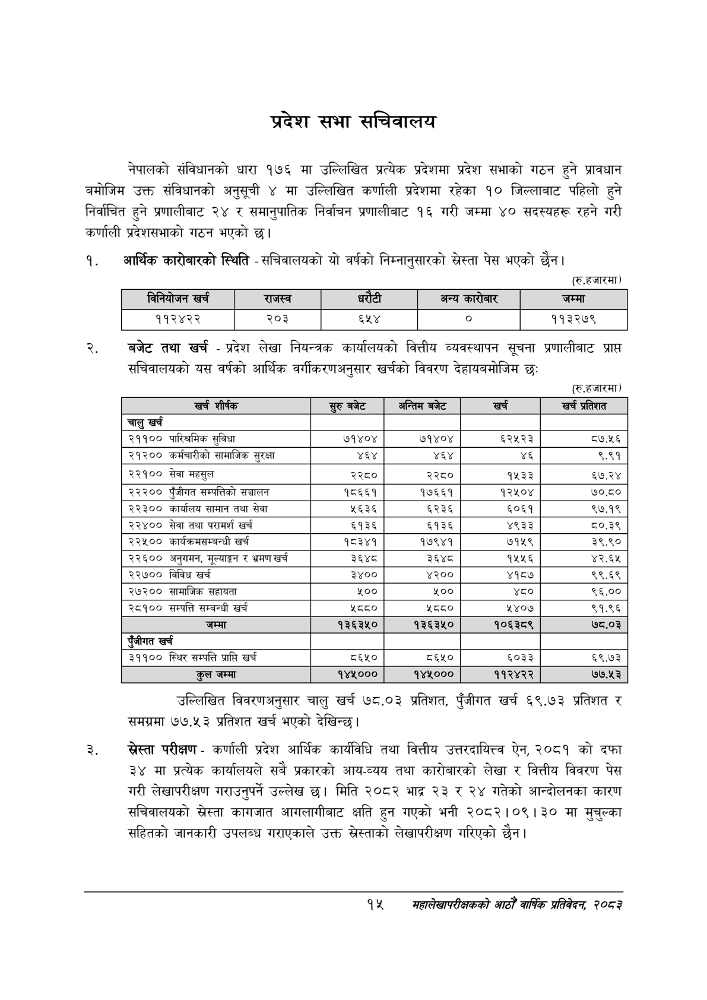

# Page 37 QA

## Rendered page


## Extracted text

```text
प्रदेश सभा सचिवालय
नेपालको संविधानको धारा १७६ मा उल्लिखित प्रत्येक प्रदेशमा प्रदेश सभाको गठन हुने प्रावधान बमोजिम उक्त संविधानको अनुसूची ४ मा उल्लिखित कर्णाली प्रदेशमा रहेका १० जिल्लाबाट पहिलो हुने निर्वाचित हुने प्रणालीबाट २४ र समानुपातिक निर्वाचन प्रणालीबाट १६ गरी जम्मा ४० सदस्यहरू रहने गरी कर्णाली प्रदेशसभाको गठन भएको छ।
आर्थिक कारोबारको स्थिति -सचिवालयको यो वर्षको निम्नानुसारको स्रेस्ता पेस भएको छैन।
(रु.हजारमा)
बजेट तथा खर्च -प्रदेश लेखा नियन्त्रक कार्यालयको वित्तीय व्यवस्थापन सूचना प्रणालीबाट प्राप्त सचिवालयको यस वर्षको आर्थिक वर्गीकरणअनुसार खर्चको विवरण देहायबमोजिम छः
(रु.हजारमा)
खर्च
प्रतिशत
उल्लिखित विवरणअनुसार चालु खर्च ७८.०३ प्रतिशत, पुँजीगत खर्च ६९.७३ प्रतिशत र समग्रमा ७७.५३ प्रतिशत खर्च भएको देखिन्छ।
स्रेस्ता परीक्षण -कर्णाली प्रदेश आर्थिक कार्यविधि तथा वित्तीय उत्तरदायित्त ऐन, २०८१ को दफा ३४ मा प्रत्येक कार्यालयले सबै प्रकारको आय-व्यय तथा कारोबारको लेखा र वित्तीय विवरण पेस गरी लेखापरीक्षण गराउनुपर्ने उल्लेख छ। मिति २०८२ भाद्र २३ र २४ गतेको आन्दोलनका कारण सचिवालयको स्रेस्ता कागजात आगलागीबाट क्षति हुन गएको भनी २०८२।०९। ३० मा मुचुल्का सहितको जानकारी उपलब्ध गराएकाले उक्त स्रेस्ताको लेखापरीक्षण गरिएको छैन।
१४
सहालेखापरीक्षकको आठौँ वाक प्रतिवेदन २०८२

| विनिवोजन खर्च | राजस्व |  |  | अन्य कारोबार | जम्मा |
| --- | --- | --- | --- | --- | --- |

| खर्च शीर्षक | बजेट | अन्तिम बजेट | खर्च | खर्च प्रतिशत |
| --- | --- | --- | --- | --- |
| चालु खर्च |  |  |  |  |
| २११०० पारिश्रमिक सुविधा | ७१४०४ | ७१४०४ | ६२५२३ | ८७.५६ |
| २१२०० कर्मचारीको सामाजिक सुरक्षा | ४६४ | ४६४ | ४६ | ६.९१ |
| २२१०० सेवा महसुल | २२८० | २२८० | १५३३ | ६७.२४ |
| २२२०० पुँजीगत खन्चत्तिको सञ्चालन | १८६६१ | १७६६१ | १२५०४ | ७०.८० |
| २२३०० कार्यालय सामान तथा सेवा | ५६३६ | ६२३६ | ५०६१ | ९७.१९ |
| २२४०० सेवा तथा परामर्श खर्च | ६१३६ | ६१३६ | ४९३३ | ८५०.३९ |
| २२५०० कार्षक्रमसन्बन्धी खर्च | १८३४१ | १७९४१ | ७१५९ | ३९.९० |
| २२६०० अनुगमन, मूल्याङ्कन र भ्रमण खर्च | ३६४८ | ३६४८ | १५५६ | ४२.६५ |
| २२७०० विविध खर्च | ३४०० | ४२०० | ४१८७ | ९९.६९ |
| २७२०० सामाजिक सहायता | १०० | ५०० | ४० | ९६.०० |
| २८१०० सम्पत्ति सम्बन्धी खर्च | ८८० | ८८० | ५४०७ | ९१.९६ |
| जम्मा | १३६३५० | १३६३५० | १०६३८९ | ७८.०३ |
| रंजीगत खर्च |  |  |  |  |
| ३११०० स्थिर सम्पत्ति प्राप्ति खर्च | ८६५० | ८६५० | ६०३३ | ६९.७३ |
| कुल जम्मा | १४५००० | १४५००० | ११२४२२ | ७७.५३ |
```

## Flags
- table_page
- medium_quality_table
