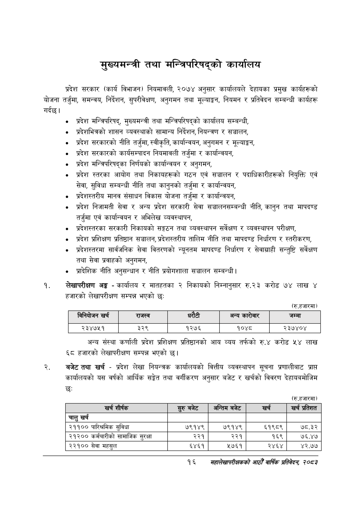

# Page 38 QA

## Rendered page


## Extracted text

```text
मुख्यमन्त्री तथा मन्त्रिपरिषद्को कार्यालय
गर्दछु। प्रदेश सरकार (कार्य विभाजन) नियमावली, २०७४ अनुसार कार्यालयले देहायका प्रमुख कार्यहरूको योजना तर्जुमा, समन्वय, निर्देशन, सुपरीवेक्षण, अनुगमन तथा मूल्याङ्कन, नियमन र प्रतिवेदन सम्बन्धी कार्यहरू
प्रदेश मन्त्रिपरिषद्‌, मुख्यमन्त्री तथा मन्त्रिपरिषद्को कार्यालय सम्बन्धी,
प्रदेशभित्रको शासन व्यवस्थाको सामान्य निर्देशन, नियन्त्रण र सञ्चालन,
प्रदेश सरकारको नीति तर्जुमा, स्वीकृति, कार्यान्वयन, अनुगमन र मूल्याङ्कन,
प्रदेश सरकारको कार्यसम्पादन नियमावली तर्जुमा र कार्यान्वयन,
प्रदेश मन्त्रिपरिषद्का निर्णयको कार्यान्वयन र अनुगमन,
प्रदेश स्तरका आयोग तथा निकायहरूको गठन एवं सञ्चालन र पदाधिकारीहरूको नियुक्ति एवं सेवा, सुविधा सम्बन्धी नीति तथा कानुनको तर्जुमा र कार्यान्वयन,
प्रदेशस्तरीय मानव संसाधन विकास योजना तर्जुमा र कार्यान्वयन,
प्रदेश निजामती सेवा र अन्य प्रदेश सरकारी सेवा सञ्चालनसम्बन्धी नीति, कानुन तथा मापदण्ड तर्जुमा एवं कार्यान्वयन र अभिलेख व्यवस्थापन,
प्रदेशस्तरका सरकारी निकायको सङ्गठन तथा व्यवस्थापन सर्वेक्षण र व्यवस्थापन परीक्षण,
प्रदेश प्रशिक्षण प्रतिष्ठान सञ्चालन, प्रदेशस्तरीय तालिम नीति तथा मापदण्ड निर्धारण र स्तरीकरण,
प्रदेशस्तरमा सार्वजनिक सेवा वितरणको न्यूनतम मापदण्ड निर्धारण र सेवाग्राही सन्तुष्टि सर्वेक्षण तथा सेवा प्रवाहको अनुगमन,
प्रादेशिक नीति अनुसन्धान र नीति प्रयोगशाला सञ्चालन सम्बन्धी |
लेखापरीक्षण अङ्ग -कार्यालय र मातहतका २ निकायको निम्नानुसार रु.२३ करोड ७४ लाख ४ हजारको लेखापरीक्षण सम्पन्न भएको छ:
(रु.हजारमा)
अन्य संस्था कर्णाली प्रदेश प्रशिक्षण प्रतिष्ठानको आय व्यय तर्फको रु.४ करोड लाख ६८ हजारको लेखापरीक्षण सम्पन्न भएको छ।
बजेट तथा खर्च -प्रदेश लेखा नियन्त्रक कार्यालयको वित्तीय व्यवस्थापन सूचना प्रणालीबाट प्राप्त कार्यालयको यस वर्षको आर्थिक सङ्केत तथा वर्गीकरण अनुसार बजेट र खर्चको विवरण देहायबमोजिम छः
(रु.हजारमा)
१६
सहालेखापरीक्षकको वाषिक प्रतिवेदन २०८२

| विनिवोजन खर्च | राजस्व | धरेटी |  | अन्य कारोबार | जम्मा |
| --- | --- | --- | --- | --- | --- |
| २३४७५१ | ३२९ | १२७६ |  | १०४८ | २३७४०४ |

| = शीष्क | सुरुबबेट | अन्तिम बजेट | खर्च | खर प्रतिशत |
| --- | --- | --- | --- | --- |
| चालु खर्च |  |  |  |  |
| २११०० पारिश्रमिक सुविधा | ७९१४९ | ७९१४९ | ६१९८९ | ७८.३२ |
| २१२०० कर्मचारीको सामाजिक सुरक्षा | २२१ | २२१ | १६९ | ७६.४७ |
| २२१०० सेवा महसुल | ६४६१ | २७६१ | २४६४ | ४२.७७ |
```

## Flags
- table_page
- medium_quality_table
