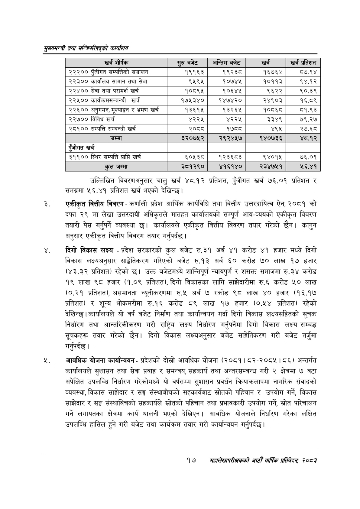

# Page 39 QA

## Rendered page


## Extracted text

```text
सुख्यसन्त्री तथा सन्तिपरिषद्को कायलिय
उल्लिखित विवरणअनुसार चालु खर्च ४८.१२ प्रतिशत, पुँजीगत खर्च ७६,००१ प्रतिशत र समग्रमा ५६.४१ प्रतिशत खर्च भएको देखिन्छ।
एकीकृत वित्तीय विवरण -कर्णाली प्रदेश आर्थिक कार्यविधि तथा वित्तीय उत्तरदायित्व ऐन, २०८१ को दफा २९ मा लेखा उत्तरदायी अधिकृतले मातहत कार्यालयको सम्पूर्ण आय-व्ययको एकीकृत विवरण तयारी पेस गर्नुपर्ने व्यवस्था छु। कार्यालयले एकीकृत वित्तीय विवरण तयार गरेको छैन। कानुन अनुसार एकीकृत वित्तीय विवरण तयार गर्नुपर्दछ |
दिगो विकास लक्ष्य -प्रदेश सरकारको कुल बजेट रु.३१ अर्ब ४१ करोड ४१ हजार मध्ये दिगो विकास लक्ष्यअनुसार साङ्गेतिकरण गरिएको बजेट रु.१३ अर्ब ६० करोड ७० लाख १७ हजार (४३.३२ प्रतिशत) रहेको छ। उक्त बजेटमध्ये शान्तिपूर्ण न्यायपुर्ण र शसक्त समाजमा रु.३४ करोड १९ लाख ९८ हजार (१.०९ प्रतिशत), दिगो विकासका लागि साझेदारीमा रु.६ करोड ५० लाख (०.२१ प्रतिशत), असमानता न्यूनीकरणमा रु.५ अर्ब ७ रकोड ९८ लाख ४० हजार (१६.१७ प्रतिशत) र शून्य भोकमरीमा रु.१६ करोड ८९ लाख १७ हजार (०.५४ प्रतिशत) रहेको देखिन्छ। कार्यालयले यो वर्ष बजेट निर्माण तथा कार्यान्वयन गर्दा दिगो विकास लक्ष्यसहितको सूचक निर्धारण तथा आन्तरिकीकरण गरी राष्ट्रिय लक्ष्य निर्धारण गर्नुपर्नेमा दिगो बिकास लक्ष्य सम्बद्ध सूचकहरू तयार गरेको छैन। दिगो विकास लक्ष्यअनुसार बजेट साङ्गेतिकरण गरी बजेट तर्जुमा गर्नुपर्दछ |
आवधिक योजना कार्यान्वयन -प्रदेशको दोस्रो आवधिक योजना (२०८१। ८२-२०८५। ८६) अन्तर्गत कार्यालयले सुशासन तथा सेवा प्रवाह र समन्वय, सहकार्य तथा अन्तरसम्बन्ध गरी २ क्षेत्रमा ७ वटा अपेक्षित उपलब्धि निर्धारण गरेकोमध्ये यो वर्षसम्म सुशासन प्रवर्धन क्रियाकलापमा नागरिक संवादको व्यवस्था, विकास साझेदार र सङ्घ संस्थाबीचको सहकार्यबाट स्रोतको पहिचान र उपयोग गर्ने, विकास साझेदार र सङ्घ संस्थाबिचको सहकार्यले स्रोतको पहिचान तथा प्रभावकारी उपयोग गर्ने, स्रोत परिचालन गर्ने लगायतका क्षेत्रमा कार्य थालनी भएको देखिएन। आवधिक योजनाले निर्धारण गरेका लक्षित उपलब्धि हासिल हुने गरी बजेट तथा कार्यक्रम तयार गरी कार्यान्वयन गर्नुपर्दछ।
१७
सहालेखापरीक्षकको आठौँ वाक प्रतिवेदन २०८२

| खर शीर्षक | सुरु बबेट | अन्तिम बजेट | खर्च | खर्च प्रतिशत |
| --- | --- | --- | --- | --- |
| २२२०० पुँजीगत सम्पतिको सञ्चालन | १९१६३ | १९२३८ | १६७६४ | ८७.१४ |
| २२३०० कार्यालष सामान तथा सेवा | ९५९५ | १०७४५ | १०११३ | ९४.१२ |
| २२४०० सेवा तथा परामर्श खर्च | १०८९४५ | १०६४४५ | ९६२२ | ९०.३९ |
| २२५०० कार्क्रमसम्बन्धी खर्च | १७५३४० | १४७४२० | २४९०३ | १६.८९ |
| २२६०० अनुगमन, ूल्याङ्गन र भ्रमण खर्च | १३६१५ | १३२६५ | १०८६८ | ८१.९३ |
| २२७०० विविध खर्च | ४२२५ | ४२२५ | ३३४९ | ७९.२७ |
| २८१०० सम्पत्ति सम्बन्धी खर्च | २०८८ | १७८८ | ४९४५ | २७.६८ |
| जम्मा | ३२०७५२ | २९२४५७ | १४०७३६ | ४८.१२ |
| एंजीगत खर्च |  |  |  |  |
| ३११०० स्थिर सम्पत्ति प्राप्ति खर्च | ६०५३८ | १२३६८३ | ९४०१५ | ७६.०१ |
| कुल जम्मा | ३८१२९० | ४१६१४० | २३४७५१ | २५६.४१ |
```

## Flags
- table_page
- medium_quality_table
