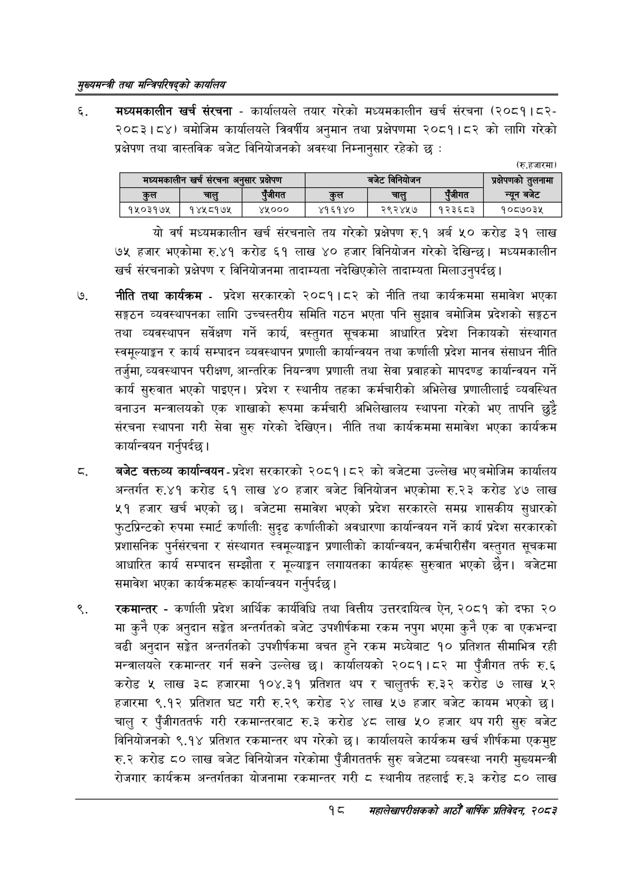

# Page 40 QA

## Rendered page


## Extracted text

```text
सुख्यसन्त्री तथा सन्तिपरिषद्को कायलिय
मध्यमकालीन खर्च संरचना -कार्यालयले तयार गरेको मध्यमकालीन खर्च संरचना (२०८१।८२२०८३।८४) बमोजिम कार्यालयले त्रिवर्षीय अनुमान तथा प्रक्षेपणमा २०८१।८२ को लागि गरेको प्रक्षेपण तथा वास्तविक बजेट विनियोजनको अवस्था निम्नानुसार रहेको छ:
(रु.हजारमा)
यो वर्ष मध्यमकालीन खर्च संरचनाले तय गरेको प्रक्षेपण रु.१ अर्ब करोड ३९ लाख ७५ हजार भएकोमा रु.४१ करोड ६१ लाख ४० हजार विनियोजन गरेको देखिन्छ। मध्यमकालीन खर्च संरचनाको प्रक्षेपण र विनियोजनमा तादाम्यता नदेखिएकोले तादाम्यता मिलाउनुपर्दछ।
नीति तथा कार्यक्रम -प्रदेश सरकारको २०८१।८२ को नीति तथा कार्यक्रममा समावेश भएका सङ्गठन व्यवस्थापनका लागि उच्चस्तरीय समिति गठन भएता पनि सुझाव बमोजिम प्रदेशको सङ्गठन तथा व्यवस्थापन सर्वेक्षण गर्ने कार्य, वस्तुगत सूचकमा आधारित प्रदेश निकायको संस्थागत स्वमूल्याङ्गन र कार्य सम्पादन व्यवस्थापन प्रणाली कार्यान्वयन तथा कर्णाली प्रदेश मानव संसाधन नीति तर्जुमा, व्यवस्थापन परीक्षण, आन्तरिक नियन्त्रण प्रणाली तथा सेवा प्रवाहको मापदण्ड कार्यान्वयन गर्ने कार्य सुरुवात भएको पाइएन। प्रदेश र स्थानीय तहका कर्मचारीको अभिलेख प्रणालीलाई व्यवस्थित बनाउन मन्त्रालयको एक शाखाको रूपमा कर्मचारी अभिलेखालय स्थापना गरेको भए तापनि छुट्टै संरचना स्थापना गरी सेवा सुरु गरेको देखिएन। नीति तथा कार्यक्रममा समावेश भएका कार्यक्रम कार्यान्वयन गर्नुपर्दछ |
बजेट वक्तव्य कार्यान्वयन -प्रदेश सरकारको २०८१।८२ को बजेटमा उल्लेख भए बमोजिम कार्यालय अन्तर्गत रु.४१ करोड ६१ लाख ४० हजार बजेट विनियोजन भएकोमा रु.२३ करोड ४७ लाख ५१ हजार खर्च भएको | बजेटमा समावेश भएको प्रदेश सरकारले समग्र शासकीय सुधारको फुटप्रिन्टको रुपमा स्मार्ट कर्णाली: सुदृढ कर्णालीको अवधारणा कार्यान्वयन गर्ने कार्य प्रदेश सरकारको प्रशासनिक पुर्नसंरचना र संस्थागत स्वमूल्याङ्कगन प्रणालीको कार्यान्वयन, कर्मचारीसँग वस्तुगत सूचकमा आधारित कार्य सम्पादन सम्झौता र मूल्याङ्कन लगायतका कार्यहरू सुरुवात भएको छैन। बजेटमा समावेश भएका कार्यक्रमहरू कार्यान्वयन गर्नुपर्दछ।
रकमान्तर -कर्णाली प्रदेश आर्थिक कार्यविधि तथा वित्तीय उत्तरदायित्व ऐन, २०८१ को दफा २० मा कुनै एक अनुदान सङ्गेत अन्तर्गतको बजेट उपशीर्षकमा रकम नपुग भएमा कुनै एक वा एकभन्दा बढी अनुदान सङ्गेत अन्तर्गतको उपशीर्षकमा बचत हुने रकम मध्येबाट १० प्रतिशत सीमाभित्र रही मन्त्रालयले रकमान्तर गर्न सक्ने उल्लेख छ। कार्यालयको २०८१।८२ मा पुँजीगत तर्फ रु.६ करोड लाख ३८ हजारमा १०४.३१ प्रतिशत थप र चालुतर्फ रु.३२२ करोड ७ लाख ५२ हजारमा ९.१२ प्रतिशत घट गरी रु.२९ करोड २४ लाख ५७ हजार बजेट कायम भएको छ। चालु र पुँजीगततर्फ गरी रकमान्तरबाट रु.३ करोड ४८ लाख ५० हजार थप गरी सुरु बजेट विनियोजनको ९.१४ प्रतिशत रकमान्तर थप गरेको छ। कार्यालयले कार्यक्रम खर्च शीर्षकमा एकमुष्ट रु.२ करोड ८० लाख बजेट विनियोजन गरेकोमा पुँजीगततर्फ सुरु बजेटमा व्यवस्था नगरी मुख्यमन्त्री रोजगार कार्यक्रम अन्तर्गतका योजनामा रकमान्तर गरी ८ स्थानीय तहलाई रु.३ करोड ८० लाख
१८
सहालेखापरीक्षकको आठौँ वा्िकि प्रतिवेदन २०८२

| मध्यमकालीन खर्च संरचना अनुसार प्रक्षेपण   | मध्यमकालीन खर्च संरचना अनुसार प्रक्षेपण   | बजेट विनियोजन   | बजेट विनियोजन   | बजेट विनियोजन   | प्रक्षेपणको तुलनामा   |
|-------------------------------------------|-------------------------------------------|-----------------|-----------------|-----------------|-----------------------|
| कुल                                       | चालु                                      | कुल             | चालु            | पुँजीगत         | न्यून बजेट            |
| १५०३१७५                                   | १४५८१७१५                                  | ४१६१४०          | २९२४५७          | १२३६८३          | १०८७०३४५              |
```

## Flags
- table_page
