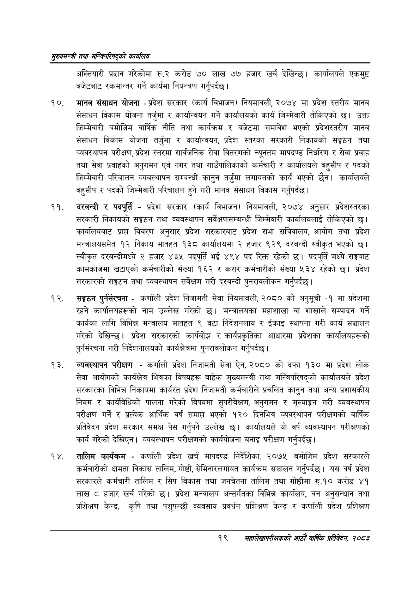

# Page 41 QA

## Rendered page


## Extracted text

```text
सुख्यसन्त्री तथा सन्तिपरिषद्को कायलिय
अख्तियारी प्रदान गरेकोमा रु.२ करोड ७० लाख ७७ हजार खर्च देखिन्छ। कार्यालयले एकमुष्ट बजेटबाट रकमान्तर गर्ने कार्यमा नियन्त्रण गर्नुपर्दछ |
मानव संसाधन योजना -प्रदेश सरकार (कार्य विभाजन) नियमावली, २०७४ मा प्रदेश स्तरीय मानव संसाधन विकास योजना तर्जुमा र कार्यान्वयन गर्ने कार्यालयको कार्य जिम्मेवारी तोकिएको छ। उक्त जिम्मेवारी बमोजिम वार्षिक नीति तथा कार्यक्रम र बजेटमा समावेश भएको प्रदेशस्तरीय मानव संसाधन विकास योजना तर्जुमा र कार्यान्वयन, प्रदेश स्तरका सरकारी निकायको सङ्गठन तथा व्यवस्थापन परीक्षण, प्रदेश स्तरमा सार्वजनिक सेवा वितरणको न्यूनतम मापदण्ड निर्धारण र सेवा प्रवाह तथा सेवा प्रवाहको अनुगमन एवं नगर तथा गाउँपालिकाको कर्मचारी र कार्यालयले बहुसीप र पदको जिम्मेवारी परिचालन व्यवस्थापन सम्बन्धी कानुन तर्जुमा लगायतको कार्य भएको छैन। कार्यालयले बहुसीप र पदको जिम्मेवारी परिचालन हुने गरी मानव संसाधन विकास गर्नुपर्दछ |
दरबन्दी र पदपूर्ति -प्रदेश सरकार (कार्य विभाजन) नियमावली, २०७४ अनुसार प्रदेशस्तरका सरकारी निकायको सङ्गठन तथा व्यवस्थापन सर्वेक्षणसम्बन्धी जिम्मेवारी कार्यालयलाई तोकिएको | कार्यालयबाट प्राप्त विवरण अनुसार प्रदेश सरकारबाट प्रदेश सभा सचिवालय, आयोग तथा प्रदेश मन्त्रालयसमेत १२ निकाय मातहत १३८ कार्यालयमा २ हजार ९२९ दरबन्दी स्वीकृत भएको छ। स्वीकृत दरबन्दीमध्ये २ हजार ४३५ पदपूर्ति भई ४९४ पद रिक्त रहेको छ। पदपूर्ति मध्ये सङ्घबाट कामकाजमा खटाएको कर्मचारीको संख्या १६२ र करार कर्मचारीको संख्या «३४ रहेको छ। प्रदेश सरकारको सङ्गठन तथा व्यवस्थापन सर्वेक्षण गरी दरवन्दी पुनरावलोकन गर्नुपर्दछ |
सङ्गठन पुर्नसंरचना -कर्णाली प्रदेश निजामती सेवा नियमावली, २०८० को अनुसूची -१ मा प्रदेशमा रहने कार्यालयहरूको नाम उल्लेख गरेको छ। मन्त्रालयका महाशाखा वा शाखाले सम्पादन गर्ने कार्यका लागि विभिन्न मन्त्रालय मातहत ९ वटा निर्देशनलाय र ईकाइ स्थापना गरी कार्य सञ्चालन गरेको देखिन्छ। प्रदेश सरकारको कार्यबोझ र कार्यप्रकृतिका आधारमा प्रदेशका कार्यालयहरूको पुर्नसंरचना गरी निर्देशनालयको कार्यक्षेत्रमा पुनरावलोकन गर्नुपर्दछ |
व्यवस्थापन परीक्षण -कर्णाली प्रदेश निजामती सेवा ऐन, २०८० को दफा १३० मा प्रदेश लोक सेवा आयोगको कार्यक्षेत्र भित्रका विषयहरू बाहेक मुख्यमन्त्री तथा मन्त्रिपरिषद्को कार्यालयले प्रदेश सरकारका विभिन्न निकायमा कार्यरत प्रदेश निजामती कर्मचारीले प्रचलित कानुन तथा अन्य प्रशासकीय नियम र कार्यविधिको पालना गरेको विषयमा सुपरीवेक्षण, अनुगमन र मूल्याङ्कन गरी व्यवस्थापन परीक्षण गर्ने र प्रत्यक आर्थिक वर्ष समाप्त भएको १२० दिनभित्र व्यवस्थापन परीक्षणको वार्षिक प्रतिवेदन प्रदेश सरकार समक्ष पेस गर्नुपर्ने उल्लेख छ। कार्यालयले यो वर्ष व्यवस्थापन परीक्षणको कार्य गरेको देखिएन। व्यवस्थापन परीक्षणको कार्ययोजना बनाइ परीक्षण गर्नुपर्दछ |
तालिम कार्यक्रम -कर्णाली प्रदेश खर्च मापदण्ड निर्देशिका, २०७५ बमोजिम प्रदेश सरकारले कर्मचारीको क्षमता विकास तालिम, गोष्ठी, सेमिनारलगायत कार्यक्रम सञ्चालन गर्नुपर्दछ। यस वर्ष प्रदेश सरकारले कर्मचारी तालिम र सिप विकास तथा जनचेतना तालिम तथा गोष्ठीमा रु.१० करोड ४१ लाख ८ हजार खर्च गरेको छ। प्रदेश मन्त्रालय अन्तर्गतका विभिन्न कार्यालय, वन अनुसन्धान तथा प्रशिक्षण केन्द्र, कृषि तथा पशुपन्छी व्यवसाय प्रवर्धन प्रशिक्षण केन्द्र र कर्णाली प्रदेश प्रशिक्षण
१९
सहालेखापरीक्षकको वाषिक प्रतिवेदन २०८२
```

## Flags
- None
