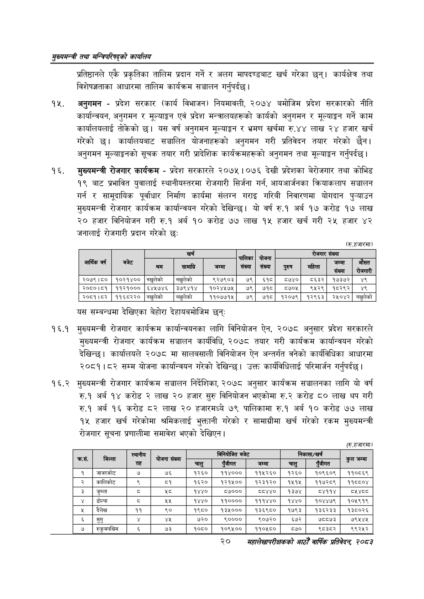

# Page 42 QA

## Rendered page


## Extracted text

```text
सुख्यसन्त्री तथा सन्तिपरिषद्को कायलिय
प्रतिष्ठानले एकै प्रकृतिका तालिम प्रदान गर्ने र अलग मापदण्डबाट खर्च गरेका छन्‌। कार्यक्षेत्र तथा विशेषज्ञताका आधारमा तालिम कार्यक्रम सञ्चालन गर्नुपर्दछ |
अनुगमन -प्रदेश सरकार (कार्य विभाजन) नियमावली, २०७४ बमोजिम प्रदेश सरकारको नीति कार्यान्वयन, अनुगमन र मूल्याङ्कन एवं प्रदेश मन्त्रालयहरूको कार्यको अनुगमन र मूल्याङ्कन गर्ने काम कार्यालयलाई तोकेको छ। यस वर्ष अनुगमन मूल्याङ्कन र भ्रमण खर्चमा रु.४४ लाख २४ हजार खर्च गरेको छ। कार्यालयबाट सञ्चालित योजनाहरूको अनुगमन गरी प्रतिवेदन तयार गरेको छैन। अनुगमन मूल्याङ्कनको सूचक तयार गरी प्रादेशिक कार्यक्रमहरूको अनुगमन तथा मूल्याङ्कन गर्नुपर्दछ |
मुख्यमन्त्री रोजगार कार्यक्रम -प्रदेश सरकारले २०७५ | ०९§ देखी प्रदेशका वेरोजगार तथा कोभिड १९ बाट प्रभावित युवालाई स्थानीयस्तरमा रोजगारी सिर्जना गर्न, आयआर्जनका क्रियाकलाप सञ्चालन गर्न र सामूदायिक पूर्वाधार निर्माण कार्यमा संलग्न गराइ गरिबी निवारणमा योगदान पुन्याउन मुख्यमन्त्री रोजगार कार्यक्रम कार्यान्वयन गरेको देखिन्छ। यो वर्ष रु.१ अर्ब १७ करोड १७ लाख २० हजार विनियोजन गरी रु.१ अर्ब १० करोड ७७ लाख १५ हजार खर्च गरी २५ हजार ४२ जनालाई रोजगारी प्रदान गरेको छः
(रु.हजारमा)
यस सम्बन्धमा देखिएका बेहोरा देहायबमोजिम छन्‌ः
१६.१ मुख्यमन्त्री रोजगार कार्यक्रम कार्यान्वयनका लागि विनियोजन ऐन, २०७८ अनुसार प्रदेश सरकारले मुख्यमन्त्री रोजगार कार्यक्रम सञ्चालन कार्यविधि, २०७८ तयार गरी कार्यक्रम कार्यान्वयन गरेको देखिन्छ। कार्यालयले २०७८ मा सालबसाली विनियोजन ऐन अन्तर्गत वनेको कार्यविधिका आधारमा २०८१।८२ सम्म योजना कार्यान्वयन गरेको देखिन्छ। उक्त कार्यविधिलाई परिमार्जन गर्नुपर्दछ |
१६.२ मुख्यमन्त्री रोजगार कार्यक्रम सञ्चालन निर्देशिका, २०७८ अनुसार कार्यक्रम सञ्चालनका लागि यो वर्ष रु.१ अर्ब १४ करोड २ लाख २० हजार सुरु विनियोजन भएकोमा रु.२ करोड ८० लाख थप गरी रु.१ अर्ब १६ करोड ८२ लाख २० हजारमध्ये ७९ पालिकामा रु.१ अर्ब १० करोड ७७ लाख १५ हजार खर्च गरेकोमा श्रमिकलाई भुक्तानी गरेको र सामाग्रीमा खर्च गरेको रकम मुख्यमन्त्री रोजगार सूचना प्रणालीमा समावेश भएको देखिएन |
(रु.हजारमा)
२०
सहालेखापरीक्षकको आठौँ वार्षिक प्रतिवेदन २०८२

|  |  |  | खर्च |  |  | योजना |  | रोजगार | सँख्या |  |
| --- | --- | --- | --- | --- | --- | --- | --- | --- | --- | --- |
| आर्थिक वर्ष | बजेट | श्रम | सामाग्रि | जम्मा | संख्या | $:० संख्या | पुरुष पुल | महिला | जम्मा संख्या | औसत रोजगारी |
| २०७९।८० | १०२१४०० | नखुलेको | नखुलेको | ९२७९०३ | ७९ | ६१५८ | ०७४० | ८६३२ | १७३७२ | ४९ |
| २०८०।८१ | ११२१००० | ६४५७४६ | ३७९४१४ | १०२४५७५ | ७९ | ७१८ | ८७०५ | ९५२९ | १८२९२ | ४९ |
| २०८१।८२ | ११६८२२० | नखुलेको | नखुलेको | ११०७७१५ | ७९ | ७१८ | १२०७९ | १२९६३ | २५०४२ | नखुलेको |

|  | ता | \| अ[ |  |  | बिनकाजत बजेट |  |  | 'निकासा/खर्च |  |
| --- | --- | --- | --- | --- | --- | --- | --- | --- | --- |
|  |  |  | छतय |  |  | जम्मा | चालु | एजीगत | कुल जम्मा |
| १ | जाजरकोट | ७ | ७६ | १२६० | ११४००० | ११५२६० | १२६० | १०९६०९ | ११०८६९ |
| २ | कालिकोट | ९ | ५९ | १६२० | १२१५०० | १२३१२० | १५१५ | ११७२८९ | ११८५०४ |
| ३ | जुम्ला | ५ |  | १४४० | ८७००० | ८४४० | १३७४ | ४११४ |  |
|  | डोल्पा | ३ | २५ | १४४० | ११०००० | १११४४० | १४४० | १०४४७९ | १०५९१९ |
| ५ | दैलेख | ११ | <० | १९६० | ४३००० | १३६९८० | १७९३ | १३६२३३ | १३८०२६ |
| ६ | मुगु |  |  | ७२० | २०००० | २०६३० | ६७२ | ७८८७३ | ७९५४४५ |
| ७ | र्कुमपछ्चिम | ५ | ७३ | १०८० | १०९५०० | ११०५८० | ८७० | ९८३८२ | १९९२५२ |
```

## Flags
- table_page
- medium_quality_table
