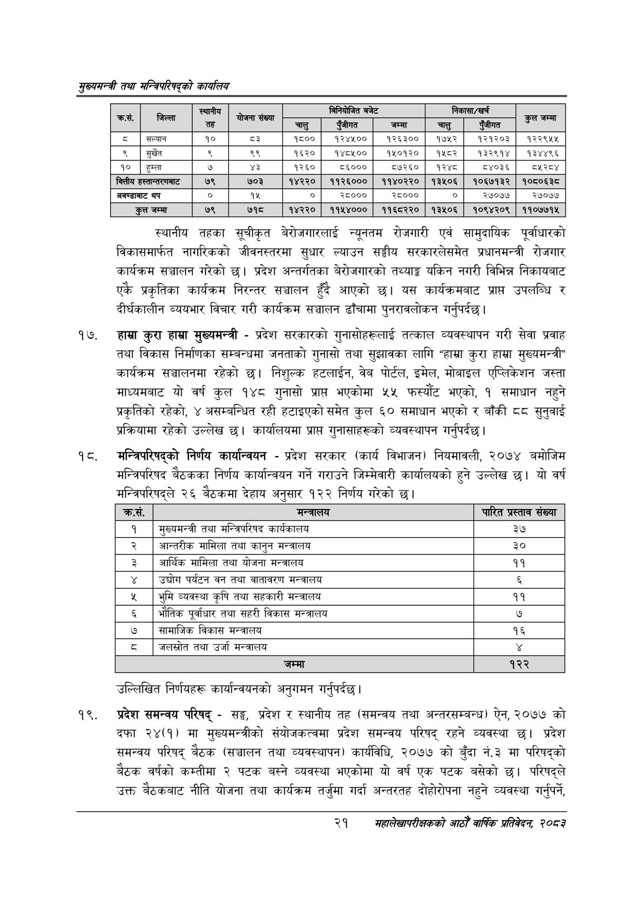

# Page 43 QA

## Rendered page


## Extracted text

```text
सुख्यसन्त्री तथा सन्तिपरिषद्को कायलिय
स्थानीय तहका सूचीकृत बेरोजगारलाई न्यूनतम रोजगारी एवं सामुदायिक पूर्वाधारको विकासमार्फत नागरिकको जीवनस्तरमा सुधार ल्याउन सङ्घीय सरकारलेसमेत प्रधानमन्त्री रोजगार कार्यक्रम सञ्चालन गरेको छ। प्रदेश अन्तर्गतका बेरोजगारको तथ्याङ्क यकिन नगरी विभिन्न निकायबाट एकै प्रकृतिका कार्यक्रम निरन्तर सञ्चालन हुँदै आएको छ। यस कार्यक्रमबाट प्राप्त उपलब्धि र दीर्घकालीन व्ययभार विचार गरी कार्यक्रम सञ्चालन ढाँचामा पुनरावलोकन गर्नुपर्दछ |
हाम्रा कुरा हाम्रा मुख्यमन्त्री -प्रदेश सरकारको गुनासोहरूलाई तत्काल व्यवस्थापन गरी सेवा प्रवाह तथा विकास निर्माणका सम्बन्धमा जनताको गुनासो तथा सुझावका लागि "हाम्रा कुरा हाम्रा मुख्यमन्त्री" कार्यक्रम सञ्चालनमा रहेको छ। निशुल्क हटलाईन, वेब पोर्टल, इमेल, मोबाइल एप्लिकेशन जस्ता माध्यमबाट यो वर्ष कुल १४८ गुनासो प्रास भएकोमा ५५ फस्यौट भएको, १ समाधान नहुने प्रकृतिको रहेको, ४ असम्बन्धित रही हटाइएको समेत कुल ६० समाधान भएको र बाँकी ५ सुनुवाई प्रक्रियामा रहेको उल्लेख | कार्यालयमा प्राप्त गुनासाहरूको व्यवस्थापन गर्नुपर्दछ |
१८, मन्त्रिपरिषद्को निर्णय कार्यान्वयन -प्रदेश सरकार (कार्य विभाजन) नियमावली, २०७४ बमोजिम मन्त्रिपरिषद बैठकका निर्णय कार्यान्वयन गर्ने गराउने जिम्मेवारी कार्यालयको हुने उल्लेख छ। यो वर्ष मन्त्रिपरिषद्ले २६ बैठकमा देहाय अनुसार १२२ निर्णय गरेको छ।
उल्लिखित निर्णयहरू कार्यान्वयनको अनुगमन गर्नुपर्दछ।
प्रदेश समन्वय परिषद्‌ -सङ्ग, प्रदेश र स्थानीय तह (समन्वय तथा अन्तरसम्बन्ध) ऐन, २०७७ को दफा २४(१) मा मुख्यमन्त्रीको संयोजकत्वमा प्रदेश समन्वय परिषद्‌ रहने व्यवस्था छ। प्रदेश समन्वय परिषद्‌ बैठक (सञ्चालन तथा व्यवस्थापन) कार्यविधि, २०७७ को बुँदा नं.३ मा परिषद्को बैठक वर्षको कम्तीमा २ पटक बस्ने व्यवस्था भएकोमा यो वर्ष एक पटक बसेको छ। परिषद्ले उक्त बैठकबाट नीति योजना तथा कार्यक्रम तर्जुमा गर्दा अन्तरतह दोहोरोपना नहुने व्यवस्था गर्नुपर्ने,
२१
सहालेखापरीक्षकको वाषिक प्रतिवेदन २०८२

| कस, | जिल्ला | स्थानीय | योजना संख्या |  | निनकोजित बजेट |  |  | 'निकासा/खर्च |  |
| --- | --- | --- | --- | --- | --- | --- | --- | --- | --- |
|  |  | तह |  | चालु | एंजीगत | जम्मा | चालु | रंजीगत | रज |
| ड | सल्यान | १० | ३ | ९५०० | १२४५०० | १२६३०० | १७५२ | १२१२०३ | १२२९५४५ |
| ९ | सुर्खेत |  | ९९ | १६२० | १४८५०० | १५०१२० | १४८२ | १३२९१४ | १३४४९६ |
| १० | हुम्ला | ७ | ४३ | १२६० | ५५००० | ५८७२६० | १२४८ | ८४०३६ | ८१२८४ |
| वित्तीय | छल्ता"तरनाट | ७९ | ७०३ | १४२२० | ११२६००० | ११४०२२० | १३५०६ | १०६७१३२ | १०८०६३८ |
| अवन्डाबाट | थप | ० | १५ | ० | २८००० | २८००० | ० | २७०७७ | र२७०७४ |
|  | कुल जम्मा | ७९ | ७१८ | १४२२० | ११५४००० | ११६८२२० | १३५०६ | १०९४२०९ | ११०७७१५ |

| कस. | सन्तासय | पारित प्रस्ताव संख्या |
| --- | --- | --- |
| १ | मनुल्बमन्त्री तथा मन्त्रिपरिषद कार्यकाल | ३७ |
| २ | आन्तरीक मामिला तथा कानुन भन्त्रालय | ३० |
| ३ | आर्थिक मामिला तथा योजना भन्नासाथ | ११ |
| ४ | उद्योग पर्यटन वन तथा वातावरण अन्त्रालय | ३ |
| ५ | भुमि व्यवस्था कृषि तथा क्षहकारी मन्त्रालय | ११ |
| ६ | भौतिक पूर्वाधार तथा सहरी विकास भन्त्रालय | ७ |
| ७ | तामाजिक विकास मन्त्रालय | १६ |
| ८ | जललोत तथा उर्जा भन्त्रालय |  |
| ९ | जम्मा | १२२ |
```

## Flags
- table_page
- medium_quality_table
