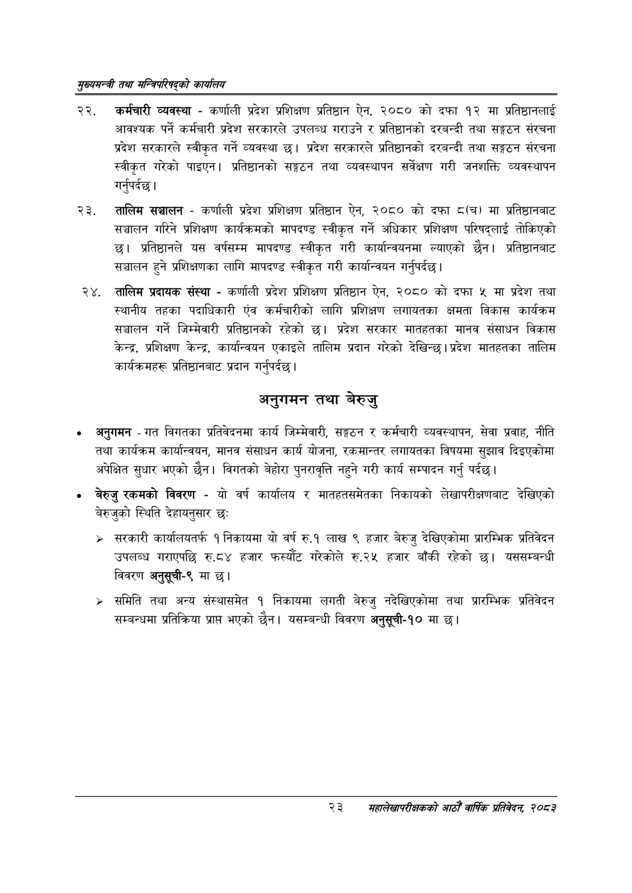

# Page 45 QA

## Rendered page


## Extracted text

```text
सुख्यसन्त्री तथा सन्तिपरिषद्को कायलिय
कर्मचारी व्यवस्था -कर्णाली प्रदेश प्रशिक्षण प्रतिष्ठान ऐन, २०८० को दफा १२ मा प्रतिष्ठानलाई आवश्यक पर्ने कर्मचारी प्रदेश सरकारले उपलब्ध गराउने र प्रतिष्ठानको दरबन्दी तथा सङ्गठन संरचना प्रदेश सरकारले स्वीकृत गर्ने व्यवस्था छ। प्रदेश सरकारले प्रतिष्ठानको दरबन्दी तथा सङ्गठन संरचना स्वीकृत गरेको पाइएन। प्रतिष्ठानको सङ्गठन तथा व्यवस्थापन सर्वेक्षण गरी जनशक्ति व्यवस्थापन गर्नुपर्दछ |
तालिम सञ्चालन -कर्णाली प्रदेश प्रशिक्षण प्रतिष्ठान ऐन, २०८० को दफा () मा प्रतिष्ठानबाट सञ्चालन गरिने प्रशिक्षण कार्यक्रमको मापदण्ड स्वीकृत गर्ने अधिकार प्रशिक्षण परिषद्लाई तोकिएको छ। प्रतिष्ठानले यस वर्षसम्म मापदण्ड स्वीकृत गरी कार्यान्वयनमा ल्याएको छैन। प्रतिष्ठानबाट सञ्चालन हुने प्रशिक्षणका लागि मापदण्ड स्वीकृत गरी कार्यान्वयन गर्नुपर्दछ |
तालिम प्रदायक संस्था -कर्णाली प्रदेश प्रशिक्षण प्रतिष्ठान ऐन, २०८० को दफा ५ मा प्रदेश तथा स्थानीय तहका पदाधिकारी एंव कर्मचारीको लागि प्रशिक्षण लगायतका क्षमता विकास कार्यक्रम सञ्चालन गर्ने जिम्मेवारी प्रतिष्ठानको रहेको छ। प्रदेश सरकार मातहतका मानव संसाधन विकास केन्द्र, प्रशिक्षण केन्द्र, कार्यान्वयन एकाइले तालिम प्रदान गरेको देखिन्छ। प्रदेश मातहतका तालिम कार्यक्रमहरू प्रतिष्ठानबाट प्रदान गर्नुपर्दछ |
अनुगमन तथा बेरुजु
० अनुगमन -गत विगतका प्रतिवेदनमा कार्य जिम्मेवारी, सङ्गठन र कर्मचारी व्यवस्थापन, सेवा प्रवाह, नीति तथा कार्यक्रम कार्यान्वयन, मानव संसाधन कार्य योजना, रकमान्तर लगायतका विषयमा सुझाव दिइएकोमा अपेक्षित सुधार भएको छैन। विगतको बेहोरा पुनरावृत्ति नहुने गरी कार्य सम्पादन गर्नु पर्दछ।
बेरुजु रकमको विवरण -यो वर्ष कार्यालय र मातहतसमेतका निकायको लेखापरीक्षणबाट देखिएको बेरुजुको स्थिति देहायनुसार छः:
> सरकारी कार्यालयतर्फ १ निकायमा यो वर्ष रु.१ लाख ९ हजार बेरुजु देखिएकोमा प्रारम्भिक प्रतिवेदन उपलब्ध गराएपछि रु.८४ हजार फस्यौट गरेकोले रु.२५ हजार बाँकी रहेको छ। यससम्बन्धी विवरण अनुसूची-९ मा छ।
समिति तथा अन्य संस्थासमेत १ निकायमा लगती बेरुजु नदेखिएकोमा तथा प्रारम्भिक प्रतिवेदन सम्बन्धमा प्रतिक्रिया प्राप भएको छैन। यसम्बन्धी विवरण अनुसूची-१० मा |
२३
सहालेखापरीक्षकको वाषिक प्रतिवेदन २०८२
```

## Flags
- None
