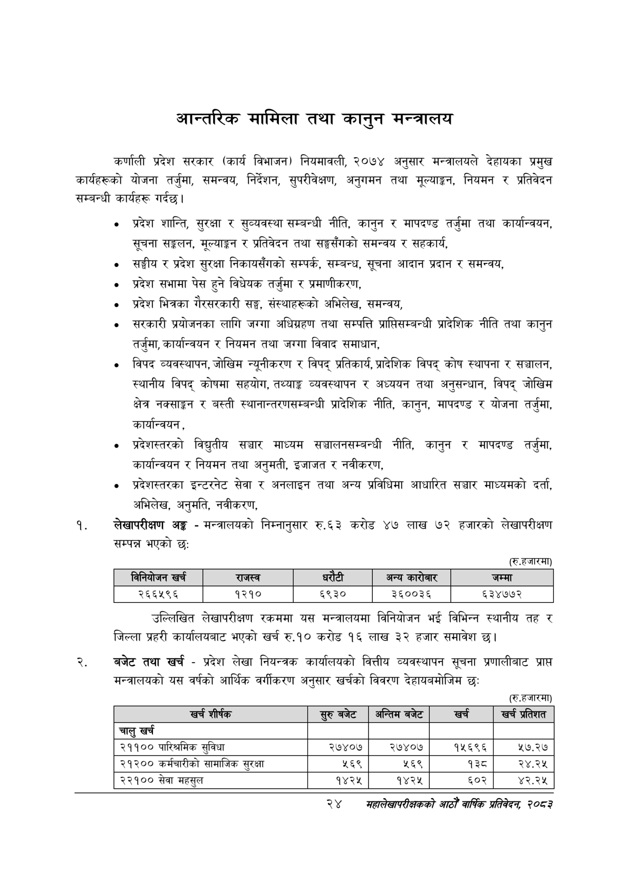

# Page 46 QA

## Rendered page


## Extracted text

```text
आन्तरिक मामिला तथा कानुन मन्त्रालय
कर्णाली प्रदेश सरकार (कार्य विभाजन) नियमावली, २०७४ अनुसार मन्त्रालयले देहायका प्रमुख कार्यहरूको योजना तर्जुमा, समन्वय, निर्देशन, सुपरीवेक्षण, अनुगमन तथा मूल्याङ्गन, नियमन र प्रतिवेदन सम्बन्धी कार्यहरू गर्दछ।
० प्रदेश शान्ति, सुरक्षा र सुव्यवस्था सम्बन्धी नीति, कानुन र मापदण्ड तर्जुमा तथा कार्यान्वयन, सूचना सङ्कलन, मूल्याङ्कन र प्रतिवेदन तथा सङ्घसँगको समन्वय र सहकार्य,
० सङ्घीय र प्रदेश सुरक्षा निकायसँगको सम्पर्क, सम्बन्ध, सूचना आदान प्रदान र समन्वय,
० प्रदेश सभामा पेस हुने विधेयक तर्जुमा र प्रमाणीकरण,
० प्रदेश भित्रका गैरसरकारी सङ्ग, संस्थाहरूको अभिलेख, समन्वय,
० सरकारी प्रयोजनका लागि जग्गा अधिग्रहण तथा सम्पत्ति प्रापतिसम्बन्धी प्रादेशिक नीति तथा कानुन तर्जुमा, कार्यान्वयन र नियमन तथा जग्गा विवाद समाधान,
० विपद व्यवस्थापन, जोखिम न्यूनीकरण र विपद्‌ प्रतिकार्य, प्रादेशिक विपद्‌ कोष स्थापना र सञ्चालन, स्थानीय विपद्‌ कोषमा सहयोग, तथ्याङ्क व्यवस्थापन र अध्ययन तथा अनुसन्धान, विपद्‌ जोखिम क्षेत्र नक्साङ्कन र बस्ती स्थानान्तरणसम्बन्धी प्रादेशिक नीति, कानुन, मापदण्ड र योजना तर्जुमा, कार्यान्वयन,
प्रदेशस्तरको विद्युतीय सञ्चार माध्यम सञ्चालनसम्बन्धी नीति, कानुन र मापदण्ड तर्जुमा, कार्यान्वयन र नियमन तथा अनुमती, इजाजत र नवीकरण,
० प्रदेशस्तरका इन्टरनेट सेवा र अनलाइन तथा अन्य प्रविधिमा आधारित सञ्चार माध्यमको दर्ता, अभिलेख, अनुमति, नवीकरण,
लेखापरीक्षण अङ्ग -मन्त्रालयको निम्नानुसार रु.६३ करोड ४७ लाख ७२ हजारको लेखापरीक्षण सम्पन्न भएको छ:
(रु.हजारमा)
उल्लिखित लेखापरीक्षण रकममा यस मन्त्रालयमा विनियोजन भई विभिन्न स्थानीय तह र जिल्ला प्रहरी कार्यालयबाट भएको खर्च रु.१० करोड १६ लाख ३२ हजार समावेश छ।
बजेट तथा खर्च -प्रदेश लेखा नियन्त्रक कार्यालयको वित्तीय व्यवस्थापन सूचना प्रणालीबाट प्राप्त मन्त्रालयको यस वर्षको आर्थिक वर्गीकरण अनुसार खर्चको विवरण देहायबमोजिम छः:
सुरुबट
[अन्तिमबजेट
खर्च]
(रु.हजारमा)
खर्च
प्रतिशत
२४
सहालेखापरीक्षकको आठौँ वा्िकि प्रतिवेदन २०८२

|  |  | बिनिकोजन खरी |  | राजस्व | धरटी |  | अन्य कासेणार | जम्मा |
| --- | --- | --- | --- | --- | --- | --- | --- | --- |
|  |  | २६६५९६ |  | १२१० | ६९३० |  | ३६००३६ | ६३४७७२ |

| खर्च शीर्षक | सुरु बबेट | अन्तिम बजेट | खर्च | खर्च प्रतिशत |
| --- | --- | --- | --- | --- |
| चालु खर्च |  |  |  |  |
| २११०० पारिश्रमिक सुविधा | २७४०७ | २७४०७ | १५६९६ | २७.२७ |
| २१२०० कर्मचारीको सामाजिक सुरक्षा | २५६९ | २६९ | १३८ | २४.२५ |
| २२१०० सेवा महसुल | १४२५ | १४२५ | ६०२ | ४२.२५ |
```

## Flags
- table_page
- medium_quality_table
