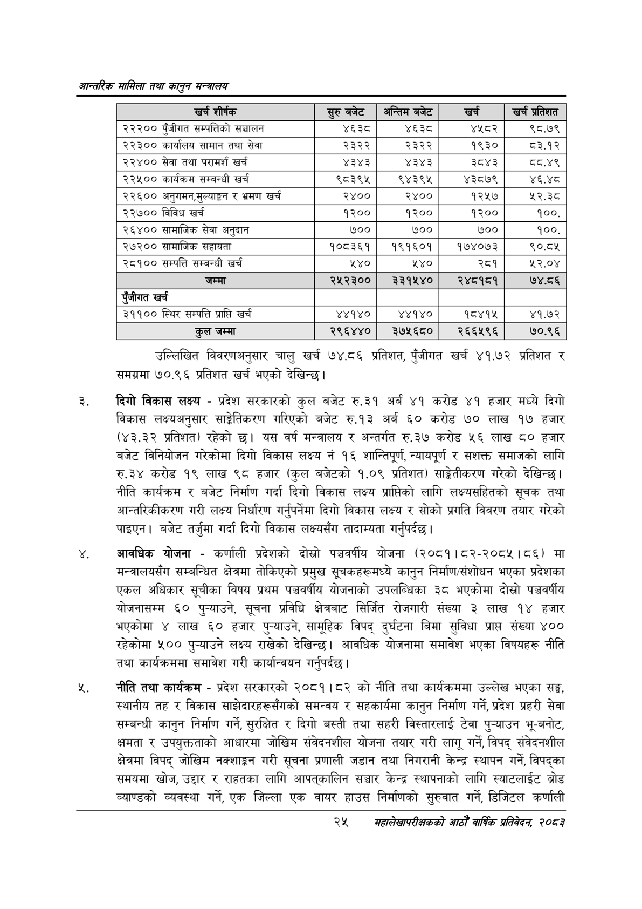

# Page 47 QA

## Rendered page


## Extracted text

```text
आन्तरिक सामिला तथा कालुन सन्बालय
उल्लिखित विवरणअनुसार चालु खर्च १९५४.८६ प्रतिशत, पुँजीगत खर्च ४१.७२ प्रतिशत र समग्रमा ७०.९६ प्रतिशत खर्च भएको देखिन्छ।
दिगो विकास लक्ष्य -प्रदेश सरकारको कुल बजेट रु.३१ अर्ब ४१ करोड ४१ हजार मध्ये दिगो विकास लक्ष्यअनुसार साङ्गेतिकरण गरिएको बजेट रु.१३ अर्ब ६० करोड ७० लाख १७ हजार (४३.३२ प्रतिशत) रहेको छ। यस वर्ष मन्त्रालय र अन्तर्गत रु.३७ करोड ५६ लाख ८० हजार बजेट विनियोजन गरेकोमा दिगो विकास लक्ष्य नं १६ शान्तिपूर्ण, न्यायपूर्ण र सशक्त समाजको लागि रु.३४ करोड १९ लाख ९८ हजार (कुल बजेटको १.०९ प्रतिशत) साङ्गेतीकरण गरेको देखिन्छ। नीति कार्यक्रम र बजेट निर्माण गर्दा दिगो विकास लक्ष्य प्राप्तिको लागि लक्ष्यसहितको सूचक तथा आन्तरिकीकरण गरी लक्ष्य निर्धारण गर्नुपर्नेमा दिगो विकास लक्ष्य र सोको प्रगति विवरण तयार गरेको पाइएन। बजेट तर्जुमा गर्दा दिगो विकास लक्ष्यसँग तादाम्यता गर्नुपर्दछ |
आवधिक योजना -कर्णाली प्रदेशको दोस्रो पञ्चवर्षीय योजना (२०८१।८२-२०८५।८६) मा मन्त्रालयसँग सम्बन्धित क्षेत्रमा तोकिएको प्रमुख सूचकहरूमध्ये कानुन निर्माण/संशोधन भएका प्रदेशका एकल अधिकार सूचीका विषय प्रथम पञ्चवर्षीय योजनाको उपलब्धिका ३८ भएकोमा दोस्रो पञ्चवर्षीय योजनासम्म ६० पुन्याउने, सूचना प्रविधि क्षेत्रबाट सिर्जित रोजगारी संख्या ३ लाख १४ हजार भएकोमा ४ लाख ६० हजार पुन्याउने, सामूहिक विपद्‌ दुर्घटना बिमा सुविधा प्राप्त संख्या ४०० रहेकोमा ५०० पुन्याउने लक्ष्य राखेको देखिन्छ। आवधिक योजनामा समावेश भएका विषयहरू नीति तथा कार्यक्रममा समावेश गरी कार्यान्वयन गर्नुपर्दछ |
नीति तथा कार्यक्रम -प्रदेश सरकारको २०८१।८२ को नीति तथा कार्यक्रममा उल्लेख भएका सङ्ग, स्थानीय तह र विकास साझेदारहरूसँगको समन्वय र सहकार्यमा कानुन निर्माण गर्ने, प्रदेश प्रहरी सेवा सम्बन्धी कानुन निर्माण गर्ने, सुरक्षित र दिगो बस्ती तथा सहरी विस्तारलाई टेवा पुन्याउन भू-बनोट, क्षमता र उपयुक्तताको आधारमा जोखिम संवेदनशील योजना तयार गरी लागू गर्ने, विपद्‌ संवेदनशील क्षेत्रमा विपद्‌ जोखिम नक्शाङ्गन गरी सूचना प्रणाली जडान तथा निगरानी केन्द्र स्थापन गर्ने, विपद्का समयमा खोज, उद्दार र राहतका लागि आपत्‌कालिन सञ्चार केन्द्र स्थापनाको लागि स्याटलाईट ब्रोड व्याण्डको व्यवस्था गर्ने, एक जिल्ला एक वायर हाउस निर्माणको सुरुवात गर्ने, डिजिटल कर्णाली
२४
सहालेखापरीक्षकको आठौँ वाक प्रतिवेदन २०८२

| खर्च शीर्षक | र्रुबजेट | अन्तिम बजेट | खरी | खर्च प्रतिशत |
| --- | --- | --- | --- | --- |
| २२२०० पुँजीगत क्षम्पतिको सञ्चालन | ४६३८ | थ्ध्श्ट | ४५८२ | ९८.७९ |
| २२३०० कार्यालय सामान तथा सेवा | २३२२ | २३२२ | १९३० | ८३.१२ |
| २२४०० सेवा तथा परामर्श खर्च | ४३४३ | ४३४३ | ३८४३ |  |
| २२४५०० कार्यक्रम सम्बन्धी खर्च | ९८३९५ | ९४३९४५ | ४३८७९ | ४६.४८ |
| २२६०० अनुगमन,ुल्याङ्गग र भ्रमण खर्च | २४०० | २४०० | १२५७ | ५२.३८ |
| २२७०० विविध खर्च | १२०० | १२०० | १२०० | १००. |
| २६४०० सामाजिक सेवा अनुदान | ७०० | ७०० | ७०० | १००. |
| २७२०० सामाजिक खहावता | १०८३६१ | १९१६०१ | १७४०७३ | ९०.८४५ |
| २८१०० सम्पत्ति सम्बन्धी खर्च | ५४० | ५४० | २८१ | ५२.०४ |
| जम्मा | २५२३०० | २३१५४० | २४८१८१ | ७४.८६ |
| खर्च |  |  |  |  |
| ३११०० स्थिर सम्पत्ति प्राप्ति खर्च | ४४१४० | ४४१४० | १८४१४५ | ४१.७२ |
| जम्मा | २९६४४० | ३७५६८० | २६६५९६ | ७०.९६ |
```

## Flags
- table_page
- medium_quality_table
