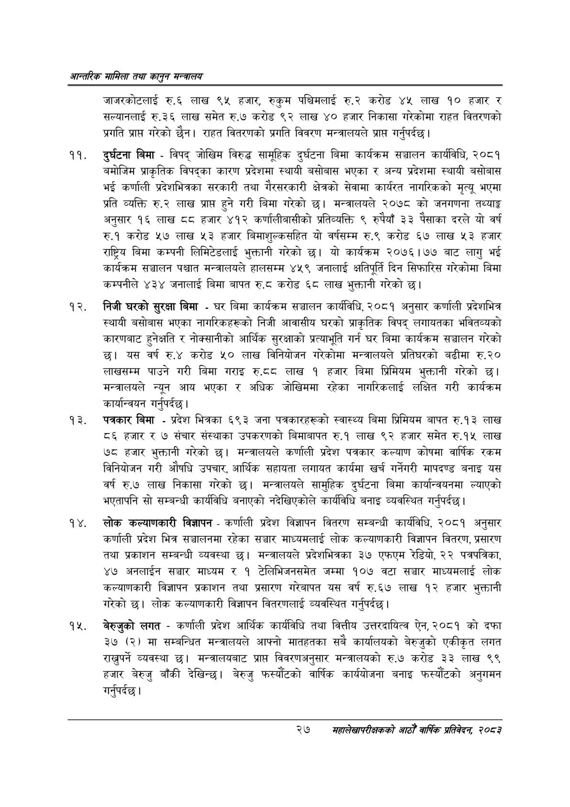

# Page 49 QA

## Rendered page


## Extracted text

```text
आन्तरिक सामिला तथा कालुन सन्बालय
जाजरकोटलाई रु.६ लाख ९५ हजार, रुकुम पश्चिमलाई रु.२ करोड ४५ लाख १० हजार र सल्यानलाई रु.३६ लाख समेत रु.७ करोड ९२ लाख ४० हजार निकासा गरेकोमा राहत वितरणको प्रगति प्राप्त गरेको छैन। राहत वितरणको प्रगति विवरण मन्त्रालयले प्राप्त गर्नुपर्दछ |
दुर्घटना बिमा -विपद्‌ जोखिम विरुद्ध सामूहिक दुर्घटना बिमा कार्यक्रम सञ्चालन कार्यविधि, २०८१ बमोजिम प्राकृतिक विपद्का कारण प्रदेशमा स्थायी बसोबास भएका र अन्य प्रदेशमा स्थायी बसोबास भई कर्णाली प्रदेशभित्रका सरकारी तथा गैरसरकारी क्षेत्रको सेवामा कार्यरत नागरिकको मृत्यू भएमा प्रति व्यक्ति रु.२ लाख प्राप्त हुने गरी बिमा गरेको छ। मन्त्रालयले २०७८ को जनगणना तथ्याङ्क अनुसार १६ लाख ६ हजार ४१२ कर्णालीबासीको प्रतिव्यक्ति ९ रुपैयाँ ३३ पैसाका दरले यो वर्ष रु.१ करोड ५७ लाख ५३ हजार बिमाशुल्कसहित यो वर्षसम्म रु.९ करोड ६७ लाख ५३ हजार राष्ट्रिय बिमा कम्पनी लिमिटेडलाई भुक्तानी गरेको १ यो कार्यक्रम २०७६।७७ बाट लागु भई कार्यक्रम सञ्चालन पश्चात मन्त्रालयले हालसम्म ४५९ जनालाई क्षतिपूर्ति दिन सिफारिस गरेकोमा बिमा कम्पनीले ४३४ जनालाई बिमा बापत रु.८ करोड ६८ लाख भुक्तानी गरेको छ।
निजी घरको सुरक्षा बिमा -घर बिमा कार्यक्रम सञ्चालन कार्यविधि, २०८१ अनुसार कर्णाली प्रदेशभित्र स्थायी बसोबास भएका नागरिकहरूको निजी आवासीय घरको प्राकृतिक विपद्‌ लगायतका भवितव्यको कारणबाट हुनेक्षति र नोक्सानीको आर्थिक सुरक्षाको प्रत्याभूति गर्न घर बिमा कार्यक्रम सञ्चालन गरेको छ। यस वर्ष रु.४ करोड ५० लाख विनियोजन गरेकोमा मन्त्रालयले प्रतिघरको बढीमा रु.२० लाखसम्म पाउने गरी बिमा गराइ. लाख १ हजार बिमा प्रिमियम भुक्तानी गरेको मन्त्रालयले न्यून आय भएका र अधिक जोखिममा रहेका नागरिकलाई लक्षित गरी कार्यक्रम कार्यान्वयन गर्नुपर्दछ |
पत्रकार बिमा -प्रदेश भित्रका ६९३ जना पत्रकारहरूको स्वास्थ्य बिमा प्रिमियम बापत रु.१३ लाख ८६ हजार र ७ संचार संस्थाका उपकरणको बिमाबापत रु.१ लाख ९२ हजार समेत रु.१५ लाख ७८ हजार भुक्तानी गरेको छ। मन्त्रालयले कर्णाली प्रदेश पत्रकार कल्याण कोषमा वार्षिक रकम विनियोजन गरी औषधि उपचार, आर्थिक सहायता लगायत कार्यमा खर्च गर्नेगरी मापदण्ड बनाइ यस वर्ष रु.७ लाख निकासा गरेको छ। मन्त्रालयले सामुहिक दुर्घटना बिमा कार्यान्वयनमा ल्याएको भएतापनि सो सम्बन्धी कार्यविधि बनाएको नदेखिएकोले कार्यविधि बनाइ व्यवस्थित गर्नुपर्दछ |
लोक कल्याणकारी विज्ञापन -कर्णाली प्रदेश विज्ञापन वितरण सम्बन्धी कार्यविधि, २०८१ अनुसार कर्णाली प्रदेश भित्र सञ्चालनमा रहेका सञ्चार माध्यमलाई लोक कल्याणकारी विज्ञापन वितरण, प्रसारण तथा प्रकाशन सम्बन्धी व्यवस्था छ। मन्त्रालयले प्रदेशभित्रका ३७ एफएम रेडियो, २२ पत्रपत्रिका, ४७ अनलाईन सञ्चार माध्यम र १ टेलिभिजनसमेत जम्मा १०७ वटा सञ्चार माध्यमलाई लोक कल्याणकारी विज्ञापन प्रकाशन तथा प्रसारण गरेबापत यस वर्ष रु.६७ लाख १२ हजार भुक्तानी गरेको | लोक कल्याणकारी विज्ञापन वितरणलाई व्यवस्थित गर्नुपर्दछ |
बेरुजुको लगत -कर्णाली प्रदेश आर्थिक कार्यविधि तथा वित्तीय उत्तरदायित्व ऐन, २०८१ को दफा ३७ (२) मा सम्बन्धित मन्त्रालयले आफ्नो मातहतका सबै कार्यालयको वेरुजुको एकीकृत लगत राख्नुपर्ने व्यवस्था | मन्त्रालयबाट प्राप्त विवरणअनुसार मन्त्रालयको रु.७ करोड ३३ लाख ९९ हजार बेरुजु बाँकी देखिन्छ। बेरुजु फस्यौटको वार्षिक कार्ययोजना बनाइ फस्यौटको अनुगमन गर्नुपर्दछ |
२७ सहालेखापरीक्षकको आठौँ वाक प्रतिवेदन २०८२
```

## Flags
- None
