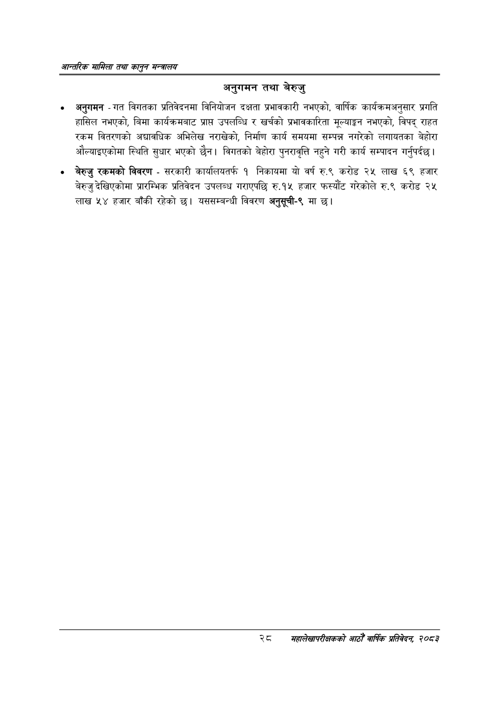

# Page 50 QA

## Rendered page


## Extracted text

```text
आन्तरिक सामिला तथा कालुन सन्बालय
अनुगमन तथा बेरुजु
० अनुगमन -गत विगतका प्रतिवेदनमा विनियोजन दक्षता प्रभावकारी नभएको, वार्षिक कार्यक्रमअनुसार प्रगति हासिल नभएको, बिमा कार्यक्रमबाट प्राप्त उपलब्धि र खर्चको प्रभावकारिता मूल्याङ्कन नभएको, विपद्‌ राहत रकम वितरणको अद्यावधिक अभिलेख नराखेको, निर्माण कार्य समयमा सम्पन्न नगरेको लगायतका बेहोरा औल्याइएकोमा स्थिति सुधार भएको छैन। विगतको बेहोरा पुनरावृत्ति नहुने गरी कार्य सम्पादन गर्नुपर्दछ |
० बेरुजु रकमको विवरण -सरकारी कार्यालयतर्फ १ निकायमा यो वर्ष रु.९ करोड २५ लाख ६९ हजार बेरुजु देखिएकोमा प्रारम्भिक प्रतिवेदन उपलब्ध गराएपछि रु.१५ हजार फस्यौट गरेकोले रु.९ करोड २५ लाख ५४ हजार बाँकी रहेको छ। यससम्बन्धी विवरण अनुसूची-९ मा छ।
२८०
सहालेखापरीक्षकको आठौँ वा्िकि प्रतिवेदन २०८२
```

## Flags
- None
