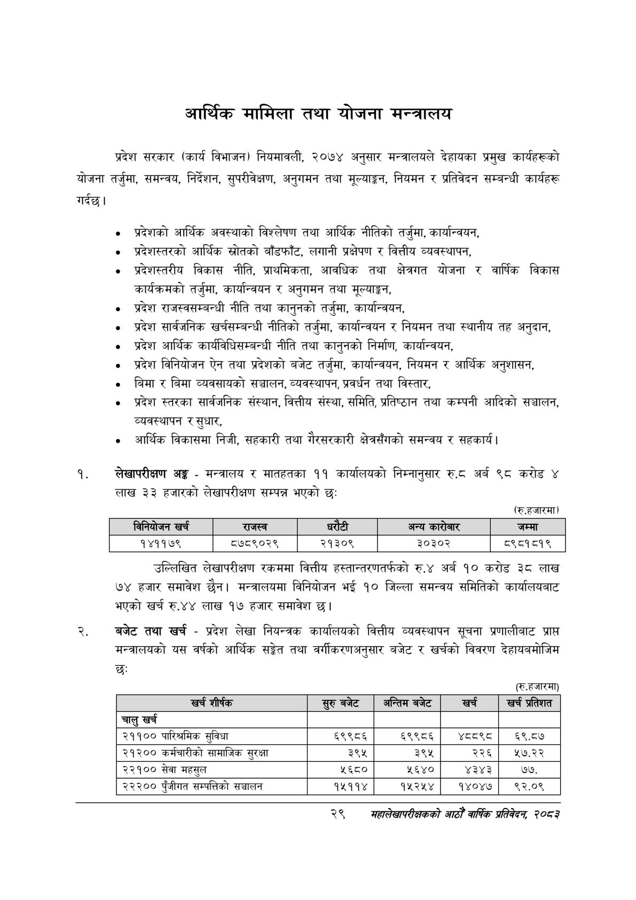

# Page 51 QA

## Rendered page


## Extracted text

```text
आर्थिक मामिला तथा योजना मन्त्रालय
गर्दछु। प्रदेश सरकार (कार्य विभाजन) नियमावली, २०७४ अनुसार मन्त्रालयले देहायका प्रमुख कार्यहरूको योजना तर्जुमा, समन्वय, निर्देशन, सुपरीवेक्षण, अनुगमन तथा मूल्याङ्कन, नियमन र प्रतिवेदन सम्बन्धी कार्यहरू
० प्रदेशको आर्थिक अवस्थाको विश्लेषण तथा आर्थिक नीतिको तर्जुमा, कार्यान्वयन,
० प्रदेशस्तरको आर्थिक स्रोतको बाँडफाँट, लगानी प्रक्षेपण र वित्तीय व्यवस्थापन,
प्रदेशस्तरीय विकास नीति, प्राथमिकता, आवधिक तथा क्षेत्रगत योजना र वार्षिक विकास कार्यक्रमको तर्जुमा, कार्यान्वयन र अनुगमन तथा मूल्याङ्कन,
० प्रदेश राजस्वसम्बन्धी नीति तथा कानुनको तर्जुमा, कार्यान्वयन,
प्रदेश सार्वजनिक खर्चसम्बन्धी नीतिको तर्जुमा, कार्यान्वयन र नियमन तथा स्थानीय तह अनुदान,
प्रदेश आर्थिक कार्यविधिसम्बन्धी नीति तथा कानुनको निर्माण, कार्यान्वयन,
प्रदेश विनियोजन ऐन तथा प्रदेशको बजेट तर्जुमा, कार्यान्वयन, नियमन र आर्थिक अनुशासन,
बिमा र बिमा व्यवसायको सञ्चालन, व्यवस्थापन, प्रवर्धन तथा विस्तार,
प्रदेश स्तरका सार्वजनिक संस्थान, वित्तीय संस्था, समिति, प्रतिष्ठान तथा कम्पनी आदिको सञ्चालन, व्यवस्थापन र सुधार,
आर्थिक विकासमा निजी, सहकारी तथा गैरसरकारी क्षेत्रसँगको समन्वय र सहकार्य |
लेखापरीक्षण अङ्ग -मन्त्रालय र मातहतका ११ कार्यालयको निम्नानुसार रु.ट अर्ब ९८ करोड लाख ३३ हजारको लेखापरीक्षण सम्पन्न भएको छ:
(रु.हजारमा)
।
उल्लिखित लेखापरीक्षण रकममा वित्तीय हस्तान्तरणतर्फको रु.४ अर्ब १० करोड ३८ लाख ७४ हजार समावेश छैन। मन्त्रालयमा विनियोजन भई १० जिल्ला समन्वय समितिको कार्यालयबाट भएको खर्च रु.४४ लाख १७ हजार समावेश छ।
बजेट तथा खर्च -प्रदेश लेखा नियन्त्रक कार्यालयको वित्तीय व्यवस्थापन सूचना प्रणालीबाट प्राप्त मन्त्रालयको यस वर्षको आर्थिक सङ्केत तथा वर्गीकरणअनुसार बजेट र खर्चको विवरण देहायबमोजिम छः
(रु.हजारमा)
२९
सहालेखापरीक्षकको वाषिक प्रतिवेदन २०८२

|  |  | 'बनेवोजन खर्च | राजस्व |  | धरेटी | अन्य कारोबार | जम्मा |
| --- | --- | --- | --- | --- | --- | --- | --- |
|  |  | १४११७९ | ८७८९०२९ | २१३०९ |  | ३०३०२ | ८९८१८१९ |

| खरी शीष्क | स्रुबबेट | अन्तिम बजेट |  |
| --- | --- | --- | --- |
| चालु खर्च |  |  |  |
| २११०० पारिश्रमिक सुविधा | ६९९८६ | ६९९८६ |  |
| २१२०० कर्मचारीको सामाजिक सुरक्षा | ३९५ | ३९५ | २२६ |
| २२१०० सेवा महसुल | ५६८० | ५६४० | ४३४३ |
| २२२०० पुँजीगत सम्पतिको सञ्चालन | १५११४ | १५२५४ | १४०४७ |
```

## Flags
- table_page
- medium_quality_table
