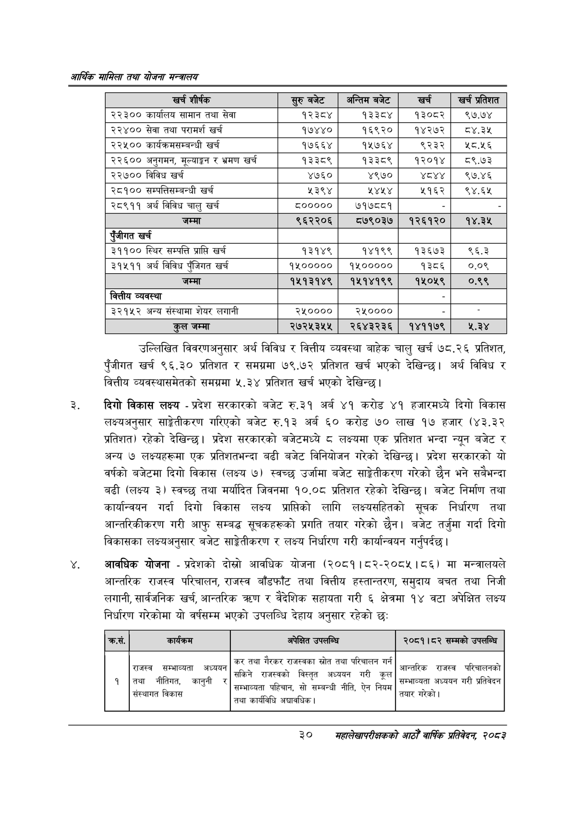

# Page 52 QA

## Rendered page


## Extracted text

```text
आर्थिक मामिला तथा योजना सन्चबालय
उल्लिखित विवरणअनुसार अर्थ विविध र वित्तीय व्यवस्था बाहेक चालु खर्च १५८.२६ प्रतिशत, पुँजीगत खर्च ९६.३० प्रतिशत र समग्रमा ७९.७२ प्रतिशत खर्च भएको देखिन्छ। अर्थ विविध र वित्तीय व्यवस्थासमेतको समग्रमा ५.३४ प्रतिशत खर्च भएको देखिन्छ।
दिगो विकास लक्ष्य -प्रदेश सरकारको बजेट रु.३१ अर्ब ४१ करोड ४१ हजारमध्ये दिगो विकास लक्ष्यअनुसार साङ्ेतीकरण गरिएको बजेट रु.१३ अर्ब ६० करोड ७० लाख १७ हजार (४३.३२ प्रतिशत) रहेको देखिन्छ। प्रदेश सरकारको बजेटमध्ये ८ लक्ष्यमा एक प्रतिशत भन्दा न्यून बजेट र अन्य ७ लक्ष्यहरूमा एक प्रतिशतभन्दा बढी बजेट विनियोजन गरेको देखिन्छ। प्रदेश सरकारको यो वर्षको बजेटमा दिगो विकास (लक्ष्य ७) स्वच्छ उर्जामा बजेट साङ्गेतीकरण गरेको छैन भने सबैभन्दा बढी (लक्ष्य ३) स्वच्छ तथा मर्यादित जिवनमा १०.०८ प्रतिशत रहेको देखिन्छ। बजेट निर्माण तथा कार्यान्वयन गर्दा दिगो विकास लक्ष्य प्राप्तिको लागि लक्ष्यसहितको सूचक निर्धारण तथा आन्तरिकीकरण गरी आफु सम्बद्ध सूचकहरूको प्रगति तयार गरेको छैन। बजेट तर्जुमा गर्दा दिगो विकासका लक्ष्यअनुसार बजेट साङ्गेतीकरण र लक्ष्य निर्धारण गरी कार्यान्वयन गर्नुपर्दछ |
आवधिक योजना -प्रदेशको दोस्रो आवधिक योजना (२०८१।८२-२०८५।८६) मा मन्त्रालयले आन्तरिक राजस्व परिचालन, राजस्व बाँडफाँट तथा वित्तीय हस्तान्तरण, समुदाय बचत तथा निजी लगानी, सार्वजनिक खर्च, आन्तरिक त्रण र वैदेशिक सहायता गरी ६ क्षेत्रमा १४ वटा अपेक्षित लक्ष्य निर्धारण गरेकोमा यो वर्षसम्म भएको उपलब्धि देहाय अनुसार रहेको छ:
३०
महालेखापरीक्षकको भाठोँ वार्षिक प्रतिवेदन २०८२

| = शीर्षक | स्रुबबेट | अन्तिम बजेट | खर्च | प्रतिशत |
| --- | --- | --- | --- | --- |
| २२३०० कार्यालय सामान तथा सेवा | १२३८४ | १३३८४ | १३०८२ | १९७.७४ |
| २२४०० सेवा तथा परामर्श खर्च | १७४४० | १६९२० | १४२७२ | ८४.३५ |
| २२५०० कार्यक्रमसम्बन्धी खर्च | १७६६४ | १५७६४ | ९२३२ | १८.५६ |
| २२६०० अनुगमन, र भ्रमण खर्च | १३३८९ | १३३८९ | १२०१४ | ८९.७३ |
| २२७०० विविध खर्च | ४७६० | ४९७० | अष्ट | ९७.४६ |
| २८१०० सम्पतिशम्वन्धी खर्च | ५३९४ | १४५४ | ५१६२ | ९४.६५ |
| २८९११ अर्थ विविध चालु खर्च | ८००००० | ७१७८८१ |  |  |
| जम्मा | ९६२२०६ | ८५७९०३७ | १२६१२० | १४.३४५ |
| एंजीगत खर्च |  |  |  |  |
| ३११०० स्थिर सम्पत्ति प्राप्ति खर्च | १३१४९ | १४१९९ | १३६७३ | ९६.३ |
| ३१५११ अर्थ विविध पँजिगत खर्च | १५००००० | १५००००० | १३८६ | ०.०९ |
| जम्मा | १५१३१४९ | १४१५१४१९९ | १५०४५९ | ०.९९ |
| वित्तीय व्यवस्था |  |  |  |  |
| ३२१४५२ अन्य संस्थामा शेयर लगानी | २५०००० | २५०००० |  |  |
| जम्मा | २७२५३५५ | २६४३२३६ | १४११७९ | ५.२४ |

| कस. |  | अपेक्षित उपसान्य | २०८१।८२ सम्मको उपलान्चि |
| --- | --- | --- | --- |
| १ | राजस्व सम्भाव्यता तथा नीतिगत, कानुनी र. संस्थानत विकास | 'कर तथा गैरकर १।जस्वका स्रोत तथा परिचालन गर्न - सकिने राजस्वको विस्तृत अध्ययन गरी कूल < सम्भाव्यता पहिचान, सो सम्बन्धी नीति, ऐन नियम तथा कार्यविधि अच्चावधिक \| | न - आन्तरिक राजस्व परिचालनको प्रतिवेदन सम्भाव्यता अध्ययन गरी प्रतिवेद तयार गरेको \| |
```

## Flags
- table_page
- medium_quality_table
