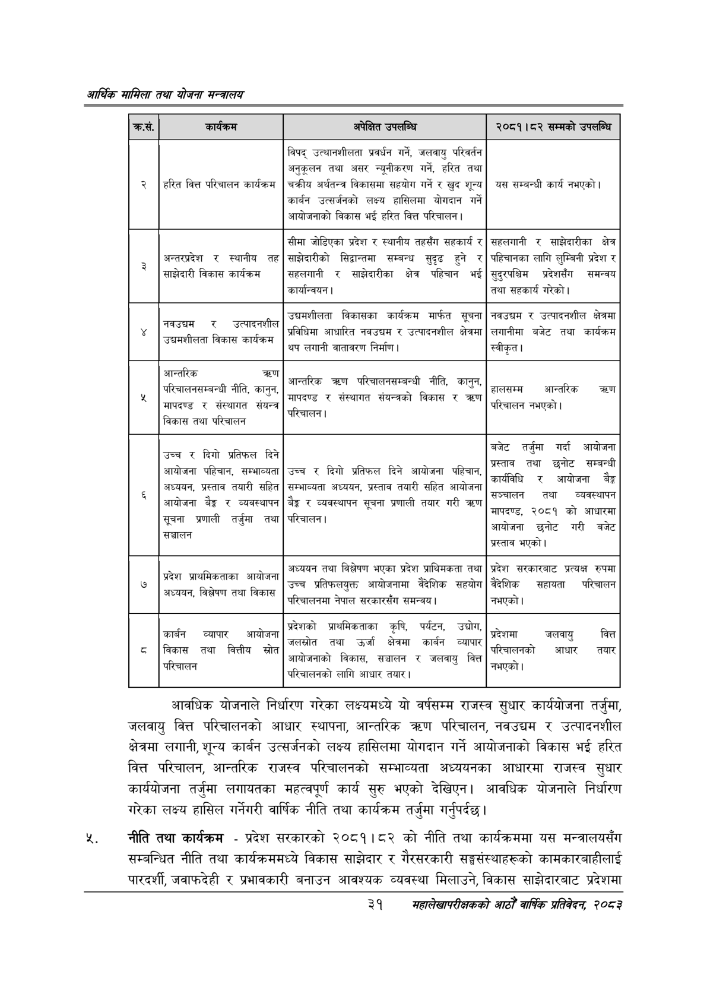

# Page 53 QA

## Rendered page


## Extracted text

```text
आर्थिक मामिला तथा योजना सन्चबालय
गरेका लक्ष्य हासिल गर्नेगरी वार्षिक नीति तथा कार्यक्रम तर्जुमा गर्नुपर्दछ | आवधिक योजनाले निर्धारण गरेका लक्ष्यमध्ये यो वर्षसम्म राजस्व सुधार कार्ययोजना तर्जुमा, जलवायु वित्त परिचालनको आधार स्थापना, आन्तरिक त्रण परिचालन, नवउद्चम र उत्पादनशील क्षेत्रमा लगानी, शून्य कार्बन उत्सर्जनको लक्ष्य हासिलमा योगदान गर्ने आयोजनाको विकास भई हरित वित्त परिचालन, आन्तरिक राजस्व परिचालनको सम्भाव्यता अध्ययनका आधारमा राजस्व सुधार कार्ययोजना तर्जुमा लगायतका महत्वपूर्ण कार्य सुरु भएको देखिएन। आवधिक योजनाले निर्धारण
नीति तथा कार्यक्रम -प्रदेश सरकारको २०८१।८२ को नीति तथा कार्यक्रममा यस मन्त्रालयसँग सम्बन्धित नीति तथा कार्यक्रममध्ये विकास साझेदार र गैरसरकारी सङ्घसंस्थाहरूको कामकारबाहीलाई पारदर्शी, जवाफदेही र प्रभावकारी बनाउन आवश्यक व्यवस्था मिलाउने, विकास साझेदारबाट प्रदेशमा
३१
सहालेखापरीक्षकको वाषिक प्रतिवेदन २०८२

| कस. |  | अपेक्षित उपसन्धि | २०८१।८२ सम्मको उपलाण्चि |
| --- | --- | --- | --- |
| २ | हरित वित्त परिचालन कार्यक्रम | विपद्‌ उत्थानशीलता प्रवर्धन गर्ने, जलवायु परिवर्तन अनुकूलन तथा असर नधूीक९५ गर्ने, हरित तथा चक्रीय अर्थतन्त्र विकासमा सहयोग गर्ने र खुद शुन्य कार्वन उत्सर्णनको लक्ष्य हासिलमा योगदान गर्ने आयोजनाको विकास भई हरित वित्त परिचालन। | यस सम्बन्धी कार्य नभएको \| |
| ३ | अन्तरञ्रदेश र स्थानीय तह | सीमा जोडिएका प्रदेश र स्थानीय तहसँग सहकार्य र शाझेदारीको सिट्ठान्तमा सम्बन्ध सुदृढ हुने र | क्षहलमानी र साझेदारीका क्षेत्र पहिचानका लागि लुम्बिनी प्रदेश र |
|  | साझेदारी विकास कार्यक्रम | सहलगानी र शान्ेदारीका क्षेत्र पहिचान भई कार्यान्वयन \| | सुदुरपश्चिम प्रदेशसँग समन्वय तथा सहकार्य गरेको \| |
|  | ८ नवउद्चम र उत्पादनशील . उच्मशीलता बिकास कार्यक्रम | उच्चमशीलता विकासका कार्यक्रम मार्फत सूचना प्रविधिमा आधारित नवउच्चम र उत्पादनशील क्षेत्रमा थप लगानी ५१५९ निर्माण। | नवउद्चयम र उत्पादनशील क्षेत्रमा ३ लगानीमा बजेट तथा कार्यक्रम स्वीकृत। |
|  | आन्तरिक त्र्ण - परिचालनसषम्बन्दधी नीति, कानुन, \| संयन्त्र मापदण्ड र संस्थागत संयन्त्र विकास तथा परिचालन | -~ आन्तरिक परिचालनसम्बन्धी नीति, कानुन, छ [ - मापदण्ड र संस्थागत संवत्को विकास र कण - परिचालन \| | . हालसम्म आन्तरिक तरण परिचालन नभएको। |
|  | दिगो उच्च र दिगो प्रतिफल दिने आयोजना पहिचान, सम्भाव्यता अध्ययन, प्रस्ताव तयारी सहित आयोजना बैङ्क र व्यवस्थापन सूचना प्रणाली तर्जुमा तथा सञ्चालन | दिगो दिने आयो उच्च र दिगो प्रतिफल दिने आयोजना पहिचान पा सम्भाव्यता अध्ययन, प्रस्ताव तयारी सहित आयोजना बैङ्क र ब्यवस्थापन सूचना प्रणाली तयार गरी परिचालन। | बजेट तर्जुमा गर्दा आधोजना > प्रस्ताव तथा छनोट सम्बन्धी आयोजना कार्यविधि र आयोजना बैङ्क सञ्चालन तथा व्यबस्थापन - मापदण्ड, २०८१ को आधारमा - आयोजना छनोट गरी बजेट - प्रस्ताव भएको \| |
|  | - आयोजना प्रदेश प्राथमिकताका आयोजना ५ अध्ययन, विश्लेषण तथा विकास | उभियन तथा विश्लेषण भएका प्रदेश प्राथिभकता तथा ~ _ बैदेशिक उच्च प्रतिकलधुक्त आधोजनामा बैदेशिक सहयोग . परिचालनमा नेपाल क्षर्कारधँग समन्वय \| | प्रदेश प्रत्यक्ष रुपमा ~ वैदेशिक सहायता परिचालन नभएको \| |
| ८ | कार्बन व्यापार आयोजना स्रोत बिकास तथा वित्तीय स्रोत परिचालन | प्रदेशको भ्राथमिकताका कृषि, पर्यटन, उद्योग < जलस्रोत तथा उर्जा क्षेत्रमा कार्वन व्यापार - आबोजनाको बिकास, सञ्चालन र जलवायु वित्त - - परिचालनको लागि आधार तयार \| | प्रदेशमा 'जलवायु वित्त < - परिचालनको आधार तयार - नभएको \| |
```

## Flags
- table_page
- medium_quality_table
