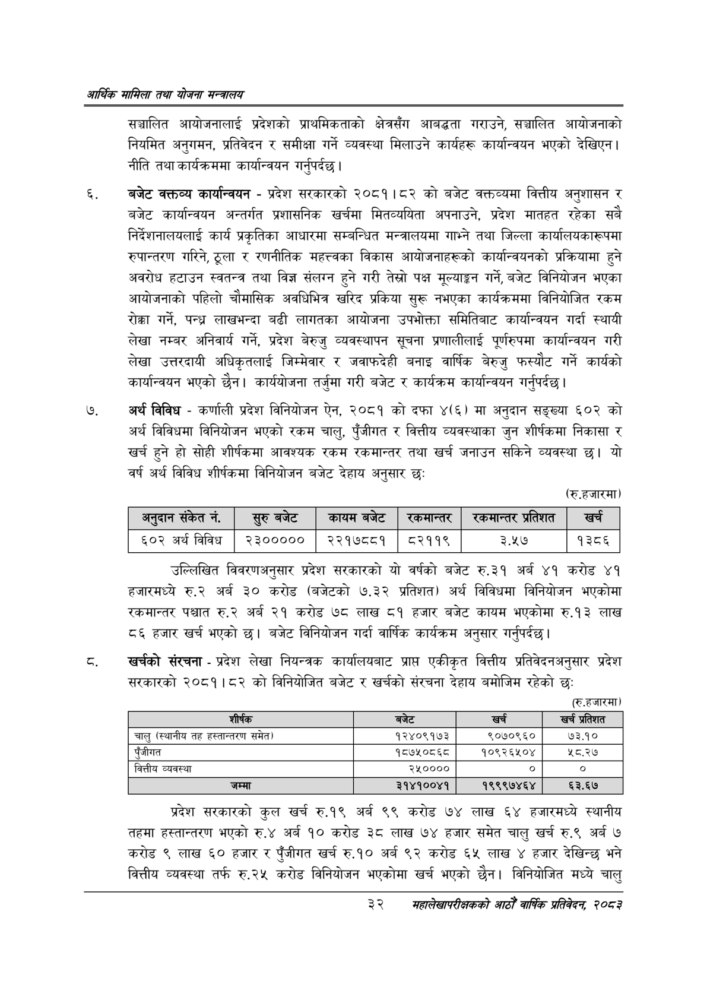

# Page 54 QA

## Rendered page


## Extracted text

```text
आर्थिक मामिला तथा योजना सन्चबालय
सञ्चालित आयोजनालाई प्रदेशको प्राथमिकताको क्षेत्रसँग आबद्धता गराउने, सञ्चालित आयोजनाको नियमित अनुगमन, प्रतिवेदन र समीक्षा गर्ने व्यवस्था मिलाउने कार्यहरू कार्यान्वयन भएको देखिएन | नीति तथा कार्यक्रममा कार्यान्वयन गर्नुपर्दछ |
बजेट कक्तव्य कार्यान्वयन -प्रदेश सरकारको २०८१।८२ को बजेट कक्तव्यमा वित्तीय अनुशासन र बजेट कार्यान्वयन अन्तर्गत प्रशासनिक खर्चमा मितव्ययिता अपनाउने, प्रदेश मातहत रहेका सबै निर्देशनालयलाई कार्य प्रकृतिका आधारमा सम्बन्धित मन्त्रालयमा गाभ्ने तथा जिल्ला कार्यालयकारूपमा रुपान्तरण गरिने, ठूला र रणनीतिक महत्त्वका विकास आयोजनाहरूको कार्यान्वयनको प्रक्रियामा हुने अवरोध हटाउन स्वतन्त्र तथा विज्ञ संलग्न हुने गरी तेस्रो पक्ष मूल्याङ्कन गर्ने, बजेट विनियोजन भएका आयोजनाको पहिलो चौमासिक अवधिभित्र खरिद प्रकिया सुरू नभएका कार्यक्रममा विनियोजित रकम रोक्का गर्ने, पन्ध्र लाखभन्दा बढी लागतका आयोजना उपभोक्ता समितिबाट कार्यान्वयन गर्दा स्थायी लेखा नम्बर अनिवार्य गर्ने, प्रदेश बेरुजु व्यवस्थापन सूचना प्रणालीलाई पूर्णरुपमा कार्यान्वयन गरी लेखा उत्तरदायी अधिकृतलाई जिम्मेवार र जवाफदेही बनाइ वार्षिक बेरुजु फस्यौट गर्ने कार्यको कार्यान्वयन भएको छैन। कार्ययोजना तर्जुमा गरी बजेट र कार्यक्रम कार्यान्वयन गर्नुपर्दछ |
अर्थ विविध -कर्णाली प्रदेश विनियोजन ऐन, २०८१ को दफा ४(६) मा अनुदान सङ्ख्या ६०२ को अर्थ विविधमा विनियोजन भएको रकम चालु, पुँजीगत र वित्तीय व्यवस्थाका जुन शीर्षकमा निकासा र खर्च हुने हो सोही शीर्षकमा आवश्यक रकम रकमान्तर तथा खर्च जनाउन सकिने व्यवस्था छ। यो वर्ष अर्थ विविध शीर्षकमा विनियोजन बजेट देहाय अनुसार छः
(रु.हजारमा)
उल्लिखित विवरणअनुसार प्रदेश सरकारको यो वर्षको बजेट रु.३१ अर्ब ४१ करोड ४१ हजारमध्ये रु.२ अर्ब ३० करोड (बजेटको ७.३२ प्रतिशत) अर्थ विविधमा विनियोजन भएकोमा रकमान्तर पश्चात रु.२ अर्ब २१ करोड ७८ लाख ८१ हजार बजेट कायम भएकोमा रु.१३ लाख ८६ हजार खर्च भएको | बजेट विनियोजन गर्दा वार्षिक कार्यक्रम अनुसार गर्नुपर्दछ |
खर्चको संरचना -प्रदेश लेखा नियन्त्रक कार्यालयबाट प्राप्त एकीकृत वित्तीय प्रतिवेदनअनुसार प्रदेश सरकारको २०८१।८२ को विनियोजित बजेट र खर्चको संरचना देहाय बमोजिम रहेको छः
(रु.हजारमा)
प्रदेश सरकारको कुल खर्च रु.१९ अर्ब ९९ करोड ७४ लाख ६४ हजारमध्ये स्थानीय तहमा हस्तान्तरण भएको रु.४ अर्ब १० करोड ३८ लाख ७४ हजार समेत चालु खर्च रु.९ अर्ब ७ करोड ९ लाख ६० हजार र पुँजीगत खर्च रु.१० अर्ब ९२ करोड ६५ लाख ४ हजार देखिन्छ भने वित्तीय व्यवस्था तर्फ रु.२५ करोड विनियोजन भएकोमा खर्च भएको छैन। विनियोजित मध्ये चालु
३२
सहालेखापरीक्षकको वाषिक प्रतिवेदन २०८२

|  | अनुदान | संकेत | न. |  | स्रुबजेट | कायम बजेट | सर्कबान्तर | सर्वम्थान्तर | भ्रतेशत | खु |  |
| --- | --- | --- | --- | --- | --- | --- | --- | --- | --- | --- | --- |
| ६०२ | अर्थ |  | विविध |  | २३००००० | २२१७८८१ | ब८२११९ | ३.१७ |  | १३८६ |  |

| शीर्षक | 'बजेट | खर्च | खर्च प्रतिशत |
| --- | --- | --- | --- |
| चालु (स्थानीय तह ह्तान्तरण समेत) | १२४०९१७३ | ९०७०९६० | ७३.१० |
| पुँजीगत | १८७५०८६८ | १०९२६४५०४ | २८.२७ |
| वित्तीय व्यवस्था | २५०००० | ० | ० |
```

## Flags
- table_page
- medium_quality_table
