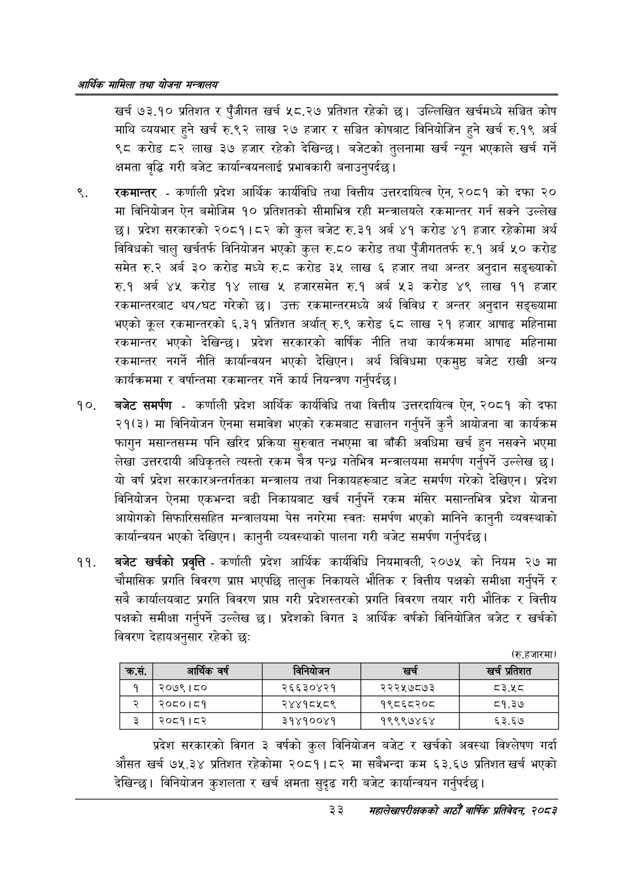

# Page 55 QA

## Rendered page


## Extracted text

```text
आर्थिक मामिला तथा योजना सन्चबालय
खर्च १७३.१० प्रतिशत र पुँजीगत खर्च ५८.२७ प्रतिशत रहेको छ। उल्लिखित खर्चमध्ये सञ्चित कोष माथि व्ययभार हुने खर्च रु.९२ लाख २७ हजार र सञ्चित कोषबाट विनियोजिन हुने खर्च रु.१९ अर्ब ९८ करोड ८२ लाख ३७ हजार रहेको देखिन्छ। बजेटको तुलनामा खर्च न्यून भएकाले खर्च गर्ने क्षमता वृद्धि गरी बजेट कार्यान्वयनलाई प्रभावकारी बनाउनुपर्दछ |
रकमान्तर -कर्णाली प्रदेश आर्थिक कार्यविधि तथा वित्तीय उत्तरदायित्व ऐन, २०८१ को दफा २० मा विनियोजन ऐन बमोजिम १० प्रतिशतको सीमाभित्र रही मन्त्रालयले रकमान्तर गर्न सक्ने उल्लेख छ। प्रदेश सरकारको २०८१।८२ को कुल बजेट रु.३१ अर्ब ४१ करोड ४१ हजार रहेकोमा अर्थ विविधको चालु खर्चतर्फ विनियोजन भएको कुल रु.८० करोड तथा पुँजीगततर्फ रु.१ अर्ब ५० करोड समेत रु.२ अर्ब ३० करोड मध्ये रु.ट करोड ३५ लाख ६ हजार तथा अन्तर अनुदान सङ्ख्याको रु.१ अर्ब ४५ करोड १४ लाख ५ हजारसमेत रु.१ अर्ब ५३ करोड ४९ लाख ११ हजार रकमान्तरबाट थप/घट गरेको | उक्त रकमान्तरमध्ये अर्थ विविध र अन्तर अनुदान सङ्ख्यामा भएको कूल रकमान्तरको ६.३१ प्रतिशत अर्थात्‌ रु.९ करोड ६८ लाख २१ हजार आषाढ महिनामा रकमान्तर भएको देखिन्छ। प्रदेश सरकारको वार्षिक नीति तथा कार्यक्रममा आषाढ महिनामा रकमान्तर नगर्ने नीति कार्यान्वयन भएको देखिएन। अर्थ विविधमा एकमुष्ठ बजेट राखी अन्य कार्यक्रममा र वर्षान्तमा रकमान्तर गर्ने कार्य नियन्त्रण गर्नुपर्दछ |
बजेट समर्पण -कर्णाली प्रदेश आर्थिक कार्यविधि तथा वित्तीय उत्तरदायित्व ऐन, २०८१ को दफा २१(३) मा विनियोजन ऐनमा समावेश भएको रकमबाट सञ्चालन गर्नुपर्ने कुनै आयोजना वा कार्यक्रम फागुन मसान्तसम्म पनि खरिद प्रक्रिया सुरुवात नभएमा वा बाँकी अवधिमा खर्च हुन नसक्ने भएमा लेखा उत्तरदायी अधिकृतले त्यस्तो रकम चैत्र पन्ध्र गतेभित्र मन्त्रालयमा समर्पण गर्नुपर्ने उल्लेख | यो वर्ष प्रदेश सरकारअन्तर्गतका मन्त्रालय तथा निकायहरूबाट बजेट समर्पण गरेको देखिएन। प्रदेश विनियोजन ऐनमा एकभन्दा बढी निकायबाट खर्च गर्नुपर्ने रकम मंसिर मसान्तभित्र प्रदेश योजना आयोगको सिफारिससहित मन्त्रालयमा पेस नगरेमा स्वत: समर्पण भएको मानिने कानुनी व्यवस्थाको कार्यान्वयन भएको देखिएन। कानुनी व्यवस्थाको पालना गरी बजेट समर्पण गर्नुपर्दछ |
बजेट खर्चको प्रवृत्ति -कर्णाली प्रदेश आर्थिक कार्यविधि नियमावली, २०७५ को नियम २७ मा चौमासिक प्रगति विवरण प्राप भएपछि तालुक निकायले भौतिक र वित्तीय पक्षको समीक्षा गर्नुपर्ने र सबै कार्यालयबाट प्रगति विवरण प्राप्त गरी प्रदेशस्तरको प्रगति विवरण तयार गरी भौतिक र वित्तीय पक्षको समीक्षा गर्नुपर्ने उल्लेख | प्रदेशको विगत ३ आर्थिक वर्षको विनियोजित बजेट र खर्चको विवरण देहायअनुसार रहेको छः
(रु.हजारमा)
प्रदेश सरकारको विगत ३ वर्षको कुल विनियोजन बजेट र खर्चको अवस्था विश्लेषण गर्दा औसत खर्च ७५.३४ प्रतिशत रहेकोमा २०८१।८२ मा सबैभन्दा कम ६३.६७ प्रतिशत खर्च भएको देखिन्छ। विनियोजन कुशलता र खर्च क्षमता सुदृढ गरी बजेट कार्यान्वयन गर्नुपर्दछ |
३३
सहालेखापरीक्षकको वाषिक प्रतिवेदन २०८२

| क्रस. | आर्क वर्ष |  | खच्ी | खच प्रतेशत |
| --- | --- | --- | --- | --- |
| १ | २०७९।८० | २६६३०४२१ | २२२५७८७३ | ८३.५८ |
| २ | २०८०।८१ | २४४१८५८९ | १९८६८२०८ | ८१.३७ |
| ३ | २०८१।८२ | ३१४१००४१ | १९९९७४६४ | ६३.६७ |
```

## Flags
- table_page
- medium_quality_table
