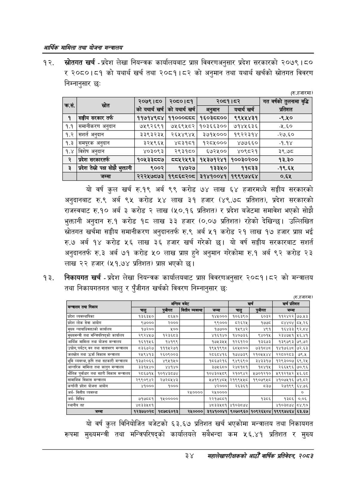

# Page 56 QA

## Rendered page


## Extracted text

```text
आर्थिक मामिला तथा योजना सन्चबालय
स्रोतगत खर्च -प्रदेश लेखा नियन्त्रक कार्यालयबाट प्राप्त विवरणअनुसार प्रदेश सरकारको २०७९। ८० २०८०।८१ को यथार्थ खर्च तथा २०८१।८२ को अनुमान तथा यथार्थ खर्चको स्रोतगत विवरण निम्नानुसार छः
(रु.हजारमा)
यो वर्ष कुल खर्च रु.१९ अर्ब ९९ करोड ७४ लाख ६४ हजारमध्ये सङ्घीय सरकारको अनुदानबाट रु.९ अर्ब ९५ करोड लाख ३१ हजार (४९.७८ प्रतिशत), प्रदेश सरकारको राजस्वबाट रु.१० अर्ब ३ करोड २ लाख (५०.१६ प्रतिशत) र प्रदेश बजेटमा समावेश भएको सोझै भुक्तानी अनुदान रु.१ करोड १८ लाख ३३ हजार (०.०७ प्रतिशत) रहेको देखिन्छ। उल्लिखित स्रोतगत खर्चमा सङ्घीय समानीकरण अनुदानतर्फ रु.९ अर्ब ५१ करोड २१ लाख १७ हजार प्राप्त भई रु.७ अर्ब १४ करोड ५६ लाख ३६ हजार खर्च गरेको छ। यो वर्ष सङ्घीय सरकारबाट सशार्त अनुदानतर्फ रु.३ अर्ब ७१ करोड ५० लाख प्राप्त हुने अनुमान गरेकोमा रु.१ अर्ब ९२ करोड २३ लाख २२ हजार (५१.७४ प्रतिशत) प्रापत भएको छ।
निकायगत खर्च -प्रदेश लेखा नियन्त्रक कार्यालयबाट प्राप्त विवरणअनुसार २०८१।८२ को मन्त्रालय तथा निकायगतगत चालु र पुँजीगत खर्चको विवरण निम्नानुसार छः
(रु.हजारमा)
यो वर्ष कुल विनियोजित बजेटको ६३. ६७ प्रतिशत खर्च भएकोमा मन्त्रालय तथा निकायगत रूपमा मुख्यमन्त्री तथा मन्त्रिपरिषद्को कार्यालयले सबैभन्दा कम ५६.४१ प्रतिशत र मुख्य
३४
महालेखापरीक्षकको भाठोँ वार्षिक प्रतिवेदन २०८२

| सक | से | २०७९।८० को यथार्थ खर्च | २०८०।८१ को यथार्थ खर्च | २०८१।८२ अनुमान | यथार्थ खर्च | गत वर्षको तुलनामा वृद्धि प्रतिशत |
| --- | --- | --- | --- | --- | --- | --- |
| १ | सङ्घीय सरकार तर्फ | ११७१४९८४ | ११०००८८८ | १६०३८८०० | ९९५४५४३१ | -९.४५० |
| १.१ | समानीकरण अनुदान | ७५९२६९१ | ७५६९५८२ | १०३६६३०० | ७१४५६३६ | ४८० |
| १.२ | अनुदान | ३३९३२३५ | २६४५४९४५ | ३७१५००० | १९२२३१४ | -२७.६० |
| १.३ | समपूरक अनुदान | ३२५९६५ | ४८३१८१ | १२८५००० | ४७७६६० | -१.१४ |
| १.४ | विशेष अनुदान | ४०३०९३ | २९३१८० | ६७२५०० | ४०९८२१ | ३९.७८ |
| २ | प्रदेश सरकारतर्फ | १०५३३८०८७ | व८०५२५९३ | १५३७१२४१ | १००३०२०० | १३.३० |
| ३ | प्रदेश तेस्रो पक्ष सोझै भुक्तानी | ९००२ | १४७२७ | १३३५० | ११८३३ | -१९.६५ |
|  | जम्मा | २२२५७८७३ | १९८६८२०८ | ३१४१००४१ | १९९९७४६४ | ०.६५ |

| 'निकाय |  | अन्तिम | बजेट |  |  | खर्च | खर्च | प्रतिशत |
| --- | --- | --- | --- | --- | --- | --- | --- | --- |
| क्या | चालु | 'पुजीगत | वित्तीय व्यवस्था | जम्मा | चालु | 'पुजीगत | जम्मा |  |
| प्रदेश व्यवस्थानिका | १३६३५० | ५६५० |  | १४५००० | १०६३६० | ६०३२ | ११२४२२ | ७७.४३ |
| प्रदेश लोक सेवा आयोग | ९७००० | २००० |  | ९९००० | ८२६२५ | १७७८ | ८४४०४ | ८५.२६ |
| मुख्य कार्यालय | १७२०० | ५१०० |  | १७७०० | ११९४२ | ४९१ | १६४३३ | ९२.८४ |
| मुख्यमन्त्री तथा कार्यालय | २९२४५७। | १२३६८३ |  | ४१६१४० | १४०७३६ | ९४०१५ | र२३४७११ | ५६.४१ |
| आर्थिक मामिला तथा योजना मन्त्रालय | १६११५६ | १४१९९ |  | १७५३५४५ | १२६१२० | १३६७३ | १३९७९३ | ७९.७२ |
| ' उद्योग, पर्यटन, वन तथा वातावरण मन्त्रालय | ८३६७२७ | १११५२७१ |  | १९५१९९८ | ६८५८०० | ७३१८४८ | १४१७६४८ | ७२.६३ |
| जलस्रोत तथा उर्जा विकास मन्त्रालय | २५९४१३ | २६०६००३ |  | २८६८४१६ | १७४७३९ | २१०५५४४ | २२८०२८३ |  |
| भूमि व्यवस्था, कृषि तथा सहकारी मन्त्रालय | १३७२०६६ | ४९५१५० |  | १८६७२१६ | ९४९६९० | ३४३३१७ | १२९३००७ | ६९,२४५ |
| आन्तरिक मामिला तथा कानुन मन्त्रालय | ३३१५४०। | ४४१४० |  | इ७५६८० | २४८१८१ | ८४१५ | २६६५९६ | ७०.९६ |
| भौतिक पूर्वाधार तथा सहरी विकास मन्चालय | २८६७१५ | १०१४३८७४ |  | १०४३०५८९ | २१०९४२ | ४५७०१२१० | ४९१२१५२ | ५६.६८ |
| सामाजिक विकास मन्त्रालय | २९९०९४२, | २७२८४५४३ |  | ५७१९४८५ | २१९९५५८ | १९०७९५८ | ४१०७५१६ | ७१.८२ |
| कर्णाली प्रदेश योजना आयोग | ४१००० | १००० |  | ४२००० | २६३६१ | ८३७ | र२७१९९ | ६४.७६ |
| अर्थ- वित्तीय व्यवस्था |  |  | २५०००० | र२१०००० |  |  |  | ० |
| अर्थ- विविध | ७१७८८१ | १५००००० |  | २२१७८०१ |  | १३८६ | १३८६ | ०.०६ |
| स्थानीय तह | ४८३३५८१ |  |  | ४८३३४८१ | ४१०३८७४ |  | ४१०३८७४ | ८४.९० |
| जम्मा | १२३७४०२८ | १८७८६०१३ | र२४५०००० | ३१४१००४१ | ९०७०९६० | १०९२६५०४ | १९९९७४६४ | ६३.६७ |
```

## Flags
- table_page
- medium_quality_table
