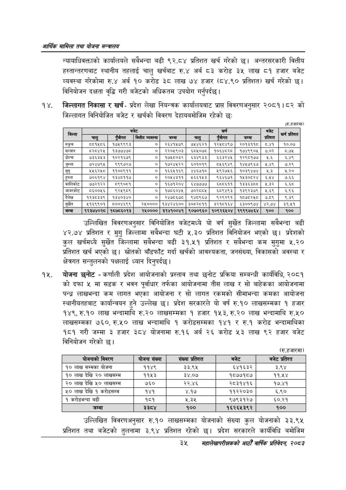

# Page 57 QA

## Rendered page


## Extracted text

```text
आर्थिक मामिला तथा योजना सन्चबालय
न्यायाधिवक्ताको कार्यालयले सबैभन्दा बढी ९२.८४ प्रतिशत खर्च गरेको छ। अन्तरसरकारी वित्तीय हस्तान्तरणबाट स्थानीय तहलाई चालु खर्चबाट रु.४ अर्ब ८३ करोड ३५ लाख ८१ हजार बजेट व्यवस्था गरेकोमा रु.४ अर्ब १० करोड ३८ लाख ७४ हजार (८४.९० प्रतिशत) खर्च गरेको छ। विनियोजन दक्षता वृद्धि गरी बजेटको अधिकतम उपयोग गर्नुपर्दछ |
जिल्लागत निकासा र खर्च -प्रदेश लेखा नियन्त्रक कार्यालयबाट प्राप्त विवरणअनुसार २०८१।८२ को जिल्लागत विनियोजित बजेट र खर्चको विवरण देहायबमोजिम रहेको छः
(रू.हजारमा)
उल्लिखित विवरणअनुसार विनियोजित बजेटमध्ये यो वर्ष सुर्खेत जिल्लामा सबैभन्दा बढी ४२.७४ प्रतिशत र मुगु जिल्लामा सबैभन्दा घटी ५.३० प्रतिशत विनियोजन भएको छ। प्रदेशको कुल खर्चमध्ये सुर्खेत जिल्लामा सबैभन्दा बढी ३१.५१ प्रतिशत र सबैभन्दा कम मुगुमा ५.२० प्रतिशत खर्च भएको छ। स्रोतको बाँडफाँट गर्दा खर्चको आवश्यकता, जनसंख्या, विकासको अवस्था क्षेत्रगत सन्तुलनको पक्षलाई ध्यान दिनुपर्दछ |
योजना छनोट -कर्णाली प्रदेश आयोजनाको प्रस्ताव तथा छनोट प्रक्रिया सम्बन्धी कार्यविधि, २०८१ कोदफा ५ मा सडक र भवन पूर्वाधार तर्फका आयोजनामा तीस लाख र सो बाहेकका आयोजनामा पन्ध्र लाखभन्दा कम लागत भएका आयोजना र सो लागत रकमको सीमाभन्दा कमका आयोजना स्थानीयतहबाट कार्यान्वयन हुने उल्लेख छ। प्रदेश सरकारले यो वर्ष रु.१० लाखसम्मका १ हजार १४९, रु.१० लाख भन्दामाथि रु.२० लाखसम्मका १ हजार १५३, रु.२० लाख भन्दामाथि रु.५० लाखसम्मका ७६०, रु.५० लाख भन्दामाथि १ करोडसम्मका १४१ र रु.१ करोड भन्दामाथिका १८१ गरी जम्मा ३ हजार ३८४ योजनामा रु.१६ अर्ब २६ करोड ५३ लाख ९२ हजार बजेट विनियोजन गरेको छ।
(रु.हजारमा)
उल्लिखित विवरणअनुसार रु.१० लाखसम्मका योजनाको संख्या कुल योजनाको ३३.९४५ प्रतिशत तथा बजेटको तुलनामा ३.९४ प्रतिशत रहेको छ। प्रदेश सरकारले कार्यविधि बमोजिम
३५
महालेखापरीक्षकको भाठोँ वार्षिक प्रतिवेदन २०८२

| जिल्ला |  |  | 'बजेट |  |  | खर्च |  | बजेट | खर्च प्रतिशत |
| --- | --- | --- | --- | --- | --- | --- | --- | --- | --- |
|  | चालु | पुँजीगत | कित्तीय व्यवस्था | जम्मा | चालु | पुँजीगत | जम्मा | प्रतिशत |  |
| रुकुम | ८८१५८६ | १७४५९९९३ | ० | २६४१५७९ | ७४१४६२१ | १२४५८४९७ | २०१३११८ | ८४१ | १०.०४ |
| सल्यान | ८२८४२५ | १३७७४७८ | ० | २२०५९०३ | ६५८५०७८ | १०६४८२८ | १७४९९०५ | ७.०२ | ८.७४५ |
| डोल्पा | ५३५३५३ | १०२१६७९ | ० | १७५८०३२ | ६५३४९३३ | ६५३२४५ | १२९८१७७ | २.६ | ६.४९ |
| जुम्ला | ७२४७९५ | ९९९७२७ | ० | १७२४५२२ | ६०१०१९ | ८५६९४९ | १४५७९६७ | २,४९९ | ७.२९ |
| मुगु | २५६२५०८० | ११०८९११ | ० | १६६५१६९ | ४४६७१८ | २९२७५६ | १०३९४७४ | €३ | २.२० |
| हुम्ला | ७०६१९४ | १३४८११७ | ० | २०४४३११ | १५६६१५३ | ९६४६७१ | १४५३०८२४ | ६४५४ | ७.६६ |
| कालिकोट | ७७२१२२ | ८९९०८१ | ० | १६७१२०४ | ६४७७७७ | ६८८६११ | १३३६३८८ | १.३२ | ४५ |
| जाजरकोट | ८६००५६ | ९२५९८९ | ० | १७८६०४५ | ७०२८०५ | ६५८९४९३ | १३९२३७९ | ५.६९ | ५.६६ |
| दैलेख | ११३८३३९ | १३४०३४० | ० | २४७५६७८ड | ९४८९६७ | ९२९२९१ | १५७८२४८ | ७८९ |  |
| सुर्खेत | ४५१६९९०१ | ८००४६९९ | २५०००० | १३४२४६०० | ३०८२८११ | ३२१८१६४ | ६३००९७४ | ४२.७४ | ३१.५१ |
| जम्मा | १२३७४०२८ | १५७८६०१३ | २४५०००० | ३१४१००४१ | ९०७०९६० | १०९२६४०४ | १९९९७४६४ | १०० | १०० |

| बोजनाको विवरण | योजना संख्या | संख्या प्रतिशत | बजेट | बजेट प्रतिश्त |
| --- | --- | --- | --- | --- |
| १० लाख सम्मका योजना | ११४९ | ३३.९४५ | ६४१६३२ | ३.९४ |
| १० लाख देखि २० लाखसम्म | ११५३ | ३४.०७ | १८७७१८४ | ११.५४ |
| २० लाख देखि ५० लाखसम्म | ७६० | २२.४६ | २८३१४१६ | १७.४१ |
| ५० लाख देखि १ करोडसम्म | १४१ | ४.१७ | ११२२०३० | ६.९० |
| १ करोडभन्दा बढी | १८१ | २.३५ | ९७९३१२७ | ६०.२१ |
| जम्मा | ३३८४ | १०० | १६२६५३९२ | १०० |
```

## Flags
- table_page
- medium_quality_table
