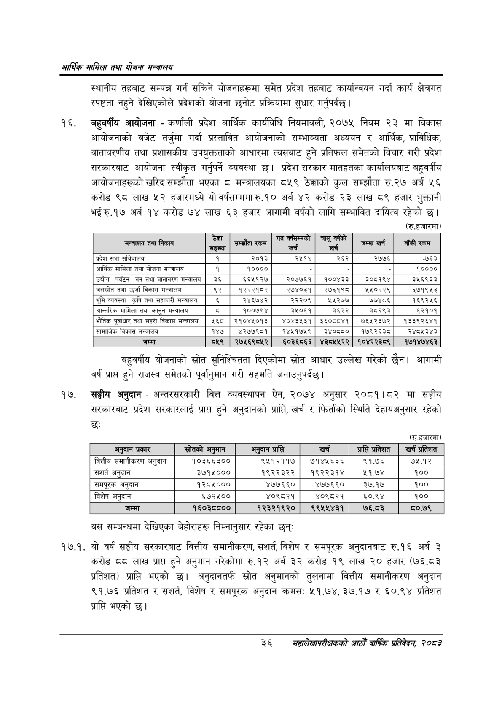

# Page 58 QA

## Rendered page


## Extracted text

```text
आर्थिक मामिला तथा योजना सन्चबालय
स्थानीय तहबाट सम्पन्न गर्न सकिने योजनाहरूमा समेत प्रदेश तहबाट कार्यान्वयन गर्दा कार्य क्षेत्रगत स्पष्टता नहुने देखिएकोले प्रदेशको योजना छनोट प्रक्रियामा सुधार गर्नुपर्दछ |
बहुवर्षीय आयोजना -कर्णाली प्रदेश आर्थिक कार्यविधि नियमावली, २०७५ नियम २३ मा विकास आयोजनाको बजेट तर्जुमा गर्दा प्रस्तावित आयोजनाको सम्भाव्यता अध्ययन र आर्थिक, प्राविधिक, वातावरणीय तथा प्रशासकीय उपयुक्तताको आधारमा त्यसबाट हुने प्रतिफल समेतको विचार गरी प्रदेश सरकारबाट आयोजना स्वीकृत गर्नुपर्ने व्यवस्था छ। प्रदेश सरकार मातहतका कार्यालयबाट बहुवर्षीय आयोजनाहरूको खरिद सम्झौता भएका ८ मन्त्रालयका ८५९ ठेक्काको कुल सम्झौता रु.२७ अर्ब ५६ करोड ९८ लाख ५२ हजारमध्ये यो वर्षसम्ममा रु.१० अर्ब ४२ करोड २३ लाख ८९ हजार भुक्तानी भई रु.१७ अर्ब १४ करोड ७४ लाख ६३ हजार आगामी वर्षको लागि सम्भावित दायित्व रहेको छ। (रु.हजारमा)
बहुवर्षीय योजनाको स्रोत सुनिश्चितता दिएकोमा स्रोत आधार उल्लेख गरेको छैन। आगामी वर्ष प्राप्त हुने राजस्व समेतको पूर्वानुमान गरी सहमति जनाउनुपर्दछ।
सङ्घीय अनुदान -अन्तरसरकारी वित्त व्यवस्थापन ऐन, २०७४ अनुसार २०८१।८२ मा सङ्घीय सरकारबाट प्रदेश सरकारलाई प्राप्त हुने अनुदानको प्राप्ति, खर्च र फिर्ताको स्थिति देहायअनुसार रहेको छः
(रु.हजारमा)
यस सम्बन्धमा देखिएका बेहोराहरू निम्नानुसार रहेका छन्‌ः
१७.१. यो वर्ष सङ्गीय सरकारबाट वित्तीय समानीकरण, सशर्त, विशेष र समपूरक अनुदानबाट रु.१६ अर्ब ३ करोड ८८ लाख प्राप्त हुने अनुमान गरेकोमा रु.१२ अर्ब ३२ करोड १९ लाख ३० हजार (७६.८३ प्रतिशत) प्राप्ति भएको छ। अनुदानतर्फ स्रोत अनुमानको तुलनामा वित्तीय समानीकरण अनुदान ९१.७६ प्रतिशत र सशर्त, विशेष र समपूरक अनुदान क्रमस: ५१.७४, ३७.१७ र ६०.९४ प्रतिशत प्राप्ति भएको छ।
३६
सहालेखापरीक्षकको वाषिक प्रतिवेदन २०८२

| मन्त्रालय तथा निकाय | हने | सम्झौता रकम | र | च्य्कुन | जम्मा खख | बाँकी रकम |
| --- | --- | --- | --- | --- | --- | --- |
| प्रदेश सभा सचिवालय | १ | २०१३ | २५१४ | २६२ | २७७६ | -७६३ |
| आर्थिक मामिला तथा योजना मन्त्रालय | १ | १०००० |  |  |  | ४०००० |
| 'उच्चोग पर्यटन वन तथा वातावरण मन्त्रालय | ३६ | ६६५१२७ | २०७७६१ | १००४३३ | ३०८१९४ | ३५६९३३ |
| 'जलस्रोत तथा उर्जा विकास मन्त्रालय | ९२ | १२२२१८२ | २७४०३१ | २७६१९८ | ११०२२९ | ५७१९५३ |
| भूमि व्यवस्था कृषि तथा सहकारी मन्त्रालय |  | २४६७४२ | २२२०९ | ५२७७ | ७७४८६ | १६९२५६ |
| आन्तरिक मामिला तथा कानुन मन्त्रालय | ५ | १००७९४ | ३५०६१ | ३६३२ | ३८६९३ | ६२१०१ |
| भौतिक पूर्वाधार तथा सहरी विकास मन्त्रालय | ५६८ | २१०४५०१३ | ४०४३५३१ | ३६०८८४१ | ७६५२३७२ | १३३९२६४१ |
| सामाजिक विकास मन्त्रालय | १४७ | ४२७७९८१ | १४५१७५९ | ३४०८५८० | १७९२६३८ | २४८५३४३ |
| जम्मा | ८५९ | २७५६९८५२ | ६०३६८६६ | ४३८५५२२ | १०४२२३८९ | १७१४७४६३ |

| अनुदान प्रकार | स्रोतको अनुमान | अनुदान प्राप्ति | खर्च | प्राप्ति प्रतिशत | खर्च प्रतिशत |
| --- | --- | --- | --- | --- | --- |
| वित्तीय सभानीकरण अनुदान | १०३६६३०० | ९५१२११७ | ७१४५६३६ | ९१.७६ | ७५.१२ |
| सशर्त अनुदान | ३७१५००० | १९२२३२२ | १९२२३१४ | ११.७४ | १०० |
| 'समपूरक अनुदान | १२८४००० | ४७७६६० | ४७७६६० | ३७.१७ | १०० |
| विशेष अनुदान | ६७२५०० | ४०९८२१ | ४०९८२१ | ६०.९४ | १०० |
| जम्मा | १६०३८८०० | १२३२१९२० | ९९५५४३१ | ७६.८३ | ८०.७९ |
```

## Flags
- table_page
- medium_quality_table
