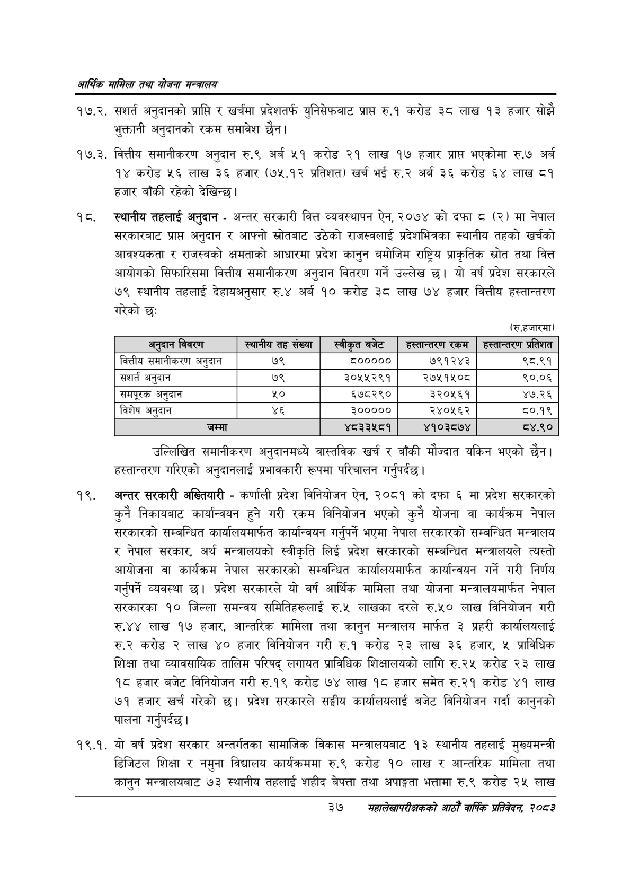

# Page 59 QA

## Rendered page


## Extracted text

```text
आर्थिक मामिला तथा योजना सन्चबालय
१७.२. सशर्त अनुदानको प्राप्ति र खर्चमा प्रदेशतर्फ युनिसेफबाट प्राप्त रु.१ करोड ३८ लाख १३ हजार सोझै भुक्तानी अनुदानको रकम समावेश |
१७.३. वित्तीय समानीकरण अनुदान रु.९ अर्ब ५१ करोड २१ लाख १७ हजार प्राप्त भएकोमा रु.७ अर्ब १४ करोड ५६ लाख ३६ हजार (७५.१२ प्रतिशत) खर्च भई रु.२ अर्ब ३६ करोड ६४ लाख ८१ हजार बाँकी रहेको देखिन्छ |
स्थानीय तहलाई अनुदान -अन्तर सरकारी वित्त व्यवस्थापन ऐन, २०७४ को दफा ८ (२) मा नेपाल सरकारबाट प्राप्त अनुदान र आफ्नो स्रोतबाट उठेको राजस्वलाई प्रदेशभित्रका स्थानीय तहको खर्चको आवश्यकता र राजस्वको क्षमताको आधारमा प्रदेश कानुन बमोजिम राष्ट्रिय प्राकृतिक स्रोत तथा वित्त आयोगको सिफारिसमा वित्तीय समानीकरण अनुदान वितरण गर्ने उल्लेख छ। यो वर्ष प्रदेश सरकारले ७९ स्थानीय तहलाई देहायअनुसार रु.४ अर्ब १० करोड ३८ लाख ७४ हजार वित्तीय हस्तान्तरण गरेको छ:
(रु.हजारमा)
उल्लिखित समानीकरण अनुदानमध्ये वास्तविक खर्च र बाँकी मौज्दात यकिन भएको छैन। हस्तान्तरण गरिएको अनुदानलाई प्रभावकारी रूपमा परिचालन गर्नुपर्दछ।
अन्तर सरकारी अख्तियारी -कर्णाली प्रदेश विनियोजन ऐन, २०८१ को दफा ६ मा प्रदेश सरकारको कुनै निकायबाट कार्यान्वयन हुने गरी रकम विनियोजन भएको कुनै योजना वा कार्यक्रम नेपाल सरकारको सम्बन्धित कार्यालयमार्फत कार्यान्वयन गर्नुपर्ने भएमा नेपाल सरकारको सम्बन्धित मन्त्रालय र नेपाल सरकार, अर्थ मन्त्रालयको स्वीकृति लिई प्रदेश सरकारको सम्बन्धित मन्त्रालयले त्यस्तो आयोजना वा कार्यक्रम नेपाल सरकारको सम्बन्धित कार्यालयमार्फत कार्यान्वयन गर्ने गरी निर्णय गर्नुपर्ने व्यवस्था छ। प्रदेश सरकारले यो वर्ष आर्थिक मामिला तथा योजना मन्त्रालयमार्फत नेपाल सरकारका १० जिल्ला समन्वय समितिहरूलाई रु.५ लाखका दरले रु.५० लाख विनियोजन गरी रु.४४ लाख १७ हजार, आन्तरिक मामिला तथा कानुन मन्त्रालय मार्फत ३ प्रहरी कार्यालयलाई करोड २ लाख ४० हजार विनियोजन गरी रु.१ करोड ३ लाख ३६ हजार, प्राविधिक शिक्षा तथा व्यावसायिक तालिम परिषद्‌ लगायत प्राविधिक शिक्षालयको लागि रु.२५ करोड २३ लाख १८ हजार बजेट विनियोजन गरी रु.१९ करोड ७४ लाख १८ हजार समेत रु.२१ करोड ४१ लाख ७१ हजार खर्च गरेको | प्रदेश सरकारले सङ्घीय कार्यालयलाई बजेट विनियोजन गर्दा कानुनको पालना गर्नुपर्दछ |
१९.१. यो वर्ष प्रदेश सरकार अन्तर्गतका सामाजिक विकास मन्त्रालयबाट १३ स्थानीय तहलाई मुख्यमन्त्री डिजिटल शिक्षा र नमुना विद्यालय कार्यक्रममा रु.९ करोड १० लाख र आन्तरिक मामिला तथा कानुन मन्त्रालयबाट ७३ स्थानीय तहलाई शहीद बेपत्ता तथा अपाङ्गता भत्तामा रु.९ करोड २५ लाख
३७
महालेखापरीक्षकको भाठोँ वार्षिक प्रतिवेदन २०८२

| अर्दान विवरण | स्थानीय तह संख्या | बजेट | हस्तान्तरण रकम | हस्तान्तरण प्रतिशत |
| --- | --- | --- | --- | --- |
| वित्तीय क्षमानीक९५ अनुदान | ७९ | ८००००० | ७९१२४३ | ९८.९१ |
| संशर्त अनुदान | ७९ | ३०५५२९१ | २७५१५०८ | ९०.०६ |
| समपूरक अनुदान | २० | ६७८२९० | ३२०५६१ | ४७.२६ |
| विशेष अनुदान | ४६ | ३००००० | २४०५६२ | ८०.१९ |
| जम्मा |  | ४८३३५८१ | ४१०३८७४ | ८४.९० |
```

## Flags
- table_page
- medium_quality_table
