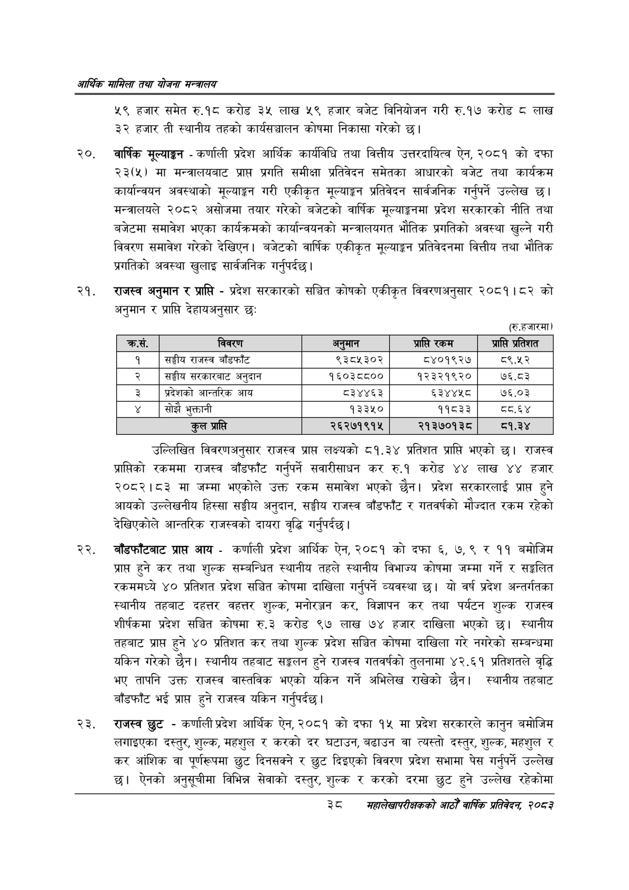

# Page 60 QA

## Rendered page


## Extracted text

```text
आर्थिक मामिला तथा योजना सन्चबालय
४९ हजार समेत रु.१८ करोड ३४५ लाख ५९ हजार बजेट विनियोजन गरी रु.१७ करोड लाख ३३ हजार ती स्थानीय तहको कार्यसञ्चालन कोषमा निकासा गरेको छ।
वार्षिक मूल्याङ्कन -कर्णाली प्रदेश आर्थिक कार्यविधि तथा वित्तीय उत्तरदायित्व ऐन, २०८१ को दफा २३(५) मा मन्त्रालयबाट प्राप्त प्रगति समीक्षा प्रतिवेदन समेतका आधारको बजेट तथा कार्यक्रम कार्यान्वयन अवस्थाको मूल्याङ्कन गरी एकीकृत मूल्याङ्कन प्रतिवेदन सार्वजनिक गर्नुपर्ने उल्लेख ३ | मन्त्रालयले २०८२ असोजमा तयार गरेको बजेटको वार्षिक मूल्याङ्कनमा प्रदेश सरकारको नीति तथा बजेटमा समावेश भएका कार्यक्रमको कार्यान्वयनको मन्त्रालयगत भौतिक प्रगतिको अवस्था खुल्ने गरी विवरण समावेश गरेको देखिएन। बजेटको वार्षिक एकीकृत मूल्याङ्कन प्रतिवेदनमा वित्तीय तथा भौतिक प्रगतिको अवस्था खुलाइ सार्वजनिक गर्नुपर्दछ |
राजस्व अनुमान र प्राप्ति -प्रदेश सरकारको सञ्चित कोषको एकीकृत विवरणअनुसार २०८१।८२ को अनुमान र प्राप्ति देहायअनुसार छः
(रु.हजारमा)
उल्लिखित विवरणअनुसार राजस्व प्रापत लक्ष्यको ८१.३४ प्रतिशत प्राप्ति भएको छ। राजस्व प्राप्तिको रकममा राजस्व बाँडफाँट गर्नुपर्ने सवारीसाधन कर रु.१ करोड ४४ लाख ४४ हजार २०८२।८३ मा जम्मा भएकोले उक्त रकम समावेश भएको छैन। प्रदेश सरकारलाई प्राप्त हुने आयको उल्लेखनीय हिस्सा सङ्घीय अनुदान, सङ्घीय राजस्व बाँडफाँट र गतवर्षको मौज्दात रकम रहेको देखिएकोले आन्तरिक राजस्वको दायरा वृद्धि गर्नुपर्दछ |
बाँडफाँटबाट प्राप्त आय -कर्णाली प्रदेश आर्थिक ऐन, २०८१ को दफा , ७,९ र ११ बमोजिम प्राप्त हुने कर तथा शुल्क सम्बन्धित स्थानीय तहले स्थानीय विभाज्य कोषमा जम्मा गर्ने र सङ्गलित रकममध्ये ४० प्रतिशत प्रदेश सञ्चित कोषमा दाखिला गर्नुपर्ने व्यवस्था छ। यो वर्ष प्रदेश अन्तर्गतका स्थानीय तहबाट दहत्तर वहत्तर शुल्क, मनोरञ्जन कर, विज्ञापन कर तथा पर्यटन शुल्क राजस्व शीर्षकमा प्रदेश सञ्चित कोषमा रु.३ करोड ९७ लाख ७४ हजार दाखिला भएको छ। स्थानीय तहबाट प्राप्त हुने ४० प्रतिशत कर तथा शुल्क प्रदेश सञ्चित कोषमा दाखिला गरे नगरेको सम्बन्धमा यकिन गरेको छैन। स्थानीय तहबाट सङ्कलन हुने राजस्व गतवर्षको तुलनामा ४२.६१ प्रतिशतले वृद्धि भए तापनि उक्त राजस्व वास्तविक भएको यकिन गर्ने अभिलेख राखेको छैन। स्थानीय तहबाट बाँडफाँट भई प्राप्त हुने राजस्व यकिन गर्नुपर्दछ |
राजस्व छुट -कर्णाली प्रदेश आर्थिक ऐन, २०८१ को दफा १५ मा प्रदेश सरकारले कानुन बमोजिम लगाइएका दस्तुर, शुल्क, महशुल र करको दर घटाउन, बढाउन वा त्यस्तो दस्तुर, शुल्क, महशुल र कर आंशिक वा पूर्णरूपमा छुट दिनसक्ने र छुट दिइएको विवरण प्रदेश सभामा पेस गर्नुपर्ने उल्लेख छ। ऐनको अनुसूचीमा विभिन्न सेवाको दस्तुर, शुल्क र करको दरमा छुट हुने उल्लेख रहेकोमा
३८
महालेखापरीक्षकको भाठोँ वार्षिक प्रतिवेदन २०८२

| कस. | विवरण | अनुमान | प्राप्ति रकम | प्राप्ति प्रतिशत |
| --- | --- | --- | --- | --- |
| १ | राजस्व बाँडफाँट | ९३८५३०२ | ८४०१९२७ | ८९.४५२ |
| २ | सङ्घीय रकार१।८ अनुदान | १६०३८८०० | १२३२१९२० | ७६.८३ |
| ३ | प्रदेशको आन्तरिक आय | ८३४४६३ | ६३४४४५८ | ७६.०३ |
| ४ | सोझै भुक्तानी | १३३५० | ११८३३ |  |
| ५ |  | २६२७१९१५ | २१३७०१३८ | ८१.३४ |
```

## Flags
- table_page
- medium_quality_table
