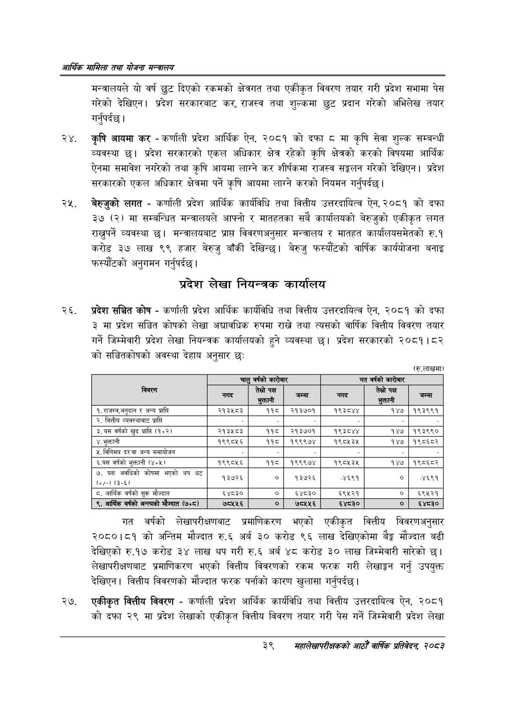

# Page 61 QA

## Rendered page


## Extracted text

```text
आर्थिक मामिला तथा योजना सन्चबालय
मन्त्रालयले यो वर्ष छुट दिएको रकमको क्षेत्रगत तथा एकीकृत विवरण तयार गरी प्रदेश सभामा पेस गरेको देखिएन। प्रदेश सरकारबाट कर, राजस्व तथा शुल्कमा छुट प्रदान गरेको अभिलेख तयार गर्नुपर्दछ |
२४, कृषि आयमा कर -कर्णाली प्रदेश आर्थिक ऐन, २०८१ को दफा ८ मा कृषि सेवा शुल्क सम्बन्धी व्यवस्था | प्रदेश सरकारको एकल अधिकार क्षेत्र रहेको कृषि क्षेत्रको करको विषयमा आर्थिक ऐनमा समावेश नगरेको तथा कृषि आयमा लाग्ने कर शीर्षकमा राजस्व सङ्कलन गरेको देखिएन। प्रदेश सरकारको एकल अधिकार क्षेत्रमा पर्ने कृषि आयमा लाग्ने करको नियमन गर्नुपर्दछ।
बेरुजुको लगत -कर्णाली प्रदेश आर्थिक कार्यविधि तथा वित्तीय उत्तरदायित्व ऐन, २०८१ को दफा ३७ (२) मा सम्बन्धित मन्त्रालयले आफ्नो र मातहतका सबै कार्यालयको बेरुजुको एकीकृत लगत राख्नुपर्ने व्यवस्था छ। मन्त्रालयबाट प्राप्त विवरणअनुसार मन्त्रालय र मातहत कार्यालयसमेतको रु.१ करोड ३७ लाख ९९ हजार बेरुजु बाँकी देखिन्छ। बेरुजु फस्यौटको वार्षिक कार्ययोजना बनाइ फरस्यौटको अनुगमन गर्नुपर्दछ |
प्रदेश लेखा नियन्त्रक कार्यालय
प्रदेश सञ्चित कोष -कर्णाली प्रदेश आर्थिक कार्यविधि तथा वित्तीय उत्तरदायित्व ऐन, २०८१ को दफा ३माप्रदेश सञ्चित कोषको लेखा अद्यावधिक रुपमा राख्ने तथा त्यसको वार्षिक वित्तीय विवरण तयार गर्ने जिम्मेवारी प्रदेश लेखा नियन्त्रक कार्यालयको हुने व्यवस्था छ। प्रदेश सरकारको २०८१। ८२ को सञ्चितकोषको अवस्था देहाय अनुसार छः
(रु.लाखमा)
गत वर्षको लेखापरीक्षणबाट प्रमाणिकरण भएको एकीकृत वित्तीय विवरणअनुसार २०८०।८१ को अन्तिम मौज्दात रु.६ अर्ब ३० करोड ९६ लाख देखिएकोमा बेङ्ग मौज्दात बढी देखिएको रु.१७ करोड ३४ लाख थप गरी रु.६ अर्ब ४८ करोड ३० लाख जिम्मेवारी सारेको | लेखापरीक्षणबाट प्रमाणिकरण भएको वित्तीय विवरणको रकम फरक गरी लेखाङ्गन गर्नु उपयुक्त देखिएन। वित्तीय विवरणको मौज्दात फरक पर्नाको कारण खुलासा गर्नुपर्दछ |
एकीकृत वित्तीय विवरण -कर्णाली प्रदेश आर्थिक कार्यविधि तथा वित्तीय उत्तरदायित्व ऐन, २०८१ कोदफा २९ मा प्रदेश लेखाको एकीकृत वित्तीय विवरण तयार गरी पेस गर्ने जिम्मेवारी प्रदेश लेखा
३९
सहालेखापरीक्षकको वाषिक प्रतिवेदन २०८२

|  | चालु | वर्षको कारोबार |  | गत | वर्षको कारोबार |  |
| --- | --- | --- | --- | --- | --- | --- |
| विवरण | लि | तेस्रो पक्ष भुक्तानी | लि |  | तेस्रो पक्ष भुक्तानी | लि |
| १.राजस्व,अनुदान र अन्य प्राप्ति | २१३५८३ | ११५ | २१३७०१ | १९३८४४ | १४७ | १९३९९१ |
| २. वित्तीय व्ववस्थाबाट प्राप्ति |  |  |  |  |  |  |
| ३.यस वर्षको खुद प्राप्त (१४२) | २१३४५८३ | ११८ | २१३७०१ | १९३८४४ | १४७ | १९३९९० |
| ४. भुक्तानी | १९९८१५६ | ११८ | १९९९७४ | १९८१५३५ | १४७ | १९८६८२ |
| ५. विनिमय दर वा अन्य समाबोजन |  |  |  |  |  |  |
| ६.यस वर्षको भुक्तानी (४५) | १९९८५६ | ११५८ | १९९९७४ | १९८५३५ | १४७ | १९८६८२ |
| र न नेको मा भएका झा बट | १३७२६ | ० | १३७२६ | -४६९१ | ० | -४६९१ |
| ८. आर्थिक वर्षको सुरू मौज्दात | ६४८३० | ० | ६४८३० | ६९५२१ | ० | ६९१२१ |
| ९, आर्थिक वर्षको अन्त्यको मौज्दात (७५८) | ७८५५६ | ० | ७८५५६ | ६४८३० | ० | ६४८३० |
```

## Flags
- table_page
- medium_quality_table
