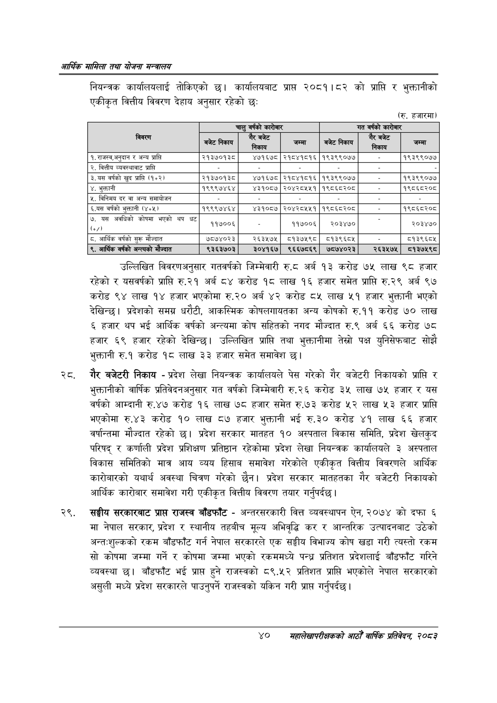

# Page 62 QA

## Rendered page


## Extracted text

```text
आर्थिक मामिला तथा योजना सन्चबालय
नियन्त्रक कार्यालयलाई तोकिएको छ। कार्यालयबाट प्राप्त २०८१।८२ को प्राप्ति र भुक्तानीको एकीकृत वित्तीय विवरण देहाय अनुसार रहेको छ:
(रु. हजारमा)
उल्लिखित विवरणअनुसार गतवर्षको जिम्मेवारी रु.८ अर्ब ९३ करोड ७५ लाख ९८ हजार रहेको र यसवर्षको प्राप्ति रु.२१ अर्ब ८४ करोड १८ लाख १६ हजार समेत प्राप्ति रु.२९ अर्ब ९७ करोड ९४ लाख १४ हजार भएकोमा रु.२० अर्ब ४२ करोड ८५ लाख ५१ हजार भुक्तानी भएको देखिन्छ। प्रदेशको समग्र धरौटी, आकस्मिक कोषलगायतका अन्य कोषको रु.११ करोड ७० लाख ६ हजार थप भई आर्थिक वर्षको अन्त्यमा कोष सहितको नगद मौज्दात रु.९ अर्ब ६६ करोड ७८ हजार ६९ हजार रहेको देखिन्छ। उल्लिखित प्राप्ति तथा भुक्तानीमा तेस्रो पक्ष युनिसेफबाट सोझै भुक्तानी रु.१ करोड १८ लाख ३३ हजार समेत समावेश |
, गैर बजेटरी निकाय -प्रदेश लेखा नियन्त्रक कार्यालयले पेस गरेको गैर बजेटरी निकायको प्राप्ति र भुक्तानीको वार्षिक प्रतिवेदनअनुसार गत वर्षको जिम्मेवारी रु.२६ करोड ३५ लाख ७५ हजार र यस वर्षको आम्दानी रु.४७ करोड १६ लाख ७८ हजार समेत रु.७३ करोड लाख ५३ हजार प्राप्ति भएकोमा रु.४३ करोड १० लाख ८७ हजार भुक्तानी भई रु.३० करोड ४१ लाख ६६ हजार वर्षान्तमा मौज्दात रहेको छ। प्रदेश सरकार मातहत १० अस्पताल विकास समिति, प्रदेश खेलकुद परिषद्‌ र कर्णाली प्रदेश प्रशिक्षण प्रतिष्ठान रहेकोमा प्रदेश लेखा नियन्त्रक कार्यालयले ३ अस्पताल विकास समितिको मात्र आय व्यय हिसाब समावेश गरेकोले एकीकृत वित्तीय विवरणले आर्थिक कारोबारको यथार्थ अवस्था चित्रण गरेको छैन। प्रदेश सरकार मातहतका गैर बजेटरी निकायको आर्थिक कारोबार समावेश गरी एकीकृत वित्तीय विवरण तयार गर्नुपर्दछ |
सङ्घीय सरकारबाट प्राप्त राजस्व बाँडफाँट -अन्तरसरकारी वित्त व्यवस्थापन ऐन, २०७४ को दफा ६ मा नेपाल सरकार, प्रदेश र स्थानीय तहबीच मूल्य अभिवृद्धि कर र आन्तरिक उत्पादनबाट उठेको अन्त-शुल्कको रकम बाँडफाँट गर्न नेपाल सरकारले एक सङ्घीय विभाज्य कोष खडा गरी त्यस्तो रकम सो कोषमा जम्मा गर्ने र कोषमा जम्मा भएको रकममध्ये पन्ध्र प्रतिशत प्रदेशलाई बाँडफाँट गरिने व्यवस्था छ। बाँडफाँट भई प्राप्त हुने राजस्वको ८९.५२ प्रतिशत प्राप्ति भएकोले नेपाल सरकारको असुली मध्ये प्रदेश सरकारले पाउनुपर्ने राजस्वको यकिन गरी प्राप्त गर्नुपर्दछ |
४०
सहालेखापरीक्षकको आठौँ वा्िकि प्रतिवेदन २०८२

|  |  | चालु वर्षको कारोबार |  |  | गत वर्षको कारोबार |  |
| --- | --- | --- | --- | --- | --- | --- |
|  | 'बजेट निकाय | पे 'निकाय | जम्मा | 'बजेट निकाय | = 'निकाय | जम्मा |
| १. राजस्व,अनुदान र अन्य प्राप्ति | २१३७०१३८ | ४७१६७८ | २१८४१८१६ | १९३९९०७४ |  | १९३९९०७४ |
| २. वित्तीय व्यवस्थाबाट प्राप्ति |  |  |  |  |  |  |
| ३,७९ वर्षको खुद प्राप्ति (१४२। | २१३७०१३८ | ४७१६७८ | २१८४१८१६ | १९३९९०७७ |  | १९३९९०७४ |
| ४. भुक्तानी | १९९९७४६४ | ४३१०८७ | २०४२८५५१ | १९८६८२०८ |  | १९८६८२०८ |
| ५. विनिमय दर वा अन्य समायोजन |  |  |  |  |  |  |
| ६.यस वर्षको भुक्तानी (४४५) | १९९९७४६४ | ४३१०८७ | २०४२८५५१ | १९८६८२०८ |  | १९८६८२०८ |
| ७. यस अवधिको कोषमा भएको थप घट | ११७००६ |  | ११७००६ | र२०३४७० |  | २०३४७० |
| ८. आर्थिक वर्षको सुरू मौज्दात | ७८७४०२३ | २६३५७५ | ८५१३७५९८ | ८१३९६८४५ |  | ५१३९६८४५ |
| ९, आर्थिक वर्षको अन्त्यको मौज्दात | ९३६३७०३ | ३०४१६७ | ९६६७८६९ | ७८७४०२३ | २६३५७५ | ८०१३७५९८ |
```

## Flags
- table_page
- medium_quality_table
