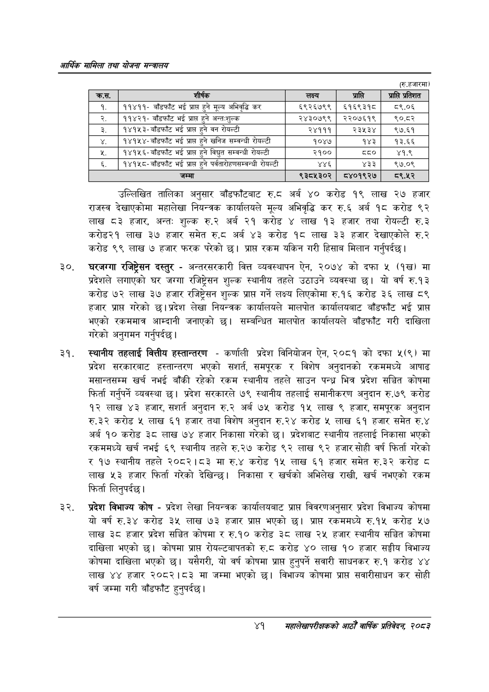

# Page 63 QA

## Rendered page


## Extracted text

```text
आर्थिक मामिला तथा योजना सन्चबालय
(रु.हजारमा)
उल्लिखित तालिका अनुसार बाँडफाँटबाट रु.८ठ अर्ब ४० करोड १९ लाख २७ हजार राजस्व देखाएकोमा महालेखा नियन्त्रक कार्यालयले मूल्य अभिवृद्धि कर रु.६ अर्ब १८ करोड ९२ लाख ८३ हजार, अन्त: शुल्क रु.२ अर्ब २१ करोड लाख १३ हजार तथा रोयल्टी रु.३ करोड२१ लाख ३७ हजार समेत रु.८ अर्ब ४३ करोड १६ लाख ३३ हजार देखाएकोले रु.२ करोड ९९ लाख ७ हजार फरक परेको छ। प्राप्त रकम यकिन गरी हिसाब मिलान गर्नुपर्दछ।
घरजग्गा रजिष्ट्रेसन दस्तुर -अन्तरसरकारी वित्त व्यवस्थापन ऐन, २०७४ को दफा ५ (१ख) मा प्रदेशले लगाएको घर जग्गा रजिष्ट्रेसन शुल्क स्थानीय तहले उठाउने व्यवस्था छ। यो वर्ष रु.१३ करोड ७२ लाख ३७ हजार रजिष्ट्रेसन शुल्क प्राप्त गर्ने लक्ष्य लिएकोमा रु.१६ करोड ३६ लाख ८९ हजार प्रापत गरेको छ। प्रदेश लेखा नियन्त्रक कार्यालयले मालपोत कार्यालयबाट बाँडफाँट भई प्राप्त भएको रकममात्र आम्दानी जनाएको छ। सम्बन्धित मालपोत कार्यालयले बाँडफाँट गरी दाखिला गरेको अनुगमन गर्नुपर्दछ।
स्थानीय तहलाई वित्तीय हस्तान्तरण -कर्णाली प्रदेश विनियोजन ऐन, २०८१ को दफा ५(९) मा प्रदेश सरकारबाट हस्तान्तरण भएको सशर्त, समपूरक र विशेष अनुदानको रकममध्ये आषाढ मसान्तसम्म खर्च नभई बाँकी रहेको रकम स्थानीय तहले साउन पन्ध्र भित्र प्रदेश सञ्चित कोषमा फिर्ता गर्नुपर्ने व्यवस्था छ। प्रदेश सरकारले ७९ स्थानीय तहलाई समानीकरण अनुदान रु.७९ करोड ९३ लाख ४३ हजार, अनुदान रु.२ अर्ब ७५ करोड १५ लाख ९ हजार, समपूरक अनुदान रु.३२ करोड ५ लाख ६१ हजार तथा विशेष अनुदान रु.२४ करोड ५ लाख ६१ हजार समेत रु.४ अर्ब १० करोड ३८ लाख ७४ हजार निकासा गरेको छ। प्रदेशबाट स्थानीय तहलाई निकासा भएको रकममध्ये खर्च नभई ६९ स्थानीय तहले रु.२७ करोड ९२ लाख ९२ हजार सोही वर्ष फिर्ता गरेको र १७ स्थानीय तहले २०८२।८३ मा रु.४ करोड १५ लाख ६१ हजार समेत रु.३२ करोड ८ लाख ५३ हजार फिर्ता गरेको देखिन्छ। निकासा र खर्चको अभिलेख राखी, खर्च नभएको रकम फिर्ता लिनुपर्दछ |
प्रदेश विभाज्य कोष -प्रदेश लेखा नियन्त्रक कार्यालयबाट प्राप्त विवरणअनुसार प्रदेश विभाज्य कोषमा यो वर्ष रु.३४ करोड ३५ लाख ७३ हजार प्रापत भएको छ। प्राप्त रकममध्ये रु.१५ करोड ५७ लाख ३८ हजार प्रदेश सञ्चित कोषमा र रु.१० करोड ३८ लाख २५ हजार स्थानीय सञ्चित कोषमा दाखिला भएको छ। कोषमा प्राप्त रोयल्टबापतको रु.८ करोड ४० लाख १० हजार सङ्घीय विभाज्य कोषमा दाखिला भएको | यसैगरी, यो वर्ष कोषमा प्राप्त हुनुपर्ने सवारी साधनकर रु.१ करोड ४४ लाख ४४ हजार २०८२।८३ मा जम्मा भएको छ। विभाज्य कोषमा प्रापत सवारीसाधन कर सोही वर्ष जम्मा गरी बाँडफाँट हुनुपर्दछ |
४१
सहालेखापरीक्षकको वाषिक प्रतिवेदन २०८२

| कस. | शीर्षक | लक्ष्य | प्राप्ति | प्रतिशत |
| --- | --- | --- | --- | --- |
| १ | ११४११- बाँडफाँट भई प्राप्त हुने मूल्य अभिवृद्धि कर | ६९२६७९९ | ६१६९३१८ | ०६.०६ |
| २ | ११४२१- बाँडफाँट भई प्राप्त हुने अन्त-शुल्क | २४३०७९९ | २२०७६१९ | १९०.८२ |
| ३ | १४१५३-बाँडफाँट भई प्राप्त हुने वन रोयल्टी | २४१११ | २३५३४ | ९७.६१ |
| ४ | १४१५४-बाँडफाँट भई प्राप्त हुने खनिज सम्वन्धी रोयल्टी | १०४७ | १४३ | १३.६६ |
| ५ | १४१५६-बाँडफाँट भई प्राप्त हुने विद्युत सम्वन्धी रोयल्टी | २१०० | द्द० | ४१.९ |
| ६ | १४१५८-बाँडफाँट भई प्राप्त हुने पर्वतारोहणस्बन्धी रोयल्टी | ४४६ | ४३३ | ९७.०९ |
| ७ | जम्मा | ९३८५३०२ | ८४०१९२७ | ८९.५२ |
```

## Flags
- table_page
- medium_quality_table
