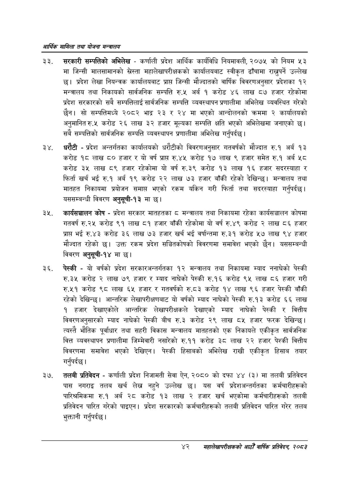

# Page 64 QA

## Rendered page


## Extracted text

```text
आर्थिक मामिला तथा योजना सन्चबालय
सरकारी सम्पत्तिको अभिलेख -कर्णाली प्रदेश आर्थिक कार्यविधि नियमावली, २०७५ को नियम ५३ मा जिन्सी मालसामानको स्ेस्ता महालेखापरीक्षकको कार्यालयबाट स्वीकृत ढाँचामा राख्नुपर्ने उल्लेख छ। प्रदेश लेखा नियन्त्रक कार्यालयबाट प्राप्त जिन्सी मौज्दातको वार्षिक विवरणअनुसार प्रदेशका १२ मन्त्रालय तथा निकायको सार्वजनिक सम्पत्ति रु.५ अर्ब १ करोड ४६ लाख ८७ हजार रहेकोमा प्रदेश सरकारको सबै सम्पत्तिलाई सार्वजनिक सम्पत्ति व्यवस्थापन प्रणालीमा अभिलेख व्यवस्थित गरेको छैन। सो सम्पत्तिमध्य २०८२ भाद्र २३ र २४ मा भएको आन्दोलनको क्रममा २ कार्यालयको अनुमानित रु.५ करोड २६ लाख ३२ हजार मूल्यका सम्पत्ति क्षति भएको अभिलेखमा जनाएको छ। सबै सम्पत्तिको सार्वजनिक सम्पत्ति व्यवस्थापन प्रणालीमा अभिलेख गर्नुपर्दछ |
धरौटी -प्रदेश अन्तर्गतका कार्यालयको धरौटीको विवरणअनुसार गतवर्षको मौज्दात रु.१ अर्ब १३ करोड १८ लाख ८० हजार र यो वर्ष प्राप्त रु.४५ करोड १७ लाख ९ हजार समेत रु.१ अर्ब ५८ करोड ३५ लाख ८९ हजार रहेकोमा यो वर्ष रु.३९ करोड १३ लाख १६ हजार सदरस्याहा र फिर्ता खर्च भई रु.१ अर्ब १९ करोड २२ लाख ७३ हजार बाँकी रहेको देखिन्छ। मन्त्रालय तथा मातहत निकायमा प्रयोजन समाप्त भएको रकम यकिन गरी फिर्ता तथा सदरस्याहा गर्नुपर्दछ। यससम्बन्धी विवरण अनुसूची-१३ मा छ।
कार्यसञ्चालन कोष -प्रदेश सरकार मातहतका ८ मन्त्रालय तथा निकायमा रहेका कार्यसञ्चालन कोषमा गतवर्ष रु.२५ करोड ९१ लाख ८१ हजार बाँकी रहेकोमा यो वर्ष रु.४९ करोड २ लाख ८६ हजार प्रापस भई रु.४३ करोड ३६ लाख ७३ हजार खर्च भई वर्षान्तमा रु.३१ करोड ५७ लाख ९४ हजार मौज्दात रहेको छ। उक्त रकम प्रदेश सञ्चितकोषको विवरणमा समावेश भएको छैन। यससम्बन्धी विवरण अनुसूची-१४ मा छ।
पेस्की -यो वर्षको प्रदेश सरकारअन्तर्गतका १२ मन्त्रालय तथा निकायमा म्याद ननाघेको पेस्की.३४ करोड २ लाख ७९ हजार र म्याद नाघेको पेस्की रु.१६ करोड ९५ लाख ८६ हजार गरी रु.५१ करोड ९८ लाख ६५ हजार र गतवर्षको रु.८३ करोड १४ लाख ९६ हजार पेस्की बाँकी रहेको देखिन्छ। आन्तरिक लेखापरीक्षणबाट यो वर्षको म्याद नाघेको पेस्की रु.१३ करोड ६६ लाख १ हजार देखाएकोले आन्तरिक लेखापरीक्षकले देखाएको म्याद नाघेको पेस्की र वित्तीय विवरणअनुसारको म्याद नाघेको पेस्की बीच रु.३ करोड २९ लाख ८५ हजार फरक देखिन्छ। त्यस्तै भौतिक पूर्वाधार तथा सहरी विकास मन्त्रालय मातहतको एक निकायले एकीकृत सार्वजनिक वित्त व्यवस्थापन प्रणालीमा जिम्मेवारी नसारेको रु.११ करोड ३८ लाख २२ हजार पेश्की वित्तीय विवरणमा समावेश भएको देखिएन। पेस्की हिसाबको अभिलेख राखी एकीकृत हिसाब तयार गर्नुपर्दछ |
तलबी प्रतिवेदन -कर्णाली प्रदेश निजामती सेवा ऐन, २०८० को दफा ४४ (३) मा तलबी प्रतिवेदन पास नगराइ तलब खर्च लेख नहुने उल्लेख यस वर्ष प्रदेशअन्तर्गतका कर्मचारीहरूको पारिश्रमिकमा रु.१ अर्ब २८ करोड १३ लाख २ हजार खर्च भएकोमा कर्मचारीहरूको तलबी प्रतिवेदन पारित गरेको पाइएन। प्रदेश सरकारको कर्मचारीहरूको तलबी प्रतिवेदन पारित गरेर तलब भुक्तानी गर्नुपर्दछ |
४२
सहालेखापरीक्षकको वाषिक प्रतिवेदन २०८२
```

## Flags
- None
