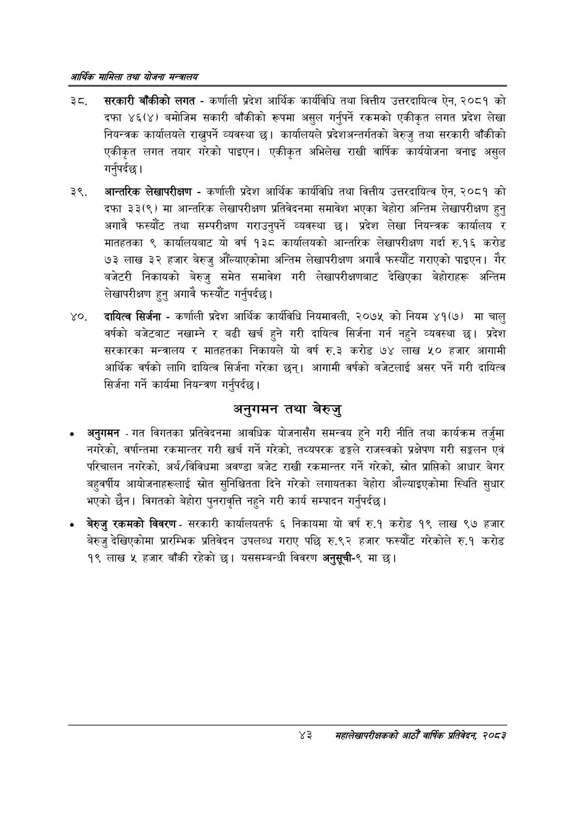

# Page 65 QA

## Rendered page


## Extracted text

```text
आर्थिक मामिला तथा योजना सन्चबालय
सरकारी बाँकीको लगत -कर्णाली प्रदेश आर्थिक कार्यविधि तथा वित्तीय उत्तरदायित्व ऐन, २०८१ को दफा ४६(४) बमोजिम सकारी बाँकीको रूपमा असुल गर्नुपर्ने रकमको एकीकृत लगत प्रदेश लेखा नियन्त्रक कार्यालयले राख्नुपर्ने व्यवस्था छ। कार्यालयले प्रदेशअन्तर्गतको बेरुजु तथा सरकारी बाँकीको एकीकृत लगत तयार गरेको पाइएन। एकीकृत अभिलेख राखी वार्षिक कार्ययोजना बनाइ असुल गर्नुपर्दछ |
आन्तरिक लेखापरीक्षण -कर्णाली प्रदेश आर्थिक कार्यविधि तथा वित्तीय उत्तरदायित्व ऐन, २०८१ को दफा ३३(९) मा आन्तरिक लेखापरीक्षण प्रतिवेदनमा समावेश भएका बेहोरा अन्तिम लेखापरीक्षण हुनु अगावै फस्यौट तथा सम्परीक्षण गराउनुपर्ने व्यवस्था छ। प्रदेश लेखा नियन्त्रक कार्यालय र मातहतका ९ कार्यालयबाट यो वर्ष १३८ कार्यालयको आन्तरिक लेखापरीक्षण गर्दा रु.१६ करोड ७३ लाख ३२ हजार बेरुजु औंल्याएकोमा अन्तिम लेखापरीक्षण अगावै फस्यौट गराएको पाइएन। गैर बजेटरी निकायको बेरुजु समेत समावेश गरी लेखापरीक्षणबाट देखिएका बेहोराहरू अन्तिम लेखापरीक्षण हुनु अगावै फस्यौंट गर्नुपर्दछ |
दायित्व सिर्जना -कर्णाली प्रदेश आर्थिक कार्यविधि नियमावली, २०७५ को नियम ४१(७) मा चालु वर्षको बजेटबाट नखाम्ने र बढी खर्च हुने गरी दायित्व सिर्जना गर्न नहुने व्यवस्था छ। प्रदेश सरकारका मन्त्रालय र मातहतका निकायले यो वर्ष रु.३ करोड ७४ लाख ५० हजार आगामी आर्थिक वर्षको लागि दायित्व सिर्जना गरेका छन्‌। आगामी वर्षको बजेटलाई असर पर्ने गरी दायित्व सिर्जना गर्ने कार्यमा नियन्त्रण गर्नुपर्दछ |
अनुगमन तथा बेरुजु
० अनुगमन -गत विगतका प्रतिवेदनमा आवधिक योजनासँग समन्वय हुने गरी नीति तथा कार्यक्रम तर्जुमा नगरेको, वर्षान्तमा रकमान्तर गरी खर्च गर्ने गरेको, तथ्यपरक ढङ्गले राजस्वको प्रक्षेपण गरी सङ्कलन एवं परिचालन नगरेको, अर्थ/विविधमा अवण्डा बजेट राखी रकमान्तर गर्ने गरेको, स्रोत प्राप्तिको आधार बेगर बहुवर्षीय आयोजनाहरूलाई स्रोत सुनिश्चितता दिने गरेको लगायतका बेहोरा औल्याइएकोमा स्थिति सुधार भएको छैन। विगतको बेहोरा पुनरावृत्ति नहुने गरी कार्य सम्पादन गर्नुपर्दछ |
बेरुजु रकमको विवरण -सरकारी कार्यालयतर्फ ६ निकायमा यो वर्ष रु.१ करोड १९ लाख ९७ हजार बेरुजु देखिएकोमा प्रारम्भिक प्रतिवेदन उपलब्ध गराए पछि रु.९२ हजार फस्यौट गरेकोले रु.१ करोड १९ लाख ५ हजार बाँकी रहेको छ। यससम्बन्धी विवरण अनुसूची-९ मा छ।
४३
सहालेखापरीक्षकको वाषिक प्रतिवेदन २०८२
```

## Flags
- None
