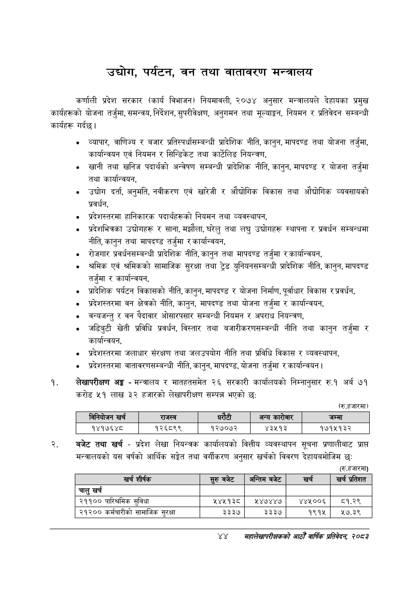

# Page 66 QA

## Rendered page


## Extracted text

```text
उद्योग, पर्यटन, वन तथा वातावरण मन्त्रालय
कर्णाली प्रदेश सरकार (कार्य विभाजन) नियमावली, २०७४ अनुसार मन्त्रालयले देहायका प्रमुख कार्यहरूको योजना तर्जुमा, समन्वय, निर्देशन, सुपरीवेक्षण, अनुगमन तथा मूल्याङ्कन, नियमन र प्रतिवेदन सम्बन्धी कार्यहरू गर्दछ।
व्यापार, वाणिज्य र बजार प्रतिस्पर्धासम्बन्धी प्रादेशिक नीति, कानुन, मापदण्ड तथा योजना तर्जुमा, कार्यान्वयन एवं नियमन र सिन्डिकेट तथा कार्टेलिङ नियन्त्रण,
खानी तथा खनिज पदार्थको अन्वेषण सम्बन्धी प्रादेशिक नीति, कानुन, मापदण्ड र योजना तर्जुमा तथा कार्यान्वयन,
उद्योग दर्ता, अनुमति, नवीकरण एवं खारेजी र औद्योगिक विकास तथा औद्योगिक व्यवसायको प्रवर्धन,
प्रदेशस्तरमा हानिकारक पदार्थहरूको नियमन तथा व्यवस्थापन,
प्रदेशभित्रका उद्योगहरू र साना, मझौला, घरेलु तथा लघु उद्योगहरू स्थापना र प्रवर्धन सम्बन्धमा नीति, कानुन तथा मापदण्ड तर्जुमा र कार्यान्वयन,
रोजगार प्रवर्धनसम्बन्धी प्रादेशिक नीति, कानुन तथा मापदण्ड तर्जुमा र कार्यान्वयन,
श्रमिक एवं श्रमिकको सामाजिक सुरक्षा तथा ट्रेड युनियनसम्बन्धी प्रादेशिक नीति, कानुन, मापदण्ड तर्जुमा र कार्यान्वयन,
प्रादेशिक पर्यटन विकासको नीति, कानुन, मापदण्ड र योजना निर्माण, पूर्वाधार विकास र प्रवर्धन,
प्रदेशस्तरमा वन क्षेत्रको नीति, कानुन, मापदण्ड तथा योजना तर्जुमा र कार्यान्वयन,
वन्यजन्तु र वन पैदावार ओसारपसार सम्बन्धी नियमन र अपराध नियन्त्रण,
जडिबुटी खेती प्रविधि प्रवर्धन, विस्तार तथा बजारीकरणसम्बन्धी नीति तथा कानुन तर्जुमा र कार्यान्वयन,
प्रदेशस्तरमा जलाधार संरक्षण तथा जलउपयोग नीति तथा प्रविधि विकास र व्यवस्थापन,
प्रदेशस्तरमा वातावरणसम्बन्धी नीति, कानुन, मापदण्ड, योजना तर्जुमा र कार्यान्वयन |
लेखापरीक्षण अङ्ग -मन्त्रालय र मातहतसमेत २६ सरकारी कार्यालयको निम्नानुसार रु.१ अर्ब ७१ करोड ५१ लाख ३२ हजारको लेखापरीक्षण सम्पन्न भएको छः:
(रु.हजारमा)
बजेट तथा खर्च -प्रदेश लेखा नियन्त्रक कार्यालयको वित्तीय व्यवस्थापन सूचना प्रणालीबाट प्राप्त मन्त्रालयको यस वर्षको आर्थिक सङ्ेत तथा वर्गीकरण अनुसार खर्चको विवरण देहायबमोजिम छः
(रु.हजारमा)
४४
सहालेखापरीक्षकको आठौँ वा्िक प्रतिवेदन २०८२

|  | निनेबोणन खर्च | राजस्व |  | ५ १ १ १ १ ५ ५२३ १२ ३३ १४ ९३.१६४७७२ अन्य ५ १ १ १ १ ६ ५६३ ६ ५७ २० ३५.०४२९१२ वरसेनार, ५ १ १ १ १ ७ ७२० १२ ४१ १४ ७४.३१११६५ जम्मा ४ १ १ १ २ ० ४८ ४२ ७३५ १६ -१ ५ १ १ १ २ १ ४८ ४२ ८७ १६ ८९.७३९४१८ १४१७६४८ ५ १ १ १ २ २ २२८ ४२ ७४ १६ ९१.५६९९०१ १२६८९९ ५ १ १ १ २ ३ ३८६ ४२ ७३ १६ ९२.१२५४४३ १२७०७२ ५ १ १ १ २ ४ ५३९ ४२ ६२ १६ ८७.७४२०५० ४३५१३ ५ १ १ १ २ ५ ६९७ ४२ ८६ १६ ९१.३६११७६ १७१५१३२ |  |  |
| --- | --- | --- | --- | --- | --- | --- |

| खरी शीर्षक | रुरुबबेट | अन्तिम बजेट | खर्च | खर्च प्रतिशत |
| --- | --- | --- | --- | --- |
| चालु खर्च |  |  |  |  |
| २११०० पारिश्रमिक सुविधा | ५४४५१३८ | ५४७४४७ | ४४५००६ | व१.२९ |
| २१२०० कर्मचारीको सामाजिक सुरक्षा | ३३३७ | ३३३७ | १९१५ | १७.३९ |
```

## Flags
- table_page
- medium_quality_table
