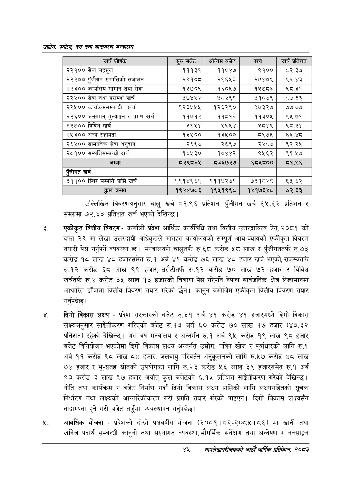

# Page 67 QA

## Rendered page


## Extracted text

```text
उद्योग पर्यटन बन तथा वातावरण मन्त्रालय
उल्लिखित विवरणअनुसार चालु खर्च ८१.९६ प्रतिशत, पुँजीगत खर्च ६५.६२ प्रतिशत र समग्रमा ७२.६३ प्रतिशत खर्च भएको देखिन्छु।
एकीकृत वित्तीय विवरण -कर्णाली प्रदेश आर्थिक कार्यविधि तथा वित्तीय उत्तरदायित्व ऐन, २०८१ को दफा २९ मा लेखा उत्तरदायी अधिकृतले मातहत कार्यालयको सम्पूर्ण आय-व्यायको एकीकृत विवरण तयारी पेस गर्नुपर्ने व्यवस्था छ। मन्त्रालयले चालुतर्फ रु.६८ करोड ५८ लाख र पुँजीगततर्फ रु.७७३ करोड १८ लाख ४८ हजारसमेत रु.१ अर्ब ४१ करोड ७६ लाख ४८ हजार खर्च भएको, राजस्वतर्फ रु.१२ करोड ६८ लाख ९९ हजार, धरौटीतर्फ रु.१२ करोड ७० लाख ७२ हजार र विविध खर्चतर्फ रु.४ करोड ३५ लाख १३ हजारको विवरण पेस गरेपनि नेपाल सार्वजनिक क्षेत्र लेखामानमा आधारित ढाँचामा वित्तीय विवरण तयार गरेको छैन। कानुन बमोजिम एकीकृत वित्तीय विवरण तयार गर्नुपर्दछ |
दिगो विकास लक्ष्य -प्रदेश सरकारको बजेट रु.३१ अर्ब ४१ करोड ४१ हजारमध्ये दिगो विकास लक्ष्यअनुसार साङ्गेतीकरण गरिएको बजेट रु.१३ अर्ब ६० करोड ७० लाख १७ हजार (४३.३२ प्रतिशत) रहेको देखिन्छ। यस वर्ष मन्त्रालय र अन्तर्गत रु.१ अर्ब ९५ करोड १९ लाख ९८ हजार बजेट विनियोजन भएकोमा दिगो विकास लक्ष्य अन्तर्गत उद्योग, नविन खोज र पूर्वाधारको लागि रु.१ अर्ब ११ करोड ९८ लाख ८४ हजार, जलवायु परिवर्तन अनुकूलनको लागि रु.५७ करोड ४८ लाख ७४ हजार र भू-सतह स्रोतको उपयोगका लागि रु.२३ करोड ५६ लाख ३९ हजारसमेत रु.१ अर्ब ९३ करोड ३ लाख ९७ हजार अर्थात्‌ कुल बजेटको ६.१५ प्रतिशत साङ्गेतीकरण गरेको देखिन्छ। नीति तथा कार्यक्रम र बजेट निर्माण गर्दा दिगो विकास लक्ष्य प्राप्तिको लागि लक्ष्यसहितको सूचक निर्धारण तथा लक्ष्यको आन्तरिकीकरण गरी प्रगति तयार गरेको पाइएन। दिगो विकास लक्ष्यसँग तादाम्यता हुने गरी बजेट तर्जुमा व्यवस्थापन गर्नुपर्दछ |
आवधिक योजना -प्रदेशको दोस्रो पञ्चवर्षीय योजना (२०८१।८२-२०८५।८६) मा खानी तथा खनिज पदार्थ सम्बन्धी कानुनी तथा संस्थागत व्यवस्था, भौगर्भिक सर्वेक्षण तथा अन्वेषण र नक्साङ्कन
४४५४
सहालेखापरीक्षकको आठौँ वाक प्रतिवेदन २०८२

| खरी शीष्क | र्रुबबेट | अन्तिम बजेट | खर्च | खर्च प्रतिशत |
| --- | --- | --- | --- | --- |
| २२१०० सेवा महसुल | १११३१ | ११०४७ | ९१०० | ट८२.३७ |
| २२२०० पुँजीगत सम्पत्तिको सञ्चालन | २९१०८ | २९६५३ | २७४०९ | ९२.४३ |
| २२३०० कार्यालय सामान तथा सेवा | १५७०९ | १६०५७ | १५७८६ | ९८.३१ |
| २२४०० सेवा तथा परामर्श खर्च | ५७४४५४ | ५८४९१ | ५१०७९ | ०५७.३३ |
| २२५०० कार्यक्रमसन्बन्धी खर्च | १२३५५५ | १२६२९० | ९७३२७ | ७७.०७ |
| २२६०० अनुनमन, भूलाङ्गण र भ्रमण खर्च | ११७१२ | ११८१२ | ११३०५ | ९४५.७१ |
| २२७०० विविध खर्च | ५९५४ | ५९५४ | श८०४९ | ९८.२४ |
| २५३०० अन्य सहायता | १३४५०० | १३४५०० | ८९७५ | ६६.४८ |
| २६४०० सामाजिक सेवा अनुदान | २६९७ | २६९७ | २४८७ | ९२.२५ |
| २८१०० सन्पततिसम्जन्धी खर्च | १०५३० | १०४४२ | ९५६२ | ९१.१७ |
| जम्मा | ८२९८२५ | ८३६७२७ | ६८५८०० | ८१.९६ |
| रंजीगत खर्च |  |  |  |  |
| ३११०० स्थिर सम्पत्ति प्राप्ति खर्च | १११४९६१ | १११५२७१ | ७३१८४८ | ६५.६२ |
| हल जम्मा | १९४४७८६ | १९५१९९८ | १४१७६४८ | ७२.६३ |
```

## Flags
- table_page
- medium_quality_table
