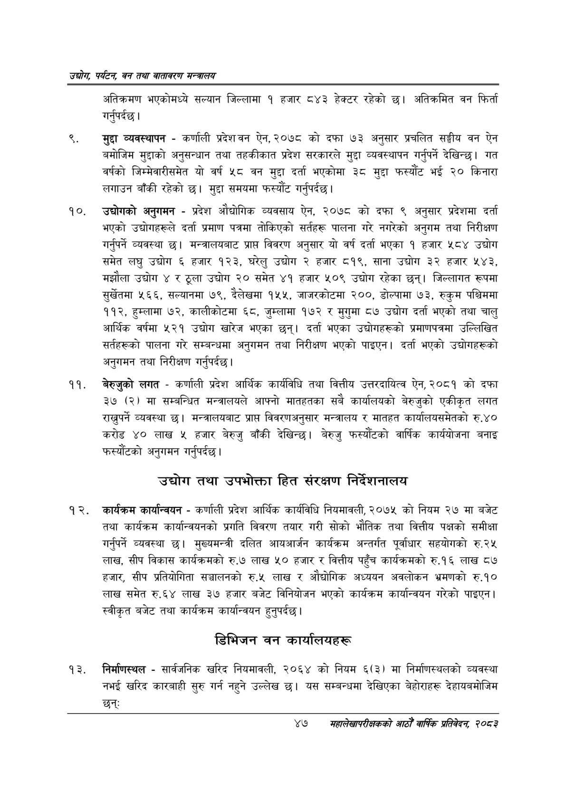

# Page 69 QA

## Rendered page


## Extracted text

```text
उद्योग पर्यटन बन तथा वातावरण मन्त्रालय
अतिक्रमण भएकोमध्ये सल्यान जिल्लामा १ हजार ८४३ हेक्टर रहेको छ। अतिक्रमित वन फिर्ता गर्नुपर्दछ |
मुद्दा व्यवस्थापन -कर्णाली प्रदेशवन ऐन, २०७८ को दफा ७३ अनुसार प्रचलित सङ्घीय वन ऐन बमोजिम मुद्दाको अनुसन्धान तथा तहकीकात प्रदेश सरकारले मुद्दा व्यवस्थापन गर्नुपर्ने देखिन्छ। गत वर्षको जिम्मेवारीसमेत यो वर्ष ५८ वन मुद्दा दर्ता भएकोमा ३८ मुद्दा फस्यौट भई २० किनारा लगाउन बाँकी रहेको छ। मुद्दा समयमा फस्यौट गर्नुपर्दछ |
उद्योगको अनुगमन -प्रदेश औद्योगिक व्यवसाय ऐन, २०७८ को दफा ९ अनुसार प्रदेशमा दर्ता भएको उद्योगहरूले दर्ता प्रमाण पत्रमा तोकिएको सर्तहरू पालना गरे नगरेको अनुगम तथा निरीक्षण गर्नुपर्ने व्यवस्था छ। मन्त्रालयबाट प्राप्त विवरण अनुसार यो वर्ष दर्ता भएका १ हजार ५८४ उद्योग समेत लघु उद्योग ६ हजार १२३, घरेलु उद्योग २ हजार ८१९, साना उद्योग ३२ हजार ५४३, मझौला उद्योग ४ र ठूला उद्योग २० समेत ४१ हजार ५०९ उद्योग रहेका छन्‌। जिल्लागत रूपमा सुर्खेतमा ५६६, सल्यानमा ७९, दैलेखमा १५५, जाजरकोटमा २००, डोल्पामा ७३, रुकुम पश्चिममा ११२, हुम्लामा ७२, कालीकोटमा ६८, जुम्लामा १७२ र मुगुमा ८७ उद्योग दर्ता भएको तथा चालु आर्थिक वर्षमा ५२१ उद्योग खारेज भएका छन्‌। दर्ता भएका उद्योगहरूको प्रमाणपत्रमा उल्लिखित सर्तहरूको पालना गरे सम्बन्धमा अनुगमन तथा निरीक्षण भएको पाइएन। दर्ता भएको उद्योगहरूको अनुगमन तथा निरीक्षण गर्नुपर्दछ |
बेरुजुको लगत -कर्णाली प्रदेश आर्थिक कार्यविधि तथा वित्तीय उत्तरदायित्व ऐन, २०८१ को दफा ३७ (२) मा सम्बन्धित मन्त्रालयले आफ्नो मातहतका सबै कार्यालयको बेरुजुको एकीकृत लगत राख्नुपर्ने व्यवस्था | मन्त्रालयबाट प्राप्त विवरणअनुसार मन्त्रालय र मातहत कार्यालयसमेतको रु.४० करोड ४० लाख ५ हजार बेरुजु बाँकी देखिन्छ। बेरुजु फस्यौटको वार्षिक कार्ययोजना बनाइ फरस्यौटको अनुगमन गर्नुपर्दछ |
उद्योग तथा उपभोक्ता हित संरक्षण निर्देशनालय
कार्यक्रम कार्यान्वयन -कर्णाली प्रदेश आर्थिक कार्यविधि नियमावली, २०७५ को नियम २७ मा बजेट तथा कार्यक्रम कार्यान्वयनको प्रगति विवरण तयार गरी सोको भौतिक तथा वित्तीय पक्षको समीक्षा गर्नुपर्ने व्यवस्था छ। मुख्यमन्त्री दलित आयआर्जन कार्यक्रम अन्तर्गत पूर्वाधार सहयोगको रु.२५ लाख, सीप विकास कार्यक्रमको रु.७ लाख ५० हजार र वित्तीय पहुँच कार्यक्रमको रु.१६ लाख ८७ हजार, सीप प्रतियोगिता सञ्चालनको रु.५ लाख र औद्योगिक अध्ययन अवलोकन भ्रमणको रु.१० लाख समेत रु.६४ लाख ३७ हजार बजेट विनियोजन भएको कार्यक्रम कार्यान्वयन गरेको पाइएन | स्वीकृत बजेट तथा कार्यक्रम कार्यान्वयन हुनुपर्दछ |
डिभिजन वन कार्यालयहरू
निर्माणस्थल -सार्वजनिक खरिद नियमावली, २०६४ को नियम ६(३) मा निर्माणस्थलको व्यवस्था नभई खरिद कारबाही सुरु गर्न नहुने उल्लेख छ। यस सम्बन्धमा देखिएका बेहोराहरू देहायबमोजिम छन्‌ः
४७
सहालेखापरीक्षकको आठौँ वा्िकि प्रतिवेदन २०८२
```

## Flags
- None
