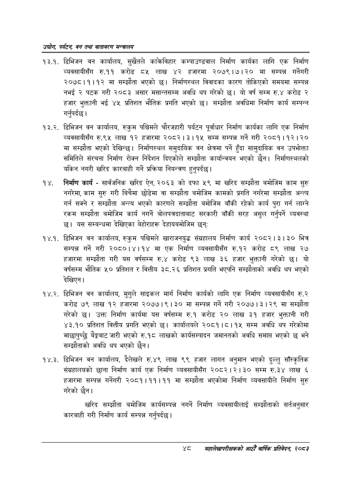

# Page 70 QA

## Rendered page


## Extracted text

```text
उद्योग पर्यटन बन तथा वातावरण मन्त्रालय
१३.१. डिभिजन वन कार्यालय, सुर्खेतले काक्रविहार कम्पाउण्डवाल निर्माण कार्यका लागि एक निर्माण व्यवसायीसँग रु.११ करोड ८५ लाख ४२ हजारमा २०७९।७।२० मा सम्पन्न गर्नेगरी २०७८।१।१२ मा सम्झौता भएको | निर्माणस्थल विवादका कारण तोकिएको समयमा सम्पन्न नभई २ पटक गरी २०८३ असार मसान्तसम्म अवधि थप गरेको छ। यो वर्ष सम्म रु.४ करोड २ हजार भुक्तानी भई ४५ प्रतिशत भौतिक प्रगति भएको छ। सम्झौता अवधिमा निर्माण कार्य सम्पन्न गर्नुपर्दछ |
१३.२. डिभिजन वन कार्यालय, रुकुम पश्चिमले चौरजहारी पर्यटन पूर्वाधार निर्माण कार्यका लागि एक निर्माण व्यवसायीसँग रु.९५ लाख १२ हजारमा २०८२।३।१५ सम्म सम्पन्न गर्ने गरी २०८१।१२।२० मा सम्झौता भएको देखिन्छ। निर्माणस्थल समुदायिक वन क्षेत्रमा पर्ने हुँदा सामुदायिक वन उपभोक्ता समितिले संरचना निर्माण रोक्न निर्देशन दिएकोले सम्झौता कार्यान्वयन भएको छैन। निर्माणस्थलको यकिन नगरी खरिद कारबाही गर्ने प्रक्रिया नियन्त्रण हुन्‌पर्दछ।
निर्माण कार्य -सार्वजनिक खरिद ऐन, २०६३ को दफा ५९ मा खरिद सम्झौता बमोजिम काम सुरु नगरेमा, काम सुरु गरी बिचैमा छोडेमा वा सम्झौता बमोजिम कामको प्रगति नगरेमा सम्झौता अन्त्य गर्न सक्ने र सम्झौता अन्त्य भएको कारणले सम्झौता बमोजिम बाँकी रहेको कार्य पुरा गर्न लाग्ने रकम सम्झौता बमोजिम कार्य नगर्ने बोलपत्रदाताबाट सरकारी बाँकी सरह असुल गर्नुपर्ने व्यवस्था | यस सम्बन्धमा देखिएका बेहोराहरू देहायबमोजिम छन्‌
१४.१. डिभिजन वन कार्यालय, रुकुम पश्चिमले खाराजनयुद्ध संग्रहालय निर्माण कार्य २०८२। ३। ३० भित्र सम्पन्न गर्ने गरी २०८०।४।१४ मा एक निर्माण व्यवसायीसँग रु.१२ करोड ८९ लाख २७ हजारमा सम्झौता गरी यस वर्षसम्म रु.४ करोड ९३ लाख ३६ हजार भुक्तानी गरेको छ। यो वर्षसम्म भौतिक ५० प्रतिशत र वित्तीय ३८.२६ प्रतिशत प्रगति भएपनि सम्झौताको अवधि थप भएको देखिएन।
१४.२. डिभिजन वन कार्यालय, मुगुले साइकल मार्ग निर्माण कार्यको लागि एक निर्माण व्यवसायीसँग रु.२ करोड ७९ लाख १२ हजारमा २०७७।९।३० मा सम्पन्न गर्ने गरी २०७७।३। २९ मा सम्झौता गरेको छ। उक्त निर्माण कार्यमा यस वर्षसम्म रु.१ करोड २० लाख ३१ हजार भुक्तानी गरी ३.९० प्रतिशत वित्तीय प्रगति भएको छ। कार्यालयले २०८१।८।१४ सम्म अवधि थप गरेकोमा माछापुच्छे बैङ्कबाट जारी भएको रु.१८ लाखको कार्यसम्पादन जमानतको अवधि समाप्त भएको छ भने सम्झौताको अवधि थप भएको छैन।
१४.३. डिभिजन वन कार्यालय, दैलेखले रु.४९ लाख ९९ हजार लागत अनुमान भएको दुल्लु साँस्कृतिक संग्रहालयको छाना निर्माण कार्य एक निर्माण व्यवसायीसँग २०८२। २।३० सम्म रु.३४ लाख ६ हजारमा सम्पन्न गर्नेगरी २०८१।११।११ मा सम्झौता भएकोमा निर्माण व्यवसायीले निर्माण सुरु गरेको छैन।
खरिद सम्झौता बमोजिम कार्यसम्पन्न नगर्ने निर्माण व्यवसायीलाई सम्झौताको सर्तअनुसार कारबाही गरी निर्माण कार्य सम्पन्न गर्नुपर्दछ |
सहालेखापरीक्षकको आठौँ वा्िक प्रतिवेदन २०८२
```

## Flags
- None
