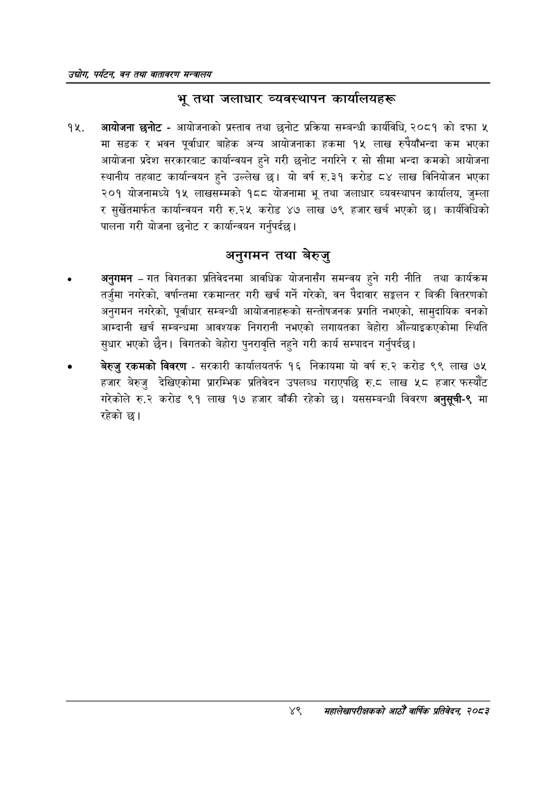

# Page 71 QA

## Rendered page


## Extracted text

```text
उद्योग पर्यटन बन तथा वातावरण मन्त्रालय
भू तथा जलाधार व्यवस्थापन कार्यालयहरू
आयोजना छनोट -आयोजनाको प्रस्ताव तथा छनोट प्रक्रिया सम्बन्धी कार्यविधि, २०८१ को दफा ५ मा सडक र भवन पूर्वाधार बाहेक अन्य आयोजनाका हकमा १५ लाख रुपैयाँभन्दा कम भएका आयोजना प्रदेश सरकारबाट कार्यान्वयन हुने गरी छनोट नगरिने र सो सीमा भन्दा कमको आयोजना स्थानीय तहबाट कार्यान्वयन हुने उल्लेख छ। यो वर्ष रु.३१ करोड ८४ लाख विनियोजन भएका २०१ योजनामध्ये १५ लाखसम्मको १८८ योजनामा भू तथा जलाधार व्यवस्थापन कार्यालय, जुम्ला र सुर्खेतमार्फत कार्यान्वयन गरी रु.२५ करोड ४७ लाख ७९ हजार खर्च भएको छ। कार्यविधिको पालना गरी योजना छनोट र कार्यान्वयन गर्नुपर्दछ |
अनुगमन तथा बेरुजु
अनुगमन -गत विगतका प्रतिवेदनमा आवधिक योजनासँग समन्वय हुने गरी नीति तथा कार्यक्रम तर्जुमा नगरेको, वर्षान्तमा रकमान्तर गरी खर्च गर्ने गरेको, वन पैदावार सङ्कलन र बिक्री वितरणको अनुगमन नगरेको, पूर्वाधार सम्बन्धी आयोजनाहरूको सन्तोषजनक प्रगति नभएको, सामुदायिक वनको आम्दानी खर्च सम्बन्धमा आवश्यक निगरानी नभएको लगायतका बेहोरा औंल्याइकएकोमा स्थिति सुधार भएको छैन। विगतको बेहोरा पुनरावृत्ति नहुने गरी कार्य सम्पादन गर्नुपर्दछ |
बेरुजु रकमको विवरण -सरकारी कार्यालयतर्फ १६ निकायमा यो वर्ष रु.२ करोड ९९ लाख ७४५ हजार बेरुजु देखिएकोमा प्रारम्भिक प्रतिवेदन उपलब्ध गराएपछि रु.८ लाख ५८ हजार फस्यौट गरेकोले रु.२ करोड ९१ लाख १७ हजार बाँकी रहेको छ। यससम्बन्धी विवरण अनुसूची-९ मा रहेको छ।
४९
सहालेखापरीक्षकको वाषिक प्रतिवेदन २०८२
```

## Flags
- None
