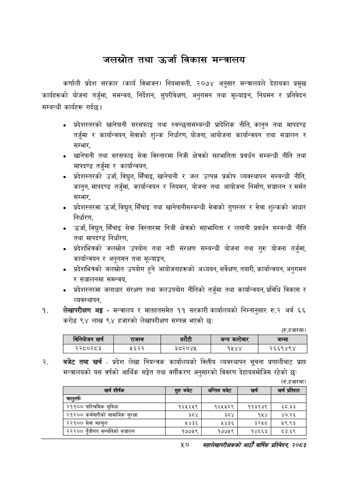

# Page 72 QA

## Rendered page


## Extracted text

```text
जलस्रोत तथा उर्जा विकास मन्त्रालय
कर्णाली प्रदेश सरकार (कार्य विभाजन) नियमावली, २०७४ अनुसार मन्त्रालयले देहायका प्रमुख कार्यहरूको योजना तर्जुमा, समन्वय, निर्देशन, सुपरीवेक्षण, अनुगमन तथा मूल्याङ्कन, नियमन र प्रतिवेदन सम्बन्धी कार्यहरू गर्दछ।
प्रदेशस्तरको खानेपानी सरसफाइ तथा स्वच्छतासम्बन्धी प्रादेशिक नीति, कानुन तथा मापदण्ड तर्जुमा र कार्यान्वयन, सेवाको शुल्क निर्धारण, योजना, आयोजना कार्यान्वयन तथा सञ्चालन र सम्भार,
खानेपानी तथा सरसफाइ सेवा विस्तारमा निजी क्षेत्रको सहभागिता प्रवर्धन सम्बन्धी नीति तथा मापदण्ड तर्जुमा र कार्यान्वयन,
प्रदेशस्तरको उर्जा, विद्युत, सिँचाइ, खानेपानी र जल उत्पन्न प्रकोप व्यवस्थापन सम्बन्धी नीति, कानुन, मापदण्ड तर्जुमा, कार्यान्वयन र नियमन, योजना तथा आयोजना निर्माण, सञ्चालन र मर्मत सम्भार,
प्रदेशस्तरमा उर्जा, विद्युत, सिँचाइ तथा खानेपानीसम्बन्धी सेवाको गुणस्तर र सेवा शुल्कको आधार निर्धारण,
उर्जा, विद्युत, सिँचाइ सेवा विस्तारमा निजी क्षेत्रको सहभागिता र लगानी प्रवर्धन सम्बन्धी नीति तथा मापदण्ड निर्धारण,
प्रदेशभित्रको जलस्रोत उपयोग तथा नदी संरक्षण सम्बन्धी योजना तथा गुरु योजना तर्जुमा, कार्यान्वयन र अनुगमन तथा मूल्याङ्कन,
प्रदेशभित्रको जलस्रोत उपयोग हुने आयोजनाहरूको अध्ययन, सर्वेक्षण, तयारी, कार्यान्वयन, अनुगमन र सञ्चालनमा समन्वय,
प्रदेशस्तरमा जलाधार संरक्षण तथा जलउपयोग नीतिको तर्जुमा तथा कार्यान्वयन, प्रविधि विकास र व्यवस्थापन,
लेखापरीक्षण अङ्ग -मन्त्रालय र मातहतसमेत ११ सरकारी कार्यालयको निम्नानुसार रु.२ अर्ब ६६ करोड ९४ लाख ९४ हजारको लेखापरीक्षण सम्पन्न भएको छ:
(रु.हजारमा)
बजेट तथा खर्च -प्रदेश लेखा नियन्त्रक कार्यालयको वित्तीय व्यवस्थापन सूचना प्रणालीबाट प्राप्त मन्त्रालयको यस वर्षको आर्थिक सङ्गेत तथा वर्गीकरण अनुसारको विवरण देहायबमोजिम रहेको छः
(रु.हजारमा)
५०
सहालेखापरीक्षकको वाषिक प्रतिवेदन २०८२

|  |  | बिनवोजन खर्च | राजस्व |  |  | अन्य कारोबार | जम्मा |
| --- | --- | --- | --- | --- | --- | --- | --- |
|  |  | २२८०२८३ | ५६२२ | ३८०२०४४ |  | १५४४ | २६६९४९४ |

| खर्च शीर्षक | सुरु बजेट | अन्तिम बजेट | खर्च | खर्च प्रतिशत |
| --- | --- | --- | --- | --- |
| चालुतर्फ |  |  |  |  |
| २११०० चारित्रमिक सुविधा | १६५६५९ | १६१५८९ | ११३१३९ | ६८.३३ |
| २९३०० कर्मचारीको सामाजिक सुरक्षा | ३ | ३ | १४५४ | ४०.२६ |
| २२१०० सेवा महसुल | २४३६ | ५४३६ | ३२५८ | २९.९३ |
| २३३०० पुँजीगत सम्पत्तिको सञ्चालन | १७७५९ | १७७५९ | १४८६३ | ८३.६९ |
```

## Flags
- table_page
- medium_quality_table
