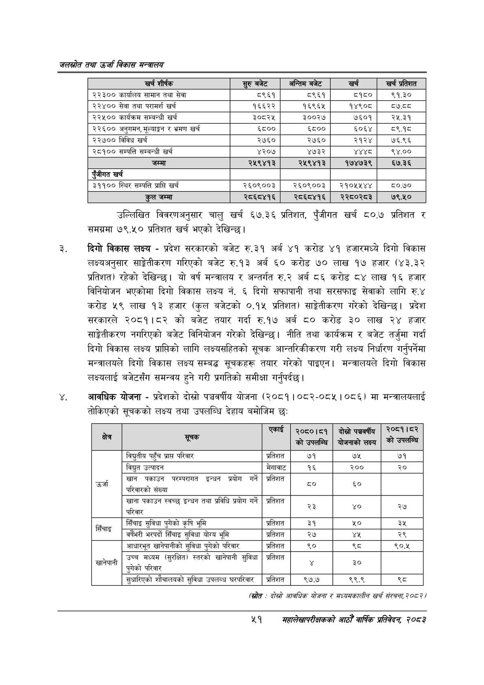

# Page 73 QA

## Rendered page


## Extracted text

```text
जलस्रोत तथा उर्जा विकास सन्वबालय
उल्लिखित विवरणअनुसार चालु खर्च ६७.३६ प्रतिशत, पुँजीगत खर्च ८०.७ प्रतिशत र समग्रमा ७९.५० प्रतिशत खर्च भएको देखिन्छ।
दिगो विकास लक्ष्य -प्रदेश सरकारको बजेट रु.३१ अर्ब ४१ करोड ४१ हजारमध्ये दिगो विकास लक्ष्यअनुसार साङ्गेतीकरण गरिएको बजेट रु.१३ अर्ब ६० करोड ७० लाख १७ हजार (४३.३२ प्रतिशत) रहेको देखिन्छ। यो वर्ष मन्त्रालय र अन्तर्गत रु.२ अर्ब ८६ करोड ८४ लाख १६ हजार विनियोजन भएकोमा दिगो विकास लक्ष्य नं. ६ दिगो सफापानी तथा सरसफाइ सेवाको लागि रु.४ करोड लाख १३ हजार (कुल बजेटको ०.१५ प्रतिशत) साङ्ेतीकरण गरेको देखिन्छ। प्रदेश सरकारले २०८१।८२ को बजेट तयार गर्दा रु.१७ अर्ब ८० करोड ३० लाख २४ हजार साङ्रेतिकरण नगरिएको बजेट विनियोजन गरेको देखिन्छ। नीति तथा कार्यक्रम र बजेट तर्जुमा गर्दा दिगो विकास लक्ष्य प्राप्तिको लागि लक्ष्यसहितको सूचक आन्तरिकीकरण गरी लक्ष्य निर्धारण गर्नुपर्नेमा मन्त्रालयले दिगो विकास लक्ष्य सम्बद्ध सूचकहरू तयार गरेको पाइएन। मन्त्रालयले दिगो विकास लक्ष्यलाई बजेटसँग समन्वय हुने गरी प्रगतिको समीक्षा गर्नुपर्दछ |
आवधिक योजना -प्रदेशको दोस्रो पञ्चवर्षीय योजना (२०८१।०८२-०८४५। ०८६) मा मन्त्रालयलाई तोकिएको सूचकको लक्ष्य तथा उपलब्धि देहाय बमोजिम छः
(स्रोत -दोस्रो आवधिक योजना र सध्यसकालीन खर्च संरचना; २०८ २४
%९
सहालेखापरीक्षकको आठोँ वाषिक प्रतिवेदन २०८२

| खर्च शीर्षक | बजेट | अन्तिम बजेट | खर्च | खर्च प्रतिशत |
| --- | --- | --- | --- | --- |
| २२३०० कार्यालय सामान तथा सेवा | ८९६१ | ८९६१ | ८१८० | ९१.३० |
| २२४०० सेवा तथा परामर्श खर्च | १६६२२ | १६९६४५ | १४९०८ | द७.व्व |
| २२५०० कार्यक्रम सम्बन्धी खर्च | ३०८२५ | ३००२७ | ७६०१ | २५.३१ |
| २२६०० अनुगमन, मूल्याङ्कन र भ्रमण खर्च | ६८०० | ६८०० | ५०६४ | ८९.१८ |
| २२७०० विविध खर्च | २७६० | २७६० | २१२४ | ७६.९६ |
| २८१०० सम्पत्ति सम्बन्धी खर्च | ४२०७ | ४७३२ | अ्थ्व | ९४.०० |
| जम्मा | २५९४१३ | २५९४१३ | १७४७३९ | ६७.३६ |
| एंजीगत खर्च |  |  |  |  |
| ३११०० स्थिर सम्पत्ति प्राप्ति खर्च | २६०९००३ | २६०९००३ | २१०१४१४४ | ८०.७० |
| जम्मा | २८६८४१६ | २८६८४१६ | २२८०२८३ | ७९.५० |

| क्षेत्र | सूचक छे | एकाई | २०८०।८१ को उपसर्ति | दोस्रो योजणाको लक्ष्य | ०१ को |
| --- | --- | --- | --- | --- | --- |
|  | विद्युतीय पहुँच प्राप्त परिवार | प्रतिशत | ७१ | ७५ | ७१ |
|  | विद्युत उत्पादन | मेगावाट | १६ | २०० | २० |
| उर्जा | खान पकाउन परम्परागत इन्धन प्रयोग गर्ने परिवारको संख्या | प्रतिशत | ८० | ६० |  |
|  | 'खाना पकाउन स्वच्छ इन्धन तथा प्रविधि प्रयोग गर्ने परिवार | प्रतिशत | २३ |  | २७४ |
| सिँचाइ | सिँचाइ सुविधा पुगेको कृषि भूमि | प्रतिशत | ३१ | %० | ३५ |
|  | भरपर्दो सिँचाइ सुविधा योग्य भूमि | प्रतिशत | २७ | १ | २९ |
|  | आधारभूत खानेपानीको सुविधा पुगेको परिवार | प्रतिशत | ९० | थ्व | ९०.४५ |
| , खानपाना | उच्च मध्यम (सुरक्षित) स्तरको ७।न५।न सुविधा प्गेको पुगेको परिवार | प्रतिशत |  | ३० |  |
|  | सुचारिएको शौचालयको सुविधा उपलब्ध | प्रतिशत | ९७.७ | ९९.९ | थ्व |
```

## Flags
- table_page
- medium_quality_table
