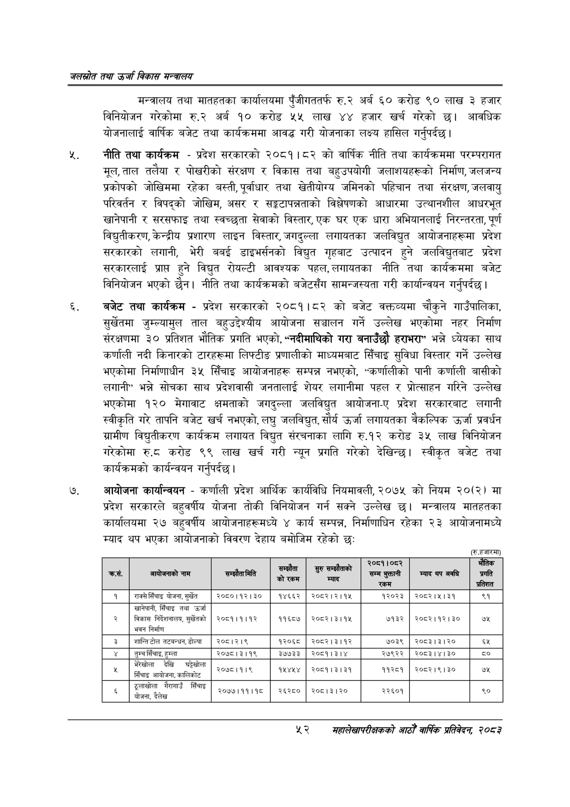

# Page 74 QA

## Rendered page


## Extracted text

```text
जलस्रोत तथा उर्जा विकास सन्वबालय
मन्त्रालय तथा मातहतका कार्यालयमा पुँजीगततर्फ रु.२ अर्ब ६० करोड ९० लाख ३ हजार विनियोजन गरेकोमा रु.२ अर्ब १० करोड ५५ लाख ४४ हजार खर्च गरेको छ। आवधिक योजनालाई वार्षिक बजेट तथा कार्यक्रममा आवद्ध गरी योजनाका लक्ष्य हासिल गर्नुपर्दछ |
नीति तथा कार्यक्रम -प्रदेश सरकारको २०८१।८२ को वार्षिक नीति तथा कार्यक्रममा परम्परागत मूल, ताल तलैया र पोखरीको संरक्षण र विकास तथा बहुउपयोगी जलाशयहरूको निर्माण, जलजन्य प्रकोपको जोखिममा रहेका बस्ती, पूर्वाधार तथा खेतीयोग्य जमिनको पहिचान तथा संरक्षण, जलवायु परिवर्तन र विपद्को जोखिम, असर र सङ्गटापन्नताको विश्लेषणको आधारमा उत्थानशील आधरभूत खानेपानी र सरसफाइ तथा स्वच्छता सेवाको विस्तार, एक घर एक धारा अभियानलाई निरन्तरता, पूर्ण विद्युतीकरण, केन्द्रीय प्रशारण लाइन विस्तार, जगदुल्ला लगायतका जलविद्युत आयोजनाहरूमा प्रदेश सरकारको लगानी, भेरी बबई डाइभर्सनको विद्युत गृहबाट उत्पादन हुने जलविद्युतबाट प्रदेश सरकारलाई प्राप्त हुने विद्युत रोयल्टी आवश्यक पहल, लगायतका नीति तथा कार्यक्रममा बजेट विनियोजन भएको छैन। नीति तथा कार्यक्रमको बजेटसँग सामन्जस्यता गरी कार्यान्वयन गर्नुपर्दछ |
बजेट तथा कार्यक्रम -प्रदेश सरकारको २०८१।८२ को बजेट वक्तव्यमा चौकुने गाउँपालिका, सुर्खेतमा जुम्ल्यामुल ताल बहुउद्देश्यीय आयोजना सञ्चालन गर्ने उल्लेख भएकोमा नहर निर्माण संरक्षणमा ३० प्रतिशत भौतिक प्रगति भएको, "नदीमाथिको गरा बनाउँछौ हराभरा" भन्ने ध्येयका साथ कर्णाली नदी किनारको टारहरूमा लिफ्टीङ प्रणालीको माध्यमबाट सिँचाइ सुविधा विस्तार गर्ने उल्लेख भएकोमा निर्माणाधीन ३५ सिँचाइ आयोजनाहरू सम्पन्न नभएको, "कर्णालीको पानी कर्णाली बासीको लगानी" भन्ने सोचका साथ प्रदेशवासी जनतालाई शेयर लगानीमा पहल र प्रोत्साहन गरिने उल्लेख भएकोमा १२० मेगावाट क्षमताको जगदुल्ला जलविद्युत आयोजना-ए प्रदेश सरकारबाट लगानी स्वीकृति गरे तापनि बजेट खर्च नभएको, लघु जलविद्युत, सौर्य उर्जा लगायतका वैकल्पिक उर्जा प्रवर्धन ग्रामीण विद्युतीकरण कार्यक्रम लगायत विद्युत संरचनाका लागि रु.१२ करोड ३५ लाख विनियोजन गरेकोमा € करोड ९९ लाख खर्च गरी न्यून प्रगति गरेको देखिन्छ। स्वीकृत बजेट तथा कार्यक्रमको कार्यन्वयन गर्नुपर्दछ |
७, आयोजना कार्यान्वयन -कर्णाली प्रदेश आर्थिक कार्यविधि नियमावली, २०७५ को नियम २०(२) मा प्रदेश सरकारले बहुवर्षीय योजना तोकी विनियोजन गर्न सक्ने उल्लेख छ। मन्त्रालय मातहतका कार्यालयमा २७ बहुवर्षीय आयोजनाहरूमध्ये ४ कार्य सम्पन्न, निर्माणाधिन रहेका २३ आयोजनामध्ये म्याद थप भएका आयोजनाको विवरण देहाय बमोजिम रहेको छ:
[रु.हजारमा)
सहालेखापरीक्षकको आठोँ वाषिक प्रतिवेदन २०८२

| का. | नाम |  | सौता | ४ *© "‘"""" | रे०८१।०८२ सम्म भुक्तानी रकम | म्याद थप अवधि | भौतिक प्रगति प्रतिशत |
| --- | --- | --- | --- | --- | --- | --- | --- |
| १ | राक्सेसिँचाइ योजना, सुर्खेत | २०८०।१२।३० | १४६६२ | २०८२।२।१५ | १२०२३ | २०८२।५।३१ | ९१ |
| २ | खानेपानी, सिँचाइ तथा उर्जा विकास निर्दशानालब, सुर्खेतको भवन निर्माण | २०८१।१।१२ | ११६८७ | २०८२।३।१५ | ७१३२ | २०८२।१२।३० | ७५ |
| ३ | शान्तिटोल तटबन्धन,डोल्पा | २०८।२।९ | १२०६८ | २०८२।३।१२ | ७०३९ | २०८३।३।२० | ६५ |
| ४ | तुम्च सिँचाइ, हुम्ला | २०७८।३।१९ | ३७७३३ | २०८१।३।४ | २७९२२ | २०८३।४।३० | ८० |
| ५ | ( देखि सिँचाइ आयोजना, कालिकोट | २०७८।१।९ | १५४५४ | २०६१।३।३१ | ११२८१ | २०६२।९।३० | ७५ |
| ६ | निँजाड पोजना, दैलेख | २०७७।११।१८ | २६२८० | २०६।३।२० | . २२६०१ |  | ९० |
```

## Flags
- table_page
- medium_quality_table
