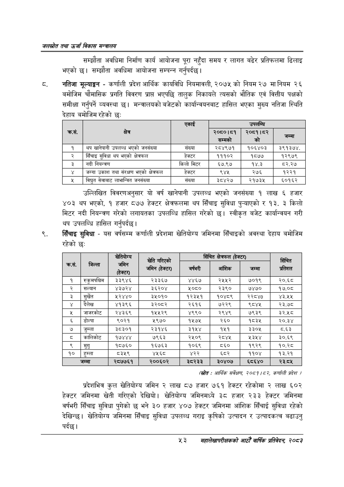

# Page 75 QA

## Rendered page


## Extracted text

```text
जलस्रोत तथा उर्जा विकास सन्वबालय
सम्झौता अवधिमा निर्माण कार्य आयोजना पूरा नहुँदा समय र लागत बढेर प्रतिफलमा ढिलाइ भएको छ। सम्झौता अवधिमा आयोजना सम्पन्न गर्नुपर्दछ |
नतिजा मूल्याङ्कन -कर्णाली प्रदेश आर्थिक कायविधि नियमावली, २०७५ को नियम २७ मानियम २६ बमोजिम चौमासिक प्रगति विवरण प्राप्त भएपछि तालुक निकायले त्यसको भौतिक एवं वित्तीय पक्षको समीक्षा गर्नुपर्ने व्यवस्था छ। मन्त्रालयको बजेटको कार्यान्वयनबाट हासिल भएका मुख्य नतिजा स्थिति देहाय बमोजिम रहेको छः:
उल्लिखित विवरणअनुसार यो वर्ष खानेपानी उपलब्ध भएको जनसंख्या १ लाख ६ हजार ४०३ थप भएको, १ हजार ८७७ हेक्टर क्षेत्रफलमा थप सिँचाइ सुविधा पुन्याएको र १३. ३ किलो मिटर नदी नियन्त्रण गरेको लगायतका उपलब्धि हासिल गरेको छ। स्वीकृत बजेट कार्यान्वयन गरी थप उपलब्धि हासिल गर्नुपर्दछ |
सिँचाइ सुविधा -यस वर्षसम्म कर्णाली प्रदेशमा खेतियोग्य जमिनमा सिँचाइको अवस्था देहाय बमोजिम रहेको छ:
(स्रोत: आर्थिक सर्वेक्षण २०८१/८२, क्णली प्रदेश )
प्रदेशभित्र कूल खेतियोग्य जमिन २ लाख ८७ हजार ७६१ हेक्टर रहेकोमा २ लाख ६०२ हेक्टर जमिनमा खेती गरिएको देखियो। खेतियोग्य जमिनमध्ये ३८ हजार २३३ हेक्टर जमिनमा वर्षभरी सिँचाइ सुविधा पुगेको छ भने ३० हजार ४०७ हेक्टर जमिनमा आंशिक सिँचाई सुविधा रहेको देखिन्छ। खेतियोरय जमिनमा सिँचाइ सुविधा उपलब्ध गराइ कृषिको उत्पादन र उत्पादकत्व बढाउनु पर्दछ।
%३
सहालेखापरीक्षकको आठोँ वाषिक प्रतिवेदन २०८२

|  |  | एकाई |  | उपलब्धि |  |
| --- | --- | --- | --- | --- | --- |
| कस. | क्षेत्र |  | २०८०।८४१ सम्मको | २०६१।८२ को | जमा |
| १ | थप खानेपानी उपलब्ध भएको जनसंख्या | संख्या | २८४९७१ | १०६४०३ | ३९१३७४, |
| २ | सिँचाइ सुविधा थप भएको क्षेत्रफल | हेक्टर | १११०२ | १८७७ | १२९७९ |
| ३ | नदी नियन्त्रण | किलो मिटर | ६७.९७ | १४.३ | ८२.२७ |
|  | जग्गा उकाश तथा संरक्षण भएको क्षेत्रफल | हेक्टर | ९४५ | २७६ | १२२१ |
| ५ | विद्युत सेवाबाट लाभान्वित जनस्या | संख्या | ३८४२७ | २१७३४५ | ६०१६२ |

|  |  |  | खेति गरिएको | सित | क्त्रफल ० |  |  |
| --- | --- | --- | --- | --- | --- | --- | --- |
| ४ | जिल्ला | जमिन हेक्टर) | 'जमिन (हेक्टर) | वर्षभरी | आंशिक | जम्मा | सिंचित प्रतिशत |
| १ | रुकुमपन्चिम | ३३९४६ | २३३६७ | ४४६७ | २५५२ | ७०१९ | २०.६८ |
| २ | सल्यान | ४३७२४ | ३६२०४ | ५०८० | २३९० | ७४७० | १७.०८ |
| ३ | सुर्खेत | २४४० | ३५०१० | १२३५१ | १०४८९ | २२८४० | ४३.५४५ |
| ४ | दैलेख | ४१३९६ | ३२०८२ | २६१६ | ७२२९ | ९८४५ | २३.७८ |
| ५ | जाजरकोट | २४३६९ | १५५२९ | ४९९० | २९४९ | ७९३९ | ३२.५८ |
| ६ | डोल्पा | ९०२१ | ५९७० | १५७५ | २६० | १८३५ | २०.३४ |
| ७ | जुम्ला | ३८३०१ | २३१४६ | ३१५४ | १५१ | ३३०५ | ८६३ |
| ८ | कालिकोट | १७४४४ | ७९६३ | २५०९ | २८४५ | ५३५४ | ३०.६९ |
| ९ | मुगु | १८७६० | १६७६३ | १०६९ | ८६० | १९२९ | १०.२८ |
| १० | हुम्ला | ८३५९ | ४५६८ | ४२२ | ६८२ | ११०४ | १३.२१ |
|  | जम्मा | २८७७६१ | २००६०२ | ३८२३३ | ३०४०७ | ६८६४० | २३.८५ |
```

## Flags
- table_page
- medium_quality_table
