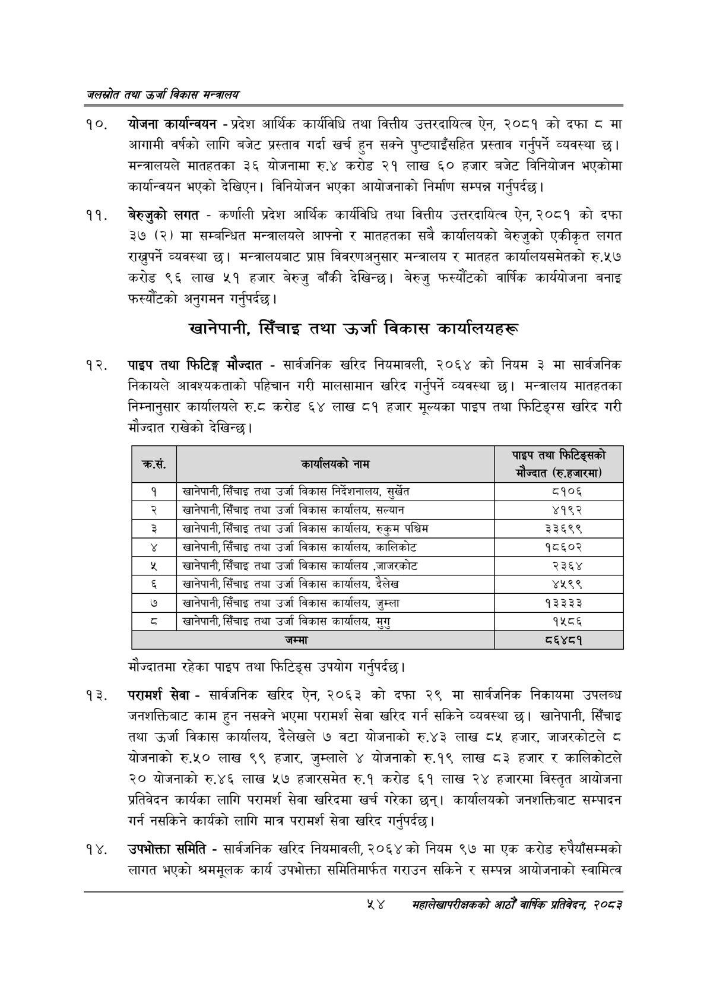

# Page 76 QA

## Rendered page


## Extracted text

```text
जलस्रोत तथा उर्जा विकास सन्वबालय
योजना कार्यान्वयन -प्रदेश आर्थिक कार्यविधि तथा वित्तीय उत्तरदायित्व ऐन, २०८१ को दफा © मा आगामी वर्षको लागि बजेट प्रस्ताव गर्दा खर्च हुन सक्ने पुष्ट्याइँसहित प्रस्ताव गर्नुपर्ने व्यवस्था | मन्त्रालयले मातहतका ३६ योजनामा रु.४ करोड २१ लाख ६० हजार बजेट विनियोजन भएकोमा कार्यान्वयन भएको देखिएन। विनियोजन भएका आयोजनाको निर्माण सम्पन्न गर्नुपर्दछ |
बेरुजुको लगत -कर्णाली प्रदेश आर्थिक कार्यविधि तथा वित्तीय उत्तरदायित्व ऐन, २०८१ को दफा ३७ (२) मा सम्बन्धित मन्त्रालयले आफ्नो र मातहतका सबै कार्यालयको बेरुजुको एकीकृत लगत राख्नुपर्ने व्यवस्था | मन्त्रालयबाट प्राप्त विवरणअनुसार मन्त्रालय र मातहत कार्यालयसमेतको रु.५७ करोड ९६ लाख ५१ हजार बेरुजु बाँकी देखिन्छ। बेरुजु फस्यौटको वार्षिक कार्ययोजना बनाइ फस्यौंटको अनुगमन गर्नुपर्दछ |
खानेपानी, सिँचाइ तथा उर्जा विकास कार्यालयहरू
पाइप तथा फिटिङ्ग मौज्दात -सार्वजनिक खरिद नियमावली, २०६४ को नियम ३ मा सार्वजनिक निकायले आवश्यकताको पहिचान गरी मालसामान खरिद गर्नुपर्ने व्यवस्था छ। मन्त्रालय मातहतका निम्नानुसार कार्यालयले रु.८ करोड ६४ लाख ८१ हजार मूल्यका पाइप तथा फिटिङ्ग्स खरिद गरी मौज्दात राखेको देखिन्छ।
मौज्दातमा रहेका पाइप तथा फिटिङ्स उपयोग गर्नुपर्दछ।
परामर्श सेवा -सार्वजनिक खरिद ऐन, २०६३ को दफा २९ मा सार्वजनिक निकायमा उपलब्ध जनशक्तिबाट काम हुन नसक्ने भएमा परामर्श सेवा खरिद गर्न सकिने व्यवस्था छ। खानेपानी, सिँचाइ तथा उर्जा विकास कार्यालय, देलेखले ७ वटा योजनाको रु.४३ लाख ८५ हजार, जाजरकोटले ८ योजनाको रु.५० लाख ९९ हजार, जुम्लाले ४ योजनाको रु.१९ लाख ८३ हजार र कालिकोटले २० योजनाको रु.४६ लाख ५७ हजारसमेत रु.१ करोड ६१ लाख २४ हजारमा विस्तृत आयोजना प्रतिवेदन कार्यका लागि परामर्श सेवा खरिदमा खर्च गरेका छन्‌। कार्यालयको जनशक्तिबाट सम्पादन गर्न नसकिने कार्यको लागि मात्र परामर्श सेवा खरिद गर्नुपर्दछ |
उपभोक्ता समिति -सार्वजनिक खरिद नियमावली, २०६४ को नियम ९७ मा एक करोड रुपैयाँसम्मको लागत भएको श्रममूलक कार्य उपभोक्ता समितिमार्फत गराउन सकिने र सम्पन्न आयोजनाको स्वामित्व
४५४
सहालेखापरीक्षकको आठौँ वा्िक प्रतिवेदन २०८२

| . क्रस. | काथा लबका नाम | पाइप तथा 'फे टेङ्सको < म ज्यात (रि.हजारमा) |
| --- | --- | --- |
| १ | खानेपानी, सिँचाइ तथा उर्जा विकास निर्देशनालय, सुर्खेत | ८१०६ |
| २ | खानेपानी, सिँचाइ तथा उर्जा विकास कार्यालय, सल्यान | ४१९२ |
| ३ | खानेपानी, सिँचाइ तथा उर्जा विकास कार्यालय, रुकुम पश्चिम | ३३६९९ |
| ४ | खानेपानी,सिँचाइ तथा उर्जा विकास , कालिकोट | १८६०२ |
| ५ | खानेपानी, सिँचाइ तथा उर्जा विकास कार्यालय,जाजरकोट | २३६४ |
| ६ | खानेपानी, सिँचाइ तथा उर्जा विकास कार्बालष, दैलेख | ४५९९ |
| ७ | खानेपानी, सिँचाइ तथा उर्जा विकास कार्षाल५, जुम्ला | १३३३३ |
| ८ | छानेपानी,सिँचाइ तथा उर्जा विकास कार्यालथ, मुगु | १५८६ |
| ९ | जम्मा | ६४८१ |
```

## Flags
- table_page
- medium_quality_table
