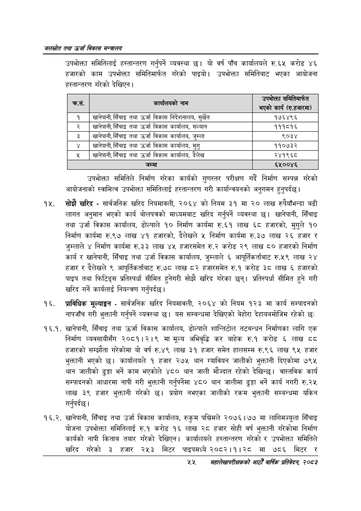

# Page 77 QA

## Rendered page


## Extracted text

```text
जलस्रोत तथा उर्जा विकास सन्वबालय
उपभोक्ता समितिलाई हस्तान्तरण गर्नुपर्ने व्यवस्था छ। यो वर्ष पाँच कार्यालयले रु.६५ करोड ४६ हजारको काम उपभोक्ता समितिमार्फत गरेको पाइयो। उपभोक्ता समितिबाट भएका आयोजना हस्तान्तरण गरेको देखिएन |
उपभोक्ता समितिले निर्माण गरेका कार्यको गुणस्तर परीक्षण गर्दै निर्माण सम्पन्न गरेको आयोजनाको स्वामित्व उपभोक्ता समितिलाई हस्तान्तरण गरी कार्यान्वयनको अनुगमन हुनुपर्दछ |
सोझै खरिद -सार्वजनिक खरिद नियमावली, २०६४ को नियम ३१ मा २० लाख रुपैयाँभन्दा बढी लागत अनुमान भएको कार्य बोलपत्रको माध्यमबाट खरिद गर्नुपर्ने व्यवस्था | खानेपानी, सिँचाइ तथा उर्जा विकास कार्यालय, डोल्पाले १० निर्माण कार्यमा रु.६१ लाख ६८ हजारको, मुगुले १० निर्माण कार्यमा रु.९७ लाख ४१ हजारको, दैलेखले ५ निर्माण कार्यमा रु.३७ लाख २६ हजार र जुम्लाले ४ निर्माण कार्यमा रु.३३ लाख ४५ हजारसमेत रु.२ करोड २९ लाख ८० हजारको निर्माण कार्य र खानेपानी, सिँचाइ तथा उर्जा विकास कार्यालय, जुम्लाले ६ आपूर्तिकर्ताबाट रु.५९ लाख २४ हजार र देलेखले ९ आपूर्तिकर्ताबाट रु.७८ लाख ८२ हजारसमेत रु.१ करोड ३८ लाख ६ हजारको पाइप तथा फिटिङ्स प्रतिस्पर्धा सीमित हुनेगरी सोझै खरिद गरेका छन्‌। प्रतिस्पर्धा सीमित हुने गरी खरिद गर्ने कार्यलाई नियन्त्रण गर्नुपर्दछ।
प्राविधिक मूल्याङ्गन -सार्वजनिक खरिद नियमावली, २०६४ को नियम १२३ मा कार्य सम्पादनको नापजाँच गरी भुक्तानी गर्नुपर्ने व्यवस्था छ। यस सम्बन्धमा देखिएको बेहोरा देहायबमोजिम रहेको छ:
. खानेपानी, सिँचाइ तथा उर्जा विकास कार्यालय, डोल्पाले शान्तिटोल तटबन्धन निर्माणका लागि एक निर्माण व्यवसायीसँग २०८१।२।९ मा मूल्य अभिवृद्धि कर बाहेक रु.१ करोड ६ लाख ८८ हजारको सम्झौता गरेकोमा यो वर्ष रु.४९ लाख ३१ हजार समेत हालसम्म रु.९६ लाख ९५ हजार भुक्तानी भएको छ। कार्यालयले १ हजार २७५ थान ग्यावियन जालीको भुक्तानी दिएकोमा ७९५ थान जालीको ढुङ्गा भर्ने काम भएकोले ४८० थान जाली मौज्दात रहेको देखिन्छ। वास्तविक कार्य सम्पादनको आधारमा नापी गरी भुक्तानी गर्नुपर्नेमा ४८० थान जालीमा ढुङ्गा भर्ने कार्य नगरी रु.२५ लाख ३९ हजार भुक्तानी गरेको छ। प्रयोग नभएका जालीको रकम भुक्तानी सम्बन्धमा यकिन गर्नुपर्दछ |
. खानेपानी, सिँचाइ तथा उर्जा विकास कार्यालय, रुकुम पश्चिमले २०७६।७७ मा लागिमज्यूला सिँचाइ योजना उपभोक्ता समितिलाई रु.१ करोड १६ लाख २८ हजार सोही वर्ष भुक्तानी गरेकोमा निर्माण कार्यको नापी किताब तयार गरेको देखिएन। कार्यालयले हस्तान्तरण गरेको र उपभोक्ता समितिले खरिद गरेको ३ हजार २५३ मिटर पाइपमध्य २०८२।१।२८ मा ७८६ मिटर र
४५५
सहालेखापरीक्षकको आठौँ वाक प्रतिवेदन २०८२

| . क्रस. | — काषालबका नाम | उपभोक्ता समेतेनारत भएको कार्य (र.हजारमा) |
| --- | --- | --- |
| १ | छानेपानी,सिँचाइ तथा उर्जा विकास निर्दशनाल४, सुर्खेत | १७६४९६ |
| २ | खानेपानी, सिँचाइ तथा उर्जा विकास कार्यालय, सल्यान | १११८१६ |
| ३ | खानेपानी,सिँचाइ तथा उर्जा विकास कार्यालय, जुम्ला | ९०३४ |
| ४ | खानेपानी,सिँचाइ तथा उर्जा विकास कार्यालथ, मुगु | ११०७३२ |
| ५ | खानेपानी,सिँचाइ तथा उर्जा विकास कार्यालय, दैलेख | २४१९६८ |
| ६ | जम्मा | ६५००४६ |
```

## Flags
- table_page
- medium_quality_table
