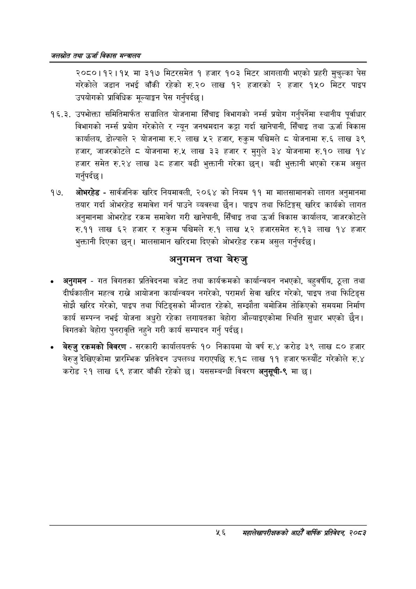

# Page 78 QA

## Rendered page


## Extracted text

```text
जलस्रोत तथा उर्जा विकास सन्वबालय
२०८०।१२।१५ मा ३१७ मिटरसमेत १ हजार १०३ मिटर आगलागी भएको प्रहरी मुचुल्का पेस गरेकोले जडान नभई बाँकी रहेको रु.२० लाख १२ हजारको २ हजार १५० मिटर पाइप उपयोगको प्राविधिक मूल्याङ्कन पेस गर्नुपर्दछ |
. उपभोक्ता समितिमार्फत सञ्चालित योजनामा सिँचाइ विभागको नर्म्स प्रयोग गर्नुपर्नेमा स्थानीय पूर्वाधार विभागको नर्म्स प्रयोग गरेकोले र न्यून जनश्रमदान कट्टा गर्दा खानेपानी, सिँचाइ तथा उर्जा विकास कार्यालय, डोल्पाले २ योजनामा रु.२ लाख ५२ हजार, रुकुम पश्चिमले ८ योजनामा रु.६ लाख ३९ हजार, जाजरकोटले ८ योजनामा रु.५ लाख ३३ हजार र मुगुले ३४ योजनामा रु.१० लाख १४ हजार समेत रु.२४ लाख ३८ हजार बढी भुक्तानी गरेका छन्‌। बढी भुक्तानी भएको रकम असुल गर्नुपर्दछ |
ओभरहेड -सार्वजनिक खरिद नियमावली, २०६४ को नियम ११ मा मालसामानको लागत अनुमानमा तयार गर्दा ओभरहेड समावेश गर्न पाउने व्यवस्था छैन। पाइप तथा फिटिङ्गस्‌ खरिद कार्यको लागत अनुमानमा ओभरहेड रकम समावेश गरी खानेपानी, सिँचाइ तथा उर्जा विकास कार्यालय, जाजरकोटले रु.११ लाख ६२ हजार र रुकुम पश्चिमले रु.१ लाख ५२ हजारसमेत रु.१३ लाख १४ हजार भुक्तानी दिएका छन्‌। मालसामान खरिदमा दिएको ओभरहेड रकम असुल गर्नुपर्दछ।
अनुगमन तथा बेरुजु
अनुगमन -गत विगतका प्रतिवेदनमा बजेट तथा कार्यक्रमको कार्यान्वयन नभएको, बहुवर्षीय, ठूला तथा दीर्घकालीन महत्व राख्ने आयोजना कार्यान्वयन नगरेको, परामर्श सेवा खरिद गरेको, पाइप तथा फिटिङ्स सोझै खरिद गरेको, पाइप तथा पिटिङ्सको मौज्दात रहेको, सम्झौता बमोजिम तोकिएको समयमा निर्माण कार्य सम्पन्न नभई योजना अधुरो रहेका लगायतका बेहोरा औल्याइएकोमा स्थिति सुधार भएको छैन। विगतको बेहोरा पुनरावृत्ति नहुने गरी कार्य सम्पादन गर्नु पर्दछ।
० बेरुजु रकमको विवरण -सरकारी कार्यालयतर्फ १० निकायमा यो वर्ष रु.४ करोड ३९ लाख ८० हजार बेरुजु देखिएकोमा प्रारम्भिक प्रतिवेदन उपलब्ध गराएपछि रु.१८ लाख ९९ हजार फस्यौट गरेकोले रु.४ करोड २१ लाख ६९ हजार बाँकी रहेको | यससम्बन्धी विवरण अनुसूची-९ मा छ।
५६
सहालेखापरीक्षकको वाषिक प्रतिवेदन २०८२
```

## Flags
- None
