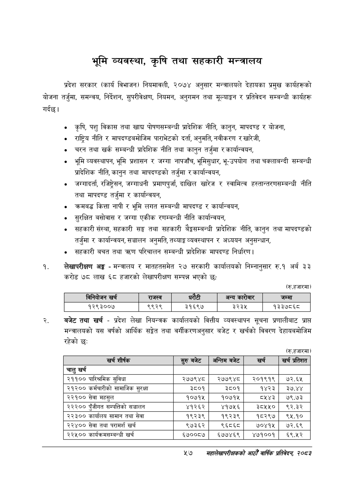

# Page 79 QA

## Rendered page


## Extracted text

```text
भूमि व्यवस्था, कृषि तथा सहकारी मन्त्रालय
गर्दछु। प्रदेश सरकार (कार्य विभाजन) नियमावली, २०७४ अनुसार मन्त्रालयले देहायका प्रमुख कार्यहरूको योजना तर्जुमा, समन्वय, निर्देशन, सुपरीवेक्षण, नियमन, अनुगमन तथा मूल्याङ्कन र प्रतिवेदन सम्बन्धी कार्यहरू
० कृषि, पशु विकास तथा खाद्य पोषणसम्बन्धी प्रादेशिक नीति, कानुन, मापदण्ड र योजना,
राष्ट्रिय नीति र मापदण्डबमोजिम पाराभेटको दर्ता, अनुमति, नवीकरण र खारेजी,
चरन तथा खर्क सम्बन्धी प्रादेशिक नीति तथा कानुन तर्जुमा र कार्यान्वयन,
० भूमि व्यवस्थापन, भूमि प्रशासन र जग्गा नापजाँच, भूमिसुधार, भू-उपयोग तथा चक्लाबन्दी सम्बन्धी प्रादेशिक नीति, कानुन तथा मापदण्डको तर्जुमा र कार्यान्वयन,
० जरगादर्ता, रजिष्ट्रेसन, जग्गाधनी प्रमाणपुर्जा, दाखिल खारेज र स्वामित्व हस्तान्तरणसम्बन्धी नीति तथा मापदण्ड तर्जुमा र कार्यान्वयन,
० क्रमबद्ध कित्ता नापी र भूमि लगत सम्बन्धी मापदण्ड र कार्यान्वयन,
० सुरक्षित बसोवास र जग्गा एकीक रणम्बन्धी नीति कार्यान्वयन,
० सहकारी संस्था, सहकारी सङ्घ तथा सहकारी बेङ्कसम्बन्धी प्रादेशिक नीति, कानुन तथा मापदण्डको तर्जुमा र कार्यान्वयन, सञ्चालन अनुमति, तथ्याङ्क व्यवस्थापन र अध्ययन अनुसन्धान,
सहकारी बचत तथा क्रण परिचालन सम्बन्धी प्रादेशिक मापदण्ड निर्धारण |
लेखापरीक्षण अङ्ग -मन्त्रालय र मातहतसमेत २७ सरकारी कार्यालयको निम्नानुसार रु.१ अर्ब ३३ करोड ७८ लाख ६८ हजारको लेखापरीक्षण सम्पन्न भएको छ:
(रू.हजारमा)
बजेट तथा खर्च -प्रदेश लेखा नियन्त्रक कार्यालयको वित्तीय व्यवस्थापन सूचना प्रणालीबाट प्राप्त मन्त्रालयको यस वर्षको आर्थिक सङ्केत तथा वर्गीकरणअनुसार बजेट र खर्चको विवरण देहायबमोजिम रहेको छः
(रु.हजारमा)
२७
सहालेखापरीक्षकको वाषिक प्रतिवेदन २०८२

|  | विनिवोजन खर्च | राजस्व |  |  | अन्य कारोबार | जम्मा |
| --- | --- | --- | --- | --- | --- | --- |
|  | १२९३००७ | ९९२९ | ३१६९७ |  | ३२३५ | १३३७८६८ |

| खच शीर्षक | सुरुबबेट | अन्तिम बजेट | खर्च | खर्च प्रतिशत |
| --- | --- | --- | --- | --- |
| चालु खर्च |  |  |  |  |
| २११०० पारिश्रमिक सुविधा | २७७९४८ | २७७९४८ | २०१९१९ | ७२.६५ |
| २१२०० कर्मचारीको सामाजिक सुरक्षा | ३८०१ | ३८०१ | १४२३ | ३७.४४ |
| २२१०० सेवा महसुल | १०७१५ | १०७१५ | ८५४३ | ७९.७३ |
| २२२०० पुँजीगत सन्पततिको सञ्चालन | ४१२६२ | ४१७५६ | ३८५५० | ९२.३२ |
| २२३०० कार्यालय सामान तथा सेवा | १९२३९ | १९२३९ | १२९७ | ९५.१० |
| २२४०० सेवा तथा परामर्श खर्च | ९७३६२ | ९६८६८ | ७०४१५ | ७२.६९ |
| २२५०० कार्वक्रमसन्बन्धी खर्च | ६७००८७ | ६७७४६९ | ४७१००१ | ६९५२ |
```

## Flags
- table_page
- medium_quality_table
