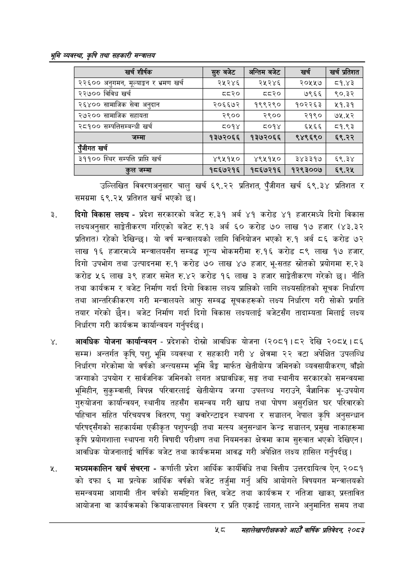

# Page 80 QA

## Rendered page


## Extracted text

```text
श्रम व्यवस्था; कृषि तथा सहकारी मन्त्रालय
उल्लिखित विवरणअनुसार चालु खर्च ६९.२२ प्रतिशत, पुँजीगत खर्च ६९.३४ प्रतिशत र समग्रमा ६९.२५ प्रतिशत खर्च भएको छ।
दिगो विकास लक्ष्य -प्रदेश सरकारको बजेट रु.३१ अर्ब ४१ करोड ४१ हजारमध्ये दिगो विकास लक्ष्यअनुसार साङ्गेतीकरण गरिएको बजेट रु.१३ अर्ब ६० करोड ७० लाख १७ हजार (४३.३२ प्रतिशत) रहेको देखिन्छ। यो वर्ष मन्त्रालयको लागि विनियोजन भएको रु.१ अर्ब ८६ करोड ७२ लाख १६ हजारमध्ये मन्त्रालयसँग सम्बद्ध शून्य भोकमरीमा रु.१६ करोड ८९ लाख १७ हजार, दिगो उपभोग तथा उत्पादनमा रु.१ करोड ७० लाख ४७ हजार, भूसतह स्रोतको प्रयोगमा रु.२३ करोड ५६ लाख ३९ हजार समेत रु.४२ करोड १६ लाख ३ हजार साङ्गेतीकरण गरेको छ। नीति तथा कार्यक्रम र बजेट निर्माण गर्दा दिगो विकास लक्ष्य प्राप्तिको लागि लक्ष्यसहितको सूचक निर्धारण तथा आन्तरिकीकरण गरी मन्त्रालयले आफु सम्बद्ध सूचकहरूको लक्ष्य निर्धारण गरी सोको प्रगति तयार गरेको छैन। बजेट निर्माण गर्दा दिगो विकास लक्ष्यलाई बजेटसँग तादाम्यता मिलाई लक्ष्य निर्धारण गरी कार्यक्रम कार्यान्वयन गर्नुपर्दछ |
आवधिक योजना कार्यान्वयन -प्रदेशको दोस्रो आवधिक योजना (२०८१।८२ देखि २०८५।८६ सम्म) अन्तर्गत कृषि, पशु, भूमि व्यवस्था र सहकारी गरी ४ क्षेत्रमा २२ वटा अपेक्षित उपलब्धि निर्धारण गरेकोमा यो वर्षको अन्त्यसम्म भूमि बैङ्क मार्फत खेतीयोग्य जमिनको व्यवसायीकरण, बाँझो जग्गाको उपयोग र सार्वजनिक जमिनको लगत अद्यावधिक, सङ्घ तथा स्थानीय सरकारको समन्वयमा भूमिहीन, सुकुम्वासी, विपन्न परिवारलाई खेतीयोग्य जग्गा उपलब्ध गराउने, वैज्ञानिक भू-उपयोग गुरुयोजना कार्यान्वयन, स्थानीय तहसँग समन्वय गरी खाद्य तथा पोषण असुरक्षित घर परिवारको पहिचान सहित परिचयपत्र वितरण, पशु क्वारेन्टाइन स्थापना र सञ्चालन, नेपाल कृषि अनुसन्धान परिषद्सँगको सहकार्यमा एकीकृत पशुपन्छी तथा मत्स्य अनुसन्धान केन्द्र सञ्चालन, प्रमुख नाकाहरूमा कृषि प्रयोगशाला स्थापना गरी विषादी परीक्षण तथा नियमनका क्षेत्रमा काम सुरुवात भएको देखिएन। आवधिक योजनालाई वार्षिक बजेट तथा कार्यक्रममा आवद्ध गरी अपेक्षित लक्ष्य हासिल गर्नुपर्दछ |
मंध्यमकालिन खर्च संचरना -कर्णाली प्रदेश आर्थिक कार्यविधि तथा वित्तीय उत्तरदायित्व ऐन, २०८१ कोदफा ६ मा प्रत्येक आर्थिक वर्षको बजेट तर्जुमा गर्नु अघि आयोगले विषयगत मन्त्रालयको समन्वयमा आगामी तीन वर्षको समष्टिगत वित्त, बजेट तथा कार्यक्रम र नतिजा खाका, प्रस्तावित आयोजना वा कार्यक्रमको क्रियाकलापगत विवरण र प्रति एकाई लागत, लाग्ने अनुमानित समय तथा
४५८
सहालेखापरीक्षकको आठौँ वा्िक प्रतिवेदन २०८२

| खर शी्क | र्रुबबेट | अन्तिम बजेट | खर्च | खर्च प्रतिशत |
| --- | --- | --- | --- | --- |
| २२६०० अनुगमन, मूल्याङ्कन र भ्रमण खर्च | २५२४६ | २५२४६ | २०५५२७ | व८१.४३ |
| २२७०० विविध खर्च |  |  | ७९६६ | %०.३% |
| २६४०० सामाजिक सेवा अनुदान | २०६६७२ | १९९२९० | १०२२६३ | १५१.३१ |
| २७२०० सामाजिक सहायता | २९०० | २९०० | २१९० | ७५.५२ |
| २८१०० सन्पत्तिसन्बन्धी खर्च | ८०१४ | ८०१४ | ६५६६ | व१.९३ |
| जम्मा | १३७२०६६ | १३७२०६६ | ९४९६९० | ६९.२२ |
| एंजीगत खर्च |  |  |  |  |
| ३११०० स्थिर सम्पत्ति प्राप्ति खर्च | ४९५१५० | ४९५१५० | ३४३३१७ | ६९.३४ |
| हल जम्मा | १८६७२१६ | १८६७२१६ | १२९३००७ | ६९.२५ |
```

## Flags
- table_page
- medium_quality_table
