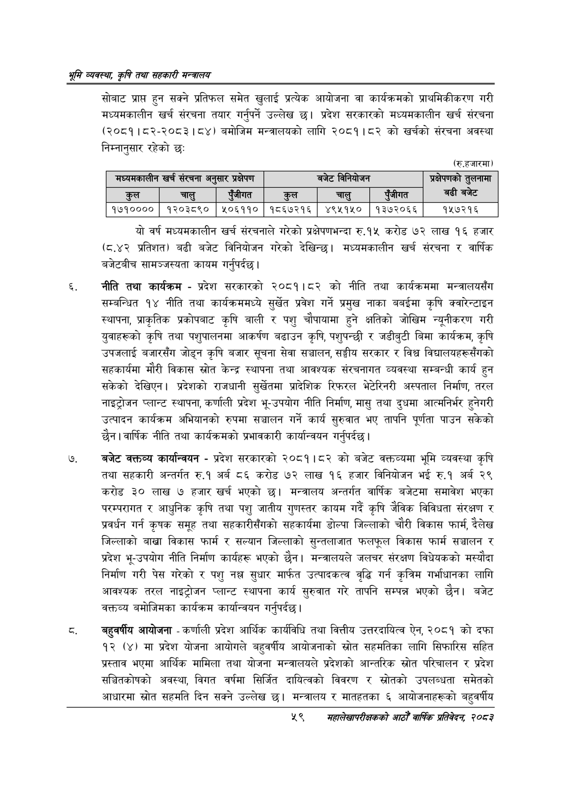

# Page 81 QA

## Rendered page


## Extracted text

```text
श्रम व्यवस्था; कृषि तथा सहकारी मन्त्रालय
सोबाट प्राप्त हुन सक्ने प्रतिफल समेत खुलाई प्रत्यक आयोजना वा कार्यक्रमको प्राथमिकीकरण गरी मध्यमकालीन खर्च संरचना तयार गर्नुपर्ने उल्लेख छ। प्रदेश सरकारको मध्यमकालीन खर्च संरचना (२०८१।८२-२०८३। ८४) बमोजिम मन्त्रालयको लागि २०८१।८२ को खर्चको संरचना अवस्था निम्नानुसार रहेको छः
(रु.हजारमा)
यो वर्ष मध्यमकालीन खर्च संरचनाले गरेको प्रक्षेपणभन्दा रु.१४५ करोड ७२ लाख १६ हजार (८.४२ प्रतिशत) बढी बजेट विनियोजन गरेको देखिन्छ। मध्यमकालीन खर्च संरचना र वार्षिक बजेटबीच सामञ्जस्यता कायम गर्नुपर्दछ |
नीति तथा कार्यक्रम -प्रदेश सरकारको २०८१।८२ को नीति तथा कार्यक्रममा मन्त्रालयसँग सम्बन्धित १४ नीति तथा कार्यक्रममध्ये सुर्खेत प्रवेश गर्ने प्रमुख नाका बबईमा कृषि क्वारेन्टाइन स्थापना, प्राकृतिक प्रकोपबाट कृषि बाली र पशु चौपायामा हुने क्षतिको जोखिम न्यूनीकरण गरी युवाहरूको कृषि तथा पशुपालनमा आकर्षण बढाउन कृषि, पशुपन्छी र जडीबुटी बिमा कार्यक्रम, कृषि उपजलाई बजारसँग जोड्न कृषि बजार सूचना सेवा सञ्चालन, सङ्घीय सरकार र विश्व विद्यालयहरूसँगको सहकार्यमा मौरी विकास स्रोत केन्द्र स्थापना तथा आवश्यक संरचनागत व्यवस्था सम्बन्धी कार्य हुन सकेको देखिएन। प्रदेशको राजधानी सुर्खेतमा प्रादेशिक रिफरल भेटेरिनरी अस्पताल निर्माण, तरल नाइट्रोजन प्लान्ट स्थापना, कर्णाली प्रदेश भू-उपयोग नीति निर्माण, मासु तथा दुधमा आत्मनिर्भर हुनेगरी उत्पादन कार्यक्रम अभियानको रुपमा सञ्चालन गर्ने कार्य सुरुवात भए तापनि पूर्णता पाउन सकेको छैन। वार्षिक नीति तथा कार्यक्रमको प्रभावकारी कार्यान्वयन गर्नुपर्दछ |
बजेट वक्तव्य कार्यान्वयन -प्रदेश सरकारको २०८१।८२ को बजेट वक्तव्यमा भूमि व्यवस्था कृषि तथा सहकारी अन्तर्गत रु.१ अर्ब ८६ करोड ७२ लाख १६ हजार विनियोजन भई रु.१ अर्ब २९ करोड ३० लाख ७ हजार खर्च भएको छ। मन्त्रालय अन्तर्गत वार्षिक बजेटमा समावेश भएका परम्परागत र आधुनिक कृषि तथा पशु जातीय गुणस्तर कायम गर्दै कृषि जैविक विविधता संरक्षण र प्रवर्धन गर्न कृषक समूह तथा सहकारीसँगको सहकार्यमा डोल्पा जिल्लाको चौरी विकास फार्म, दैलेख जिल्लाको बाख्रा विकास फार्म र सल्यान जिल्लाको सुन्तलाजात फलफूल विकास फार्म सञ्चालन र प्रदेश भू-उपयोग नीति निर्माण कार्यहरू भएको छैन। मन्त्रालयले जलचर संरक्षण विधेयकको मस्यौदा निर्माण गरी पेस गरेको र पशु नक्ल सुधार मार्फत उत्पादकत्व वृद्धि गर्न कृत्रिम गर्भाधानका लागि आवश्यक तरल नाइट्रोजन प्लान्ट स्थापना कार्य सुरुवात गरे तापनि सम्पन्न भएको छैन। बजेट वक्तव्य बमोजिमका कार्यक्रम कार्यान्वयन गर्नुपर्दछ |
बहुवर्षीय आयोजना -कर्णाली प्रदेश आर्थिक कार्यविधि तथा वित्तीय उत्तरदायित्व ऐन, २०८१ को दफा १२ (४) मा प्रदेश योजना आयोगले बहुवर्षीय आयोजनाको स्रोत सहमतिका लागि सिफारिस सहित प्रस्ताव भएमा आर्थिक मामिला तथा योजना मन्त्रालयले प्रदेशको आन्तरिक स्रोत परिचालन र प्रदेश सञ्चितकोषको अवस्था, विगत वर्षमा सिर्जित दायित्वको विवरण र स्रोतको उपलब्धता समेतको आधारमा स्रोत सहमति दिन सक्ने उल्लेख छ। मन्त्रालय र मातहतका ६ आयोजनाहरूको बहुवर्षीय
५९
सहालेखापरीक्षकको वाषिक प्रतिवेदन २०८२

|  |  |  |  |  |  |  |
| --- | --- | --- | --- | --- | --- | --- |
| मध्यनकालीन | खरी संरचना अन | सार प्रक्षेपण |  | 'बजेट |  | अ्रकेषणको ६ लनामा |
|  |  | एंजीगत |  |  | एंजीगत | बढी बजेट |
| १७१०००० | १२०३८९० | २५०६११० | १८६७२१६ | ४९५१५० | १३७२०६६ | १५७२१६ |
```

## Flags
- table_page
- medium_quality_table
