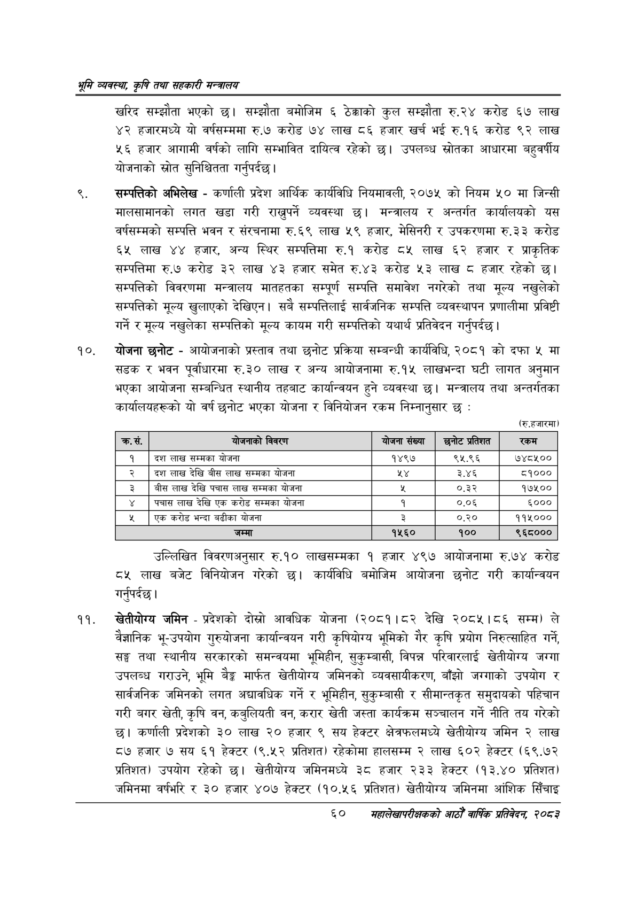

# Page 82 QA

## Rendered page


## Extracted text

```text
श्रम व्यवस्था; कृषि तथा सहकारी मन्त्रालय
खरिद सम्झौता भएको छ। सम्झौता बमोजिम ६ ठेक्काको कुल सम्झौता रु.२४ करोड ६७ लाख ४२ हजारमध्ये यो वर्षसम्ममा रु.७ करोड ७४ लाख ८६ हजार खर्च भई रु.१६ करोड ९२ लाख ५६ हजार आगामी वर्षको लागि सम्भावित दायित्व रहेको | उपलब्ध स्रोतका आधारमा बहुवर्षीय योजनाको स्रोत सुनिश्चितता गर्नुपर्दछ |
सम्पत्तिको अभिलेख -कर्णाली प्रदेश आर्थिक कार्यविधि नियमावली, २०७५ को नियम ५० मा जिन्सी मालसामानको लगत खडा गरी राख्नुपर्ने व्यवस्था छ। मन्त्रालय र अन्तर्गत कार्यालयको यस वर्षसम्मको सम्पत्ति भवन र संरचनामा रु.६९ लाख ५९ हजार, मेसिनरी र उपकरणमा रु.३३ करोड ६५ लाख ४४ हजार, अन्य स्थिर सम्पत्तिमा रु.१ करोड ८५ लाख ६२ हजार र प्राकृतिक सम्पत्तिमा रु.७ करोड ३२ लाख ४३ हजार समेत रु.४३ करोड ५३ लाख हजार रहेको छ। सम्पत्तिको विवरणमा मन्त्रालय मातहतका सम्पूर्ण सम्पत्ति समावेश नगरेको तथा मूल्य नखुलेको सम्पत्तिको मूल्य खुलाएको देखिएन। सबै सम्पत्तिलाई सार्वजनिक सम्पत्ति व्यवस्थापन प्रणालीमा प्रविष्ठी गर्ने र मूल्य नखुलेका सम्पत्तिको मूल्य कायम गरी सम्पत्तिको यथार्थ प्रतिवेदन गर्नुपर्दछ |
योजना छनोट -आयोजनाको प्रस्ताव तथा छनोट प्रक्रिया सम्बन्धी कार्यविधि, २०८१ को दफा ५ मा सडक र भवन पूर्वाधारमा रु.३० लाख र अन्य आयोजनामा रु.१५ लाखभन्दा घटी लागत अनुमान भएका आयोजना सम्बन्धित स्थानीय तहबाट कार्यान्वयन हुने व्यवस्था छ। मन्त्रालय तथा अन्तर्गतका कार्यालयहरूको यो वर्ष छनोट भएका योजना र विनियोजन रकम निम्नानुसार छ:
(रु.हजारमा)
उल्लिखित विवरणअनुसार रु.१० लाखसम्मका १ हजार ४९७ आयोजनामा रु.७४ करोड ८५ लाख बजेट विनियोजन गरेको छ। कार्यविधि बमोजिम आयोजना छनोट गरी कार्यान्वयन गर्नुपर्दछ |
खेतीयोग्य जमिन -प्रदेशको दोस्रो आवधिक योजना (२०८१।८२ देखि २०८५।८६ सम्म) ले वैज्ञानिक भू-उपयोग गुरुयोजना कार्यान्वयन गरी कृषियोग्य भूमिको गैर कृषि प्रयोग निरुत्साहित गर्ने, सङ्ग तथा स्थानीय सरकारको समन्वयमा भूमिहीन, सुकुम्बासी, विपन्न परिवारलाई खेतीयोग्य जग्गा उपलब्ध गराउने, भूमि बैङ्क मार्फत खेतीयोग्य जमिनको व्यवसायीकरण, बाँझो जग्गाको उपयोग र सार्वजनिक जमिनको लगत अद्यावधिक गर्ने र भूमिहीन, सुकुम्बासी र सीमान्तकृत समुदायको पहिचान गरी बगर खेती, कृषि वन, कबुलियती वन, करार खेती जस्ता कार्यक्रम सञ्चालन गर्ने नीति तय गरेको कर्णाली प्रदेशको ३० लाख २० हजार ९ सय हेक्टर क्षेत्रफलमध्ये खेतीयोग्य जमिन २ लाख ८७ हजार ७ सय ६१ हेक्टर (९.५२ प्रतिशत) रहेकोमा हालसम्म २ लाख ६०२ हेक्टर (६९.७२ प्रतिशत) उपयोग रहेको छ। खेतीयोग्य जमिनमध्ये ३८ हजार २३३ हेक्टर (१३.४० प्रतिशत) जमिनमा वर्षभरि र ३० हजार ४०७ हेक्टर (१०.५६ प्रतिशत) खेतीयोग्य जमिनमा आंशिक सिँचाइ
६०
मसहालेखापरीक्षकको आठौँ वाषिक प्रतिवेदन २०८२

| क्रस. | बाजनाको विवरण | योजना संख्या | छनोट प्रतिशत | 'रकम |
| --- | --- | --- | --- | --- |
| १ | दश लाख सम्मका योजना | १४९७ | ९५.९६ | ७४८५०० |
| २ | दश लाख देखि बीस लाख सम्मका योजना | श४ | ३.४६ | ८५१००० |
| ३ | बीस लाख देखि पचास लाख सम्मका योजना | श | ०.३२ | १७५०० |
| ४ | पचास लाख देखि एक करोड सम्मका योजना | १ | ०.०६ | ६००० |
| ५ | एक करोड भन्दा बढीका योजना | ३ | ०.२० | ११५००० |
| ६ | जम्मा | १५६० | १०० | ९६८००० |
```

## Flags
- table_page
- medium_quality_table
