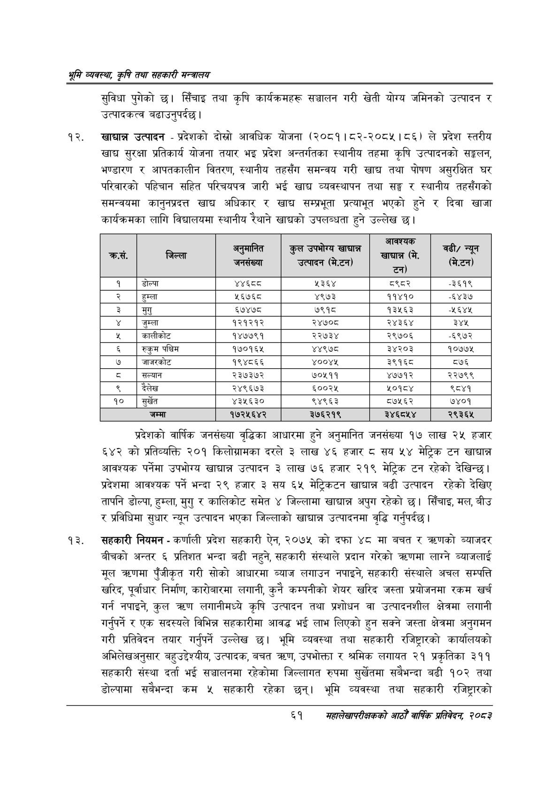

# Page 83 QA

## Rendered page


## Extracted text

```text
श्रम व्यवस्था; कृषि तथा सहकारी मन्त्रालय
सुविधा पुगेको छ। सिँचाइ तथा कृषि कार्यक्रमहरू सञ्चालन गरी खेती योग्य जमिनको उत्पादन र उत्पादकत्व बढाउनुपर्दछ।
खाद्यान्न उत्पादन -प्रदेशको दोस्रो आवधिक योजना (२०८१।८२-२०८५।८६) ले प्रदेश स्तरीय खाद्य सुरक्षा प्रतिकार्य योजना तयार भइ प्रदेश अन्तर्गतका स्थानीय तहमा कृषि उत्पादनको सङ्कलन, भण्डारण र आपतकालीन वितरण, स्थानीय तहसँग समन्वय गरी खाद्य तथा पोषण असुरक्षित घर परिवारको पहिचान सहित परिचयपत्र जारी भई खाद्य व्यवस्थापन तथा सङ्घ र स्थानीय तहसँगको समन्वयमा कानुनप्रदत्त खाद्य अधिकार र खाद्य सम्प्रभूता प्रत्याभृत भएको हुने र दिवा खाजा कार्यक्रमका लागि विद्यालयमा स्थानीय रैथाने खाद्चको उपलब्धता हुने उल्लेख छ।
प्रदेशको वार्षिक जनसंख्या वृद्धिका आधारमा हुने अनुमानित जनसंख्या १७ लाख २५ हजार ६४२ को प्रतिव्यक्ति २०१ किलोग्रामका दरले ३ लाख ४६ हजार ८ सय ५४ मेट्रिक टन खाद्यान्न आवश्यक पर्नेमा उपभोग्य खाद्यान्न उत्पादन ३ लाख ७६ हजार २१९ मेट्रिक टन रहेको देखिन्छ। प्रदेशमा आवश्यक पर्ने भन्दा २९ हजार ३ सय मेट्रिकटन खाद्यान्न बढी उत्पादन रहेको देखिए तापनि डोल्पा, हुम्ला, मुगु र कालिकोट समेत ४ जिल्लामा खाद्यान्न अपुग रहेको छ। सिँचाइ, मल, बीउ र प्रविधिमा सुधार न्यून उत्पादन भएका जिल्लाको खाद्यान्न उत्पादनमा वृद्धि गर्नुपर्दछ |
सहकारी नियमन -कर्णाली प्रदेश सहकारी ऐन, २०७५ को दफा ४८ मा बचत र त्रदणको ब्याजदर बीचको अन्तर ६ प्रतिशत भन्दा बढी नहुने, सहकारी संस्थाले प्रदान गरेको त्रहणमा लाग्ने ब्याजलाई मूल त्रहणमा पुँजीकृत गरी सोको आधारमा ब्याज लगाउन नपाइने, सहकारी संस्थाले अचल सम्पत्ति खरिद, पूर्वाधार निर्माण, कारोबारमा लगानी, कुनै कम्पनीको शेयर खरिद जस्ता प्रयोजनमा रकम खर्च गर्न नपाइने, कुल त्रहण लगानीमध्ये कृषि उत्पादन तथा प्रशोधन वा उत्पादनशील क्षेत्रमा लगानी गर्नुपर्ने र एक सदस्यले विभिन्न सहकारीमा आवद्ध भई लाभ लिएको हुन सक्ने जस्ता क्षेत्रमा अनुगमन गरी प्रतिवेदन तयार गर्नुपर्ने उल्लेख छ। भूमि व्यवस्था तथा सहकारी रजिष्ट्रारको कार्यालयको अभिलेखअनुसार बहुउद्देश्यीय, उत्पादक, बचत ७०, उपभोक्ता र श्रमिक लगायत २१ प्रकृतिका ३११ सहकारी संस्था दर्ता भ सञ्चालनमा रहेकोमा जिल्लागत रुपमा सुर्खेतमा सबैभन्दा बढी १०२ तथा डोल्पामा सबैभन्दा कम ५ सहकारी रहेका छन्‌। भूमि व्यवस्था तथा सहकारी रजिष्ट्रारको
६१
सहालेखापरीक्षकको वाषिक प्रतिवेदन २०८२

| क्रस. | जिल्ला | ~ जनसंख्या | ०. उत्पादन मि.टन) | जावरधक खाद्यन्न मि. टन) | चढी; = / नल ) |
| --- | --- | --- | --- | --- | --- |
| १ | डोल्पा | अ््ध््द | ५३६४ | ८९८२ | -३६१९ |
| २ | हुम्ला | ५६७६८ | ४९७३ | ११४१० | -६४३७ |
| ३ | मुगु | ६७४७८ | ७९१८ | १३५६३ | ४११४ |
| ४ | जुम्ला | १२१२१२ | २४७०८ | २४३६४ | ३४४५ |
| ५ | कालीकोट | १४७७९१ | २२७३४ | २९७०६ | -६९७२ |
| ६ | रुकुम पश्चिम | १७०१६४५ | ४४९७८ | ३४२०३ | १०७७५ |
| ७ | जाजरकोट | १९४८६६ | ४००४५ | ३९१६८ | ८७६ |
| ८ | सल्यान | २३७३७२ | ७०५११ | ४७७१२ | २२७९९ |
| ९ | दैलेख | २४९६७३ | ६००२५ | ५०१८४ | ९८४१ |
| १० | सुर्खेत | ४३५६३० | ९४९६३ | ८७५६२ | ७४०१ |
| ११ | जम्मा | १७२५६४२ | ३७६२१९ | ३४६८५४ | २९३६५ |
```

## Flags
- table_page
- medium_quality_table
