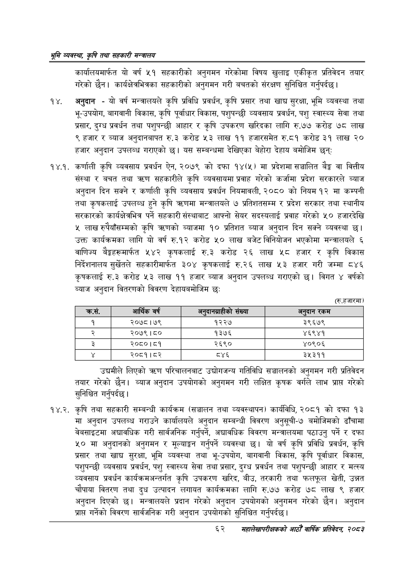

# Page 84 QA

## Rendered page


## Extracted text

```text
श्रम व्यवस्था; कृषि तथा सहकारी मन्त्रालय
कार्यालयमार्फत यो वर्ष ५१ सहकारीको अनुगमन गरेकोमा विषय खुलाइ एकीकृत प्रतिवेदन तयार गरेको छैन। कार्यक्षेत्रभित्रका सहकारीको अनुगमन गरी बचतको संरक्षण सुनिश्चित गर्नुपर्दछ |
अनुदान -यो वर्ष मन्त्रालयले कृषि प्रविधि प्रवर्धन, कृषि प्रसार तथा खाद्य सुरक्षा, भूमि व्यवस्था तथा भू-उपयोग, बागवानी विकास, कृषि पूर्वाधार विकास, पशुपन्छी व्यवसाय प्रवर्धन, पशु स्वास्थ्य सेवा तथा प्रसार, दुग्ध प्रवर्धन तथा पशुपन्छी आहार र कृषि उपकरण खरिदका लागि रु.७७ करोड ७८ लाख हजार र ब्याज अनुदानबापत रु.३ करोड ५३ लाख ९९ हजारसमेत रु.८१ करोड ३९ लाख ० हजार अनुदान उपलब्ध गराएको छ। यस सम्बन्धमा देखिएका बेहोरा देहाय बमोजिम छन्‌
१४.१. कर्णाली कृषि व्यवसाय प्रवर्धन ऐन, २०७९ को दफा १४(५) मा प्रदेशमा सञ्चालित बैङ्क वा वित्तीय संस्था र बचत तथा क्रण सहकारीले कृषि व्यवसायमा प्रवाह गरेको कर्जामा प्रदेश सरकारले ब्याज अनुदान दिन सक्ने र कर्णाली कृषि व्यवसाय प्रवर्धन नियमावली, २०८० को नियम १२ मा कम्पनी तथा कृषकलाई उपलब्ध हुने कृषि त्रहणमा मन्त्रालयले ७ प्रतिशतसम्म र प्रदेश सरकार तथा स्थानीय सरकारको कार्यक्षेत्रभित्र पर्ने सहकारी संस्थाबाट आफ्नो सेयर सदस्यलाई प्रवाह गरेको ५० हजारदेखि ५ लाख रुपैयाँसम्मको कृषि त्रहणको व्याजमा १० प्रतिशत ब्याज अनुदान दिन सक्ने व्यवस्था | उक्त कार्यक्रमका लागि यो वर्ष रु.१२ करोड ५० लाख बजेट विनियोजन भएकोमा मन्त्रालयले ६ वाणिज्य बैङ्कहरूमार्फत ५४२ कृषकलाई रु.३ करोड २६ लाख ५८ हजार र कृषि विकास निर्देशनालय सुर्खेतले सहकारीमार्फत ३०४ कृषकलाई रु.२६ लाख ५३ हजार गरी जम्मा ८४६ कृषकलाई रु.३ करोड ३ लाख ११ हजार ब्याज अनुदान उपलब्ध गराएको छ। विगत ४ वर्षको ब्याज अनुदान वितरणको विवरण देहायबमोजिम छः
(रु.हजारमा)
उद्यमीले लिएको त्रहण परिचालनबाट उद्योगजन्य गतिविधि सञ्चालनको अनुगमन गरी प्रतिवेदन तयार गरेको छैन। ब्याज अनुदान उपयोगको अनुगमन गरी लक्षित कृषक वर्गले लाभ प्राप्त गरेको सुनिश्चित गर्नुपर्दछ |
१४.२. कृषि तथा सहकारी सम्बन्धी कार्यक्रम (सञ्चालन तथा व्यवस्थापन) कार्यविधि, २०८१ को दफा १३ मा अनुदान उपलब्ध गराउने कार्यालयले अनुदान सम्बन्धी विवरण अनुसूची-७ बमोजिमको ढाँचामा वेबसाइटमा अद्यावधिक गरी सार्वजनिक गर्नुपर्ने, अद्यावधिक विवरण मन्त्रालयमा पठाउनु पर्ने र दफा ५० मा अनुदानको अनुगमन र मूल्याङ्कन गर्नुपर्ने व्यवस्था छ। यो वर्ष कृषि प्रविधि प्रवर्धन, कृषि प्रसार तथा खाद्य सुरक्षा, भूमि व्यवस्था तथा भू-उपयोग, बागवानी विकास, कृषि पूर्वाधार विकास, पशुपन्छी व्यवसाय प्रवर्धन, पशु स्वास्थ्य सेवा तथा प्रसार, दुग्ध प्रवर्धन तथा पशुपन्छी आहार र मत्स्य व्यवसाय प्रवर्धन कार्यक्रमअन्तर्गत कृषि उपकरण खरिद, बीउ, तरकारी तथा फलफूल खेती, उन्नत चौपाया वितरण तथा दुध उत्पादन लगायत कार्यक्रमका लागि रु.७७ करोड ७८ लाख ९ हजार अनुदान दिएको छ। मन्त्रालयले प्रदान गरेको अनुदान उपयोगको अनुगमन गरेको छैन। अनुदान प्राप्त गर्नेको विवरण सार्वजनिक गरी अनुदान उपयोगको सुनिश्चित गर्नुपर्दछ |
६२
सहालेखापरीक्षकको वाषिक प्रतिवेदन २०८२

| क्रस. | आरखिक वर्ष | अर दागश्राहीको संख्या | अर्दान रकम |
| --- | --- | --- | --- |
| १ | २०७८।७९ | १२२७ | ३९६७९ |
| २ | २०७९।८० | १३७६ | ४६९४१ |
| ३ | २०८०।८१ | २६९० | ४०९०६ |
| ४ | २०५९१८३ | ८४६ | ३५३११ |
```

## Flags
- table_page
- medium_quality_table
