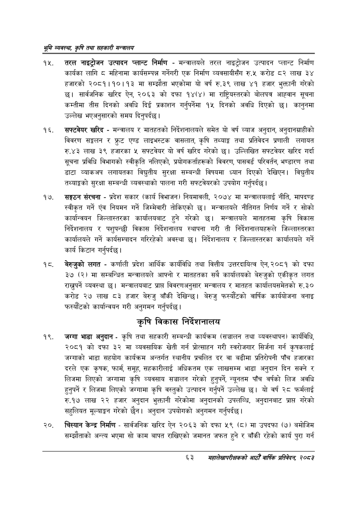

# Page 85 QA

## Rendered page


## Extracted text

```text
श्रम व्यवस्था; कृषि तथा सहकारी मन्त्रालय
तरल नाइट्रोजन उत्पादन प्लान्ट निर्माण -मन्त्रालयले तरल नाइट्रोजन उत्पादन प्लान्ट निर्माण कार्यका लागि ८ महिनामा कार्यसम्पन्न गर्नेगरी एक निर्माण व्यवसायीसँग रु.५ करोड ८२ लाख ३४ हजारको २०८१।१०।१३ मा सम्झौता भएकोमा यो वर्ष रु.३९ लाख ४१ हजार भुक्तानी गरेको छ। सार्वजनिक खरिद ऐन, २०६३ को दफा १४(४) मा राष्ट्रियस्तरको बोलपत्र आह्वान सूचना कम्तीमा तीस दिनको अवधि दिई प्रकाशन गर्नुपर्नेमा १५ दिनको अवधि दिएको छ। कानुनमा उल्लेख भएअनुसारको समय दिनुपर्दछ।
सफ्टवेयर खरिद -मन्त्रालय र मातहतको निर्देशनालयले समेत यो वर्ष व्याज अनुदान, अनुदानग्राहीको विवरण सङ्कलन र फ्रुट एण्ड लाइभस्टक वासलात, कृषि तथ्याङ्क तथा प्रतिवेदन प्रणाली लगायत रु.४३ लाख ३९ हजारका ५ सफ्टवेयर यो वर्ष खरिद गरेको छ। उल्लिखित सफ्टवेयर खरिद गर्दा सूचना प्रविधि विभागको स्वीकृति नलिएको, प्रयोगकर्ताहरूको विवरण, पासवर्ड परिवर्तन, भण्डारण तथा डाटा व्याकअप लगायतका विद्युतीय सुरक्षा सम्बन्धी विषयमा ध्यान दिएको देखिएन। विद्युतीय तथ्याङ्कको सुरक्षा सम्बन्धी व्यवस्थाको पालना गरी सफ्टवेयरको उपयोग गर्नुपर्दछ |
सङ्गठन संरचना -प्रदेश सकार (कार्य विभाजन) नियमावली, २०७४ मा मन्त्रालयलाई नीति, मापदण्ड स्वीकृत गर्ने एंव नियमन गर्ने जिम्मेवारी तोकिएको छ। मन्त्रालयले नीतिगत निर्णय गर्ने र सोको कार्यान्वयन जिल्लास्तरका कार्यालयबाट हुने गरेको छ। मन्त्रालयले मातहतमा कृषि विकास निर्देशनालय र पशुपन्छी विकास निर्देशनालय स्थापना गरी ती निर्देशनालयहरूले जिल्लास्तरका कार्यालयले गर्ने कार्यसम्पादन गरिरहेको अवस्था छ। निर्देशनालय र जिल्लास्तरका कार्यालयले गर्ने कार्य किटान गर्नुपर्दछ |
बेरुजुको लगत -कर्णाली प्रदेश आर्थिक कार्यविधि तथा वित्तीय उत्तरदायित्व ऐन, २०८१ को दफा ३७ (२) मा सम्बन्धित मन्त्रालयले आफ्नो र मातहतका सबै कार्यालयको बेरुजुको एकीकृत लगत राख्नुपर्ने व्यवस्था | मन्त्रालयबाट प्राप्त विवरणअनुसार मन्त्रालय र मातहत कार्यालयसमेतको रु.३० करोड २७ लाख ८३ हजार बेरुजु बाँकी देखिन्छ। बेरुजु फस्यौटको वार्षिक कार्ययोजना बनाइ फस्यौटको कार्यान्वयन गरी अनुगमन गर्नुपर्दछ |
कृषि विकास निर्देशनालय
जग्गा भाडा अनुदान -कृषि तथा सहकारी सम्बन्धी कार्यक्रम (सञ्चालन तथा व्यवस्थापन) कार्यविधि, २०८१ को दफा ३२ मा व्यवसायिक खेती गर्न प्रोत्साहन गरी स्वरोजगार सिर्जना गर्न कृषकलाई जग्गाको भाडा सहयोग कार्यक्रम अन्तर्गत स्थानीय प्रचलित दर वा बढीमा प्रतिरोपनी पाँच हजारका दरले एक कृषक, फार्म, समूह, सहकारीलाई अधिकतम एक लाखसम्म भाडा अनुदान दिन सक्ने र लिजमा लिएको जग्गामा कृषि व्यवसाय सञ्चालन गरेको हुनुपर्ने, न्यूनतम पाँच वर्षको लिज अवधि हुनुपर्ने र लिजमा लिएको जग्गामा कृषि वस्तुको उत्पादन गर्नुपर्ने उल्लेख छ। यो वर्ष २८ फर्मलाई रु.१७ लाख २२ हजार अनुदान भुक्तानी गरेकोमा अनुदानको उपलब्धि, अनुदानबाट प्राप्त गरेको सहुलियत मूल्याङ्कन गरेको छैन। अनुदान उपयोगको अनुगमन गर्नुपर्दछ |
२०, चिस्यान केन्द्र निर्माण -सार्वजनिक खरिद ऐन २०६३ को दफा ५९ (८) मा उपदफा (७) बमोजिम सम्झौताको अन्त्य भएमा सो काम बापत राखिएको जमानत जफत हुने र बाँकी रहेको कार्य पुरा गर्न
६३
सहालेखापरीक्षकको वाषिक प्रतिवेदन २०८२
```

## Flags
- None
