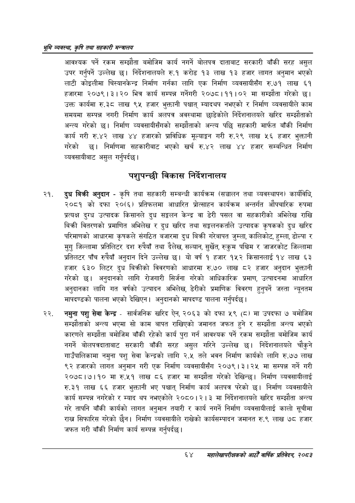

# Page 86 QA

## Rendered page


## Extracted text

```text
श्रम व्यवस्था; कृषि तथा सहकारी मन्त्रालय
आवश्यक पर्ने रकम सम्झौता बमोजिम कार्य नगर्ने बोलपत्र दाताबाट सरकारी बाँकी सरह असुल उपर गर्नुपर्ने उल्लेख छ। निर्देशनालयले रु.१ करोड १३ लाख १३ हजार लागत अनुमान भएको लाटी कोइलीमा चिस्यानकेन्द्र निर्माण गर्नका लागि एक निर्माण व्यवसायीसँग रु.७१ लाख ६१ हजारमा २०७९।३।२० भित्र कार्य सम्पन्न गर्नेगरी २०७८।११।०२ मा सम्झौता गरेको छ। उक्त कार्यमा रु.३८ लाख ९५ हजार भुक्तानी पश्चात्‌ म्यादयप नभएको र निर्माण व्यवसायीले काम समयमा सम्पन्न नगरी निर्माण कार्य अलपत्र अवस्थामा छाडेकोले निर्देशनालयले खरिद सम्झौताको अन्त्य गरेको छ। निर्माण व्यवसायीसँगको सम्झौताको अन्त्य पछि सहकारी मार्फत बाँकी निर्माण कार्य गरी रु.४२ लाख ४४ हजारको प्राविधिक मूल्याङ्कन गरी रु.२९ लाख ५६ हजार भुक्तानी गरेको छ। निर्माणमा सहकारीबाट भएको खर्च रु.४२ लाख ४४ हजार सम्बन्धित निर्माण व्यवसायीबाट असुल गर्नुपर्दछ |
पशुपन्छी विकास निर्देशनालय
दुध बिक्री अनुदान -कृषि तथा सहकारी सम्बन्धी कार्यक्रम (सञ्चालन तथा व्यवस्थापन) कार्यविधि, २०८१ को दफा २०(६) प्रतिफलमा आधारित प्रोत्साहन कार्यक्रम अन्तर्गत औपचारिक रुपमा प्रत्यक्ष दुग्ध उत्पादक किसानले दुध सङ्गलन केन्द्र वा डेरी पसल वा सहकारीको अभिलेख राखि बिक्री वितरणको प्रमाणित अभिलेख र दुध खरिद तथा सङ्लनकर्ताले उत्पादक कृषकको दुध खरिद परिमाणको आधारमा कृषकले संगठित बजारमा दुध बिक्री गरेबापत जुम्ला, कालिकोट, हुम्ला, डोल्पा र मुगु जिल्लामा प्रतिलिटर दश रुपैयाँ तथा दैलेख, सल्यान, सुर्खेत, रुकुम पश्चिम र जाजरकोट जिल्लामा प्रतिलटर पाँच रुपैयाँ अनुदान दिने उल्लेख छ। यो वर्ष १ हजार १५२ किसानलाई १४ लाख ६३ हजार ६३० लिटर दुध बिक्रीको विवरणको आधारमा रु.७० लाख ८२ हजार अनुदान भुक्तानी गरेको | अनुदानको लागि रोजगारी सिर्जना गरेको आधिकारिक प्रमाण, उत्पादनमा आधारित अनुदानका लागि गत वर्षको उत्पादन अभिलेख, डेरीको प्रमाणिक विवरण हुनुपर्ने जस्ता न्यूनतम मापदण्डको पालना भएको देखिएन। अनुदानको मापदण्ड पालना गर्नुपर्दछ |
नमुना पशु सेवा केन्द्र -सार्वजनिक खरिद ऐन, २०६३ को दफा ५९ (८) मा उपदफा ७ बमोजिम सम्झौताको अन्त्य भएमा सो काम बापत राखिएको जमानत जफत हुने र सम्झौता अन्त्य भएको कारणले सम्झौता बमोजिम बाँकी रहेको कार्य पुरा गर्न आवश्यक पर्ने रकम सम्झौता बमोजिम कार्य नगर्ने बोलपत्रदाताबाट सरकारी बाँकी सरह असुल गरिने उल्लेख छ। निर्देशनालयले चौकुने गाउँपालिकामा नमुना पशु सेवा केन्द्रको लागि २.५ तले भवन निर्माण कार्यको लागि रु.७७ लाख ९२ हजारको लागत अनुमान गरी एक निर्माण व्यवसायीसँग २०७९।३।२५ मा सम्पन्न गर्ने गरी २०७८।७।१० मा रु.५१ लाख ८६ हजार मा सम्झौता गरेको देखिन्छ। निर्माण व्यवसायीलाई रु.३२१ लाख ६६ हजार भुक्तानी भए पश्चात्‌ निर्माण कार्य अलपत्र परेको छ। निर्माण व्यवसायीले कार्य सम्पन्न नगरेको र म्याद थप नभएकोले २०८०।२। ३ मा निर्देशनालयले खरिद सम्झौता अन्त्य गरे तापनि बाँकी कार्यको लागत अनुमान तयारी र कार्य नगर्ने निर्माण व्यवसायीलाई कालो सूचीमा राख सिफारिस गरेको छैन। निर्माण व्यवसायीले राखेको कार्यसम्पादन जमानत रु.९ लाख ७८ हजार जफत गरी बाँकी निर्माण कार्य सम्पन्न गर्नुपर्दछ |
६४ समंहालेखापरीक्षकको आठौँ वाषिक प्रतिवेदन २०८२
```

## Flags
- None
