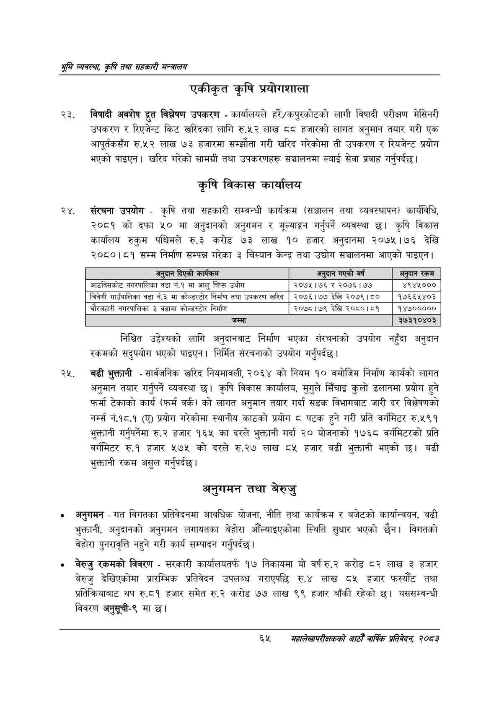

# Page 87 QA

## Rendered page


## Extracted text

```text
भूमि व्यवस्था; कृषि तथा सहकारी सन्च्रालय
एकीकृत कृषि प्रयोगशाला
विषादी अवशेष द्रुत विश्लेषण उपकरण -कार्यालयले हरे/कपुरकोटको लागी विषादी परीक्षण मेसिनरी उपकरण र रिएजेन्ट किट खरिदका लागि रु.५२ लाख ५ हजारको लागत अनुमान तयार गरी एक आपूर्तकसँग रु.५२ लाख ७३ हजारमा सम्झौता गरी खरिद गरेकोमा ती उपकरण र रियजेन्ट प्रयोग भएको पाइएन। खरिद गरेको सामग्री तथा उपकरणहरू सञ्चालनमा ल्याई सेवा प्रवाह गर्नुपर्दछ।
कृषि विकास कार्यालय
संरचना उपयोग -कृषि तथा सहकारी सम्बन्धी कार्यक्रम (सञ्चालन तथा व्यवस्थापन) कार्यविधि, २०८१ को दफा ५० मा अनुदानको अनुगमन र मूल्याङ्कन गर्नुपर्ने व्यवस्था छ। कृषि विकास कार्यालय रुकुम पश्चिमले रु.३२ करोड ७३ लाख १० हजार अनुदानमा २०७५।७६ देखि २०८०।८१ सम्म निर्माण सम्पन्न गरेका ३ चिस्यान केन्द्र तथा उद्योग सञ्चालनमा आएको पाइएन |
निश्चित उद्देश्यको लागि अनुदानबाट निर्माण भएका संरचनाको उपयोग नहुँदा अनुदान रकमको सदुपयोग भएको पाइएन। निर्मित संरचनाको उपयोग गर्नुपर्दछ |
बढी भुक्तानी -सार्वजनिक खरिद नियमावली, २०६४ को नियम १० बमोजिम निर्माण कार्यको लागत अनुमान तयार गर्नुपर्ने व्यवस्था छ। कृषि विकास कार्यालय, मुगुले सिँचाइ कुलो ढलानमा प्रयोग हुने फर्मा टेकाको कार्य (फर्म वर्क) को लागत अनुमान तयार गर्दा सडक विभागबाट जारी दर विश्लेषणको नं.१८.१ (ए) प्रयोग गरेकोमा स्थानीय काठको प्रयोग ८ पटक हुने गरी प्रति वर्गमिटर रु.५९१ भुक्तानी गर्नुपर्नेमा रु.२ हजार १६५ का दरले भुक्तानी गर्दा २० योजनाको १७६८ वर्गमिटरको प्रति वर्गमिटर रु.१ हजार ५७५ को दरले रु.२७ लाख ८५ हजार बढी भुक्तानी भएको छ। बढी भुक्तानी रकम असुल गर्नुपर्दछ |
अनुगमन तथा बेरुजु
अनुगमन -गत विगतका प्रतिवेदनमा आवधिक योजना, नीति तथा कार्यक्रम र बजेटको कार्यान्वयन, बढी भुक्तानी, अनुदानको अनुगमन लगायतका बेहोरा औँल्याइएकोमा स्थिति सुधार भएको छैन। विगतको बेहोरा पुनरावृत्ति नहुने गरी कार्य सम्पादन गर्नुपर्दछ |
० बेरुजु रकमको विवरण -सरकारी कार्यालयतर्फ १७ निकायमा यो वर्ष रु.२ करोड ८२ लाख ३ हजार बेरुजु देखिएकोमा प्रारम्भिक प्रतिवेदन उपलब्ध गराएपछि रु.४ लाख ८५ हजार फस्यौट तथा प्रतिक्रियाबाट थप रु.८१ हजार समेत रु.२ करोड ७७ लाख ९९ हजार बाँकी रहेको छ। यससम्बन्धी विवरण अनुसूची-९ मा छ।
६५
संहालेखापरीक्षकको आठौँ वाषिक प्रतिवेदन २०८२

| अनुदान दिएको कार्यक्रम | अनुदान गएको वर्ष | अनुदान रकम |
| --- | --- | --- |
| जाटविलकोट नगरपालिका वडा नं.१ मा आलु चिप्स उधोग | २०७५।७६ र २०७६।७७ | ४९४५००० |
| व्रिवेणी भ।उँपालिका वडा नं.३ मा कोल्ड«८।र निर्माण तथा उपकरण खरिद | २०७६।७७ देखि २०७९।८० | १७६६५४०३ |
| चोरजहारी नगरपालिका ३ वडामा कोल्डध्टोर निर्माण | २०७८।७९ देखि २०८०।८१ | १४७००००० |
| जम्मा |  | ३७३१०४०३ |
```

## Flags
- table_page
- medium_quality_table
