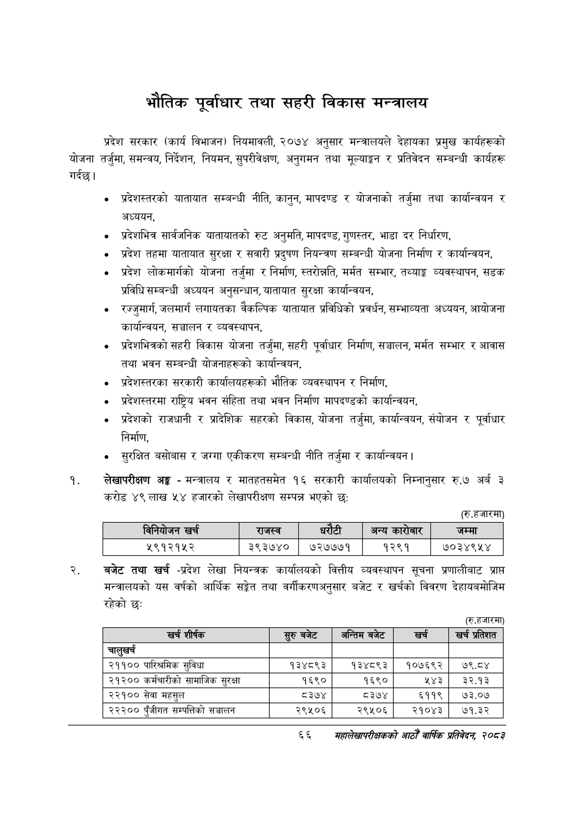

# Page 88 QA

## Rendered page


## Extracted text

```text
भौतिक पूर्वाधार तथा सहरी विकास मन्त्रालय
गर्दछु। प्रदेश सरकार (कार्य विभाजन) नियमावली, २०७४ अनुसार मन्त्रालयले देहायका प्रमुख कार्यहरूको योजना तर्जुमा, समन्वय, निर्देशन, नियमन, सुपरीवेक्षण, अनुगमन तथा मूल्याङ्कन र प्रतिवेदन सम्बन्धी कार्यहरू
प्रदेशस्तरको यातायात सम्बन्धी नीति, कानुन, मापदण्ड र योजनाको तर्जुमा तथा कार्यान्वयन र अध्ययन,
प्रदेशभित्र सार्वजनिक यातायातको रुट अनुमति, मापदण्ड, गुणस्तर, भाडा दर निर्धारण,
प्रदेश तहमा यातायात सुरक्षा र सवारी प्रदुषण नियन्त्रण सम्बन्धी योजना निर्माण र कार्यान्वयन,
प्रदेश लोकमार्गको योजना तर्जुमा र निर्माण, स्तरोन्नति, मर्मत सम्भार, तथ्याङ्क व्यवस्थापन, सडक प्रविधि सम्बन्धी अध्ययन अनुसन्धान, यातायात सुरक्षा कार्यान्वयन,
रज्जुमार्ग, जलमार्ग लगायतका वैकल्पिक यातायात प्रविधिको प्रवर्धन, सम्भाव्यता अध्ययन, आयोजना कार्यान्वयन, सञ्चालन र व्यवस्थापन,
प्रदेशभित्रको सहरी विकास योजना तर्जुमा, सहरी पूर्वाधार निर्माण, सञ्चालन, मर्मत सम्भार र आवास तथा भवन सम्बन्धी योजनाहरूको कार्यान्वयन,
प्रदेशस्तरका सरकारी कार्यालयहरूको भौतिक व्यवस्थापन र निर्माण,
प्रदेशस्तरमा राष्ट्रिय भवन संहिता तथा भवन निर्माण मापदण्डको कार्यान्वयन,
प्रदेशको राजधानी र प्रादेशिक सहरको विकास, योजना तर्जुमा, कार्यान्वयन, संयोजन र पूर्वाधार निर्माण,
सुरक्षित बसोबास र जग्गा एकीकरण सम्बन्धी नीति तर्जुमा र कार्यान्वयन।
लेखापरीक्षण अङ्ग -मन्त्रालय र मातहतसमेत १६ सरकारी कार्यालयको निम्नानुसार रु.७ अर्ब ३ करोड ४९ लाख ५४ हजारको लेखापरीक्षण सम्पन्न भएको छ:
(रि. हजारमा)
बजेट तथा खर्च -प्रदेश लेखा नियन्त्रक कार्यालयको वित्तीय व्यवस्थापन सूचना प्रणालीबाट प्राप्त मन्त्रालयको यस वर्षको आर्थिक सङ्गेत तथा वर्गीकरणअनुसार बजेट र खर्चको विवरण देहायबमोजिम रहेको छ:
(रु.हजारमा)
६६
सहालेखापरीक्षकको वाषिक प्रतिवेदन २०८२

|  | त | नेवोणन खरी |  | राजस्व |  |  | अन्य कारोबार | जम्मा |
| --- | --- | --- | --- | --- | --- | --- | --- | --- |
|  |  | २९१२१५२ |  | ३९३७४० | ७२७७७१ |  | १२९१ | ७०३४९४५४ |

| खर्च शीर्षक | र्रुबबेट | अन्तिम बजेट | खर्च | खर प्रतेशत |
| --- | --- | --- | --- | --- |
| चालुखर्च |  |  |  |  |
| २११०० पारिश्रमिक सुविधा | १३४८९३ | १३४८९३ | १०७६९२ | ७९.८४ |
| २१२०० कर्मचारीको लामाजिक सुरक्षा | १६९० | १६९० | ५४३ | ३२.१३ |
| २२१०० सेवा महसुल | ८३७४ | ८३७४ | ६११९ | ७३.०७ |
| २२२०० पुँजीगत सम्पतिको सञ्चालन | २९५०६ | २९५०६ | २१०४३ | ७१.३२ |
```

## Flags
- table_page
- medium_quality_table
