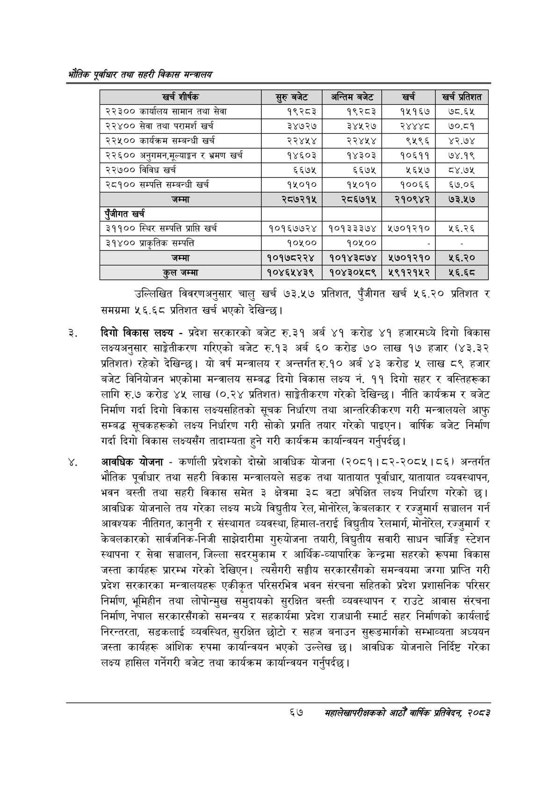

# Page 89 QA

## Rendered page


## Extracted text

```text
भरोतिक एवधार तथा सहरी विकास
उल्लिखित विवरणअनुसार चालु खर्च ७३.५७ प्रतिशत, पुँजीगत खर्च ५६.२० प्रतिशत र समग्रमा ५६.६८ प्रतिशत खर्च भएको देखिन्छ |
दिगो विकास लक्ष्य -प्रदेश सरकारको बजेट रु.३१ अर्ब ४१ करोड ४१ हजारमध्ये दिगो विकास लक्ष्यअनुसार साङ्ेतीकरण गरिएको बजेट रु.१३ अर्ब ६० करोड ७० लाख १७ हजार (४३.३२ प्रतिशत) रहेको देखिन्छ। यो वर्ष मन्त्रालय र अन्तर्गत रु.१० अर्ब ४३ करोड लाख ८९ हजार बजेट विनियोजन भएकोमा मन्त्रालय सम्बद्ध दिगो विकास लक्ष्य नं. ११ दिगो सहर र वस्तिहरूका लागि रु.७ करोड ४५ लाख (०.२४ प्रतिशत) साङ्ेतीकरण गरेको देखिन्छ। नीति कार्यक्रम र बजेट निर्माण गर्दा दिगो विकास लक्ष्यसहितको सूचक निर्धारण तथा आन्तरिकीकरण गरी मन्त्रालयले आफु सम्बद्ध सूचकहरूको लक्ष्य निर्धारण गरी सोको प्रगति तयार गरेको पाइएन। वार्षिक बजेट निर्माण गर्दा दिगो विकास लक्ष्यसँग तादाम्यता हुने गरी कार्यक्रम कार्यान्वयन गर्नुपर्दछ |
आवधिक योजना -कर्णाली प्रदेशको दोस्रो आवधिक योजना (२०८१।८२-२०८५। ८६) अन्तर्गत भौतिक पूर्वाधार तथा सहरी विकास मन्त्रालयले सडक तथा यातायात पूर्वाधार, यातायात व्यवस्थापन, भवन बस्ती तथा सहरी विकास समेत ३ क्षेत्रमा ३८ वटा अपेक्षित लक्ष्य निर्धारण गरेको छ। आवधिक योजनाले तय गरेका लक्ष्य मध्ये विद्युतीय रेल, मोनोरेल, केबलकार र रज्जुमार्ग सञ्चालन गर्न आवश्यक नीतिगत, कानुनी र संस्थागत व्यवस्था, हिमाल-तराई विद्युतीय रेलमार्ग, मोनोरेल, रज्जुमार्ग र केबलकारको सार्वजनिक-निजी साझेदारीमा गुरुयोजना तयारी, विद्युतीय सवारी साधन चार्जिङ्ग स्टेशन स्थापना र सेवा सञ्चालन, जिल्ला सदरमुकाम र आर्थिक-व्यापारिक केन्द्रमा सहरको रूपमा विकास जस्ता कार्यहरू प्रारम्भ गरेको देखिएन। त्यसैगरी सङ्घीय सरकारसँगको समन्वयमा जग्गा प्राप्ति गरी प्रदेश सरकारका मन्त्रालयहरू एकीकृत परिसरभित्र भवन संरचना सहितको प्रदेश प्रशासनिक परिसर निर्माण, भूमिहीन तथा लोपोन्मुख समुदायको सुरक्षित बस्ती व्यवस्थापन र राउटे आवास संरचना निर्माण, नेपाल सरकारसँगको समन्वय र सहकार्यमा प्रदेश राजधानी स्मार्ट सहर निर्माणको कार्यलाई निरन्तरता, सडकलाई व्यवस्थित, सुरक्षित छोटो र सहज बनाउन सुरूङमार्गको सम्भाव्यता अध्ययन जस्ता कार्यहरू आंशिक रुपमा कार्यान्वयन भएको उल्लेख छ। आवधिक योजनाले निर्दिष्ट गरेका लक्ष्य हासिल गर्नेगरी बजेट तथा कार्यक्रम कार्यान्वयन गर्नुपर्दछ |
६७
मसंहालेखापरीक्षकको आठौँ वाषिक प्रतिवेदन २०८२

| खर्च शीर्षक |  | अन्तिम बजेट | खर्च | खर प्रतेशत |
| --- | --- | --- | --- | --- |
| २२३०० कार्यालय सामान तथा सेवा | १९२८३ | १९२८३ | १५१६७ | ७८.६५ |
| २२४०० सेवा तथा परामर्श खर्च | ३४७२७ | ३४५२७ | २४४४८ | ७०.८१ |
| २२५०० कार्यक्रम सम्बन्धी खर्च | २२४५४ | २२४५४ | ९५९६ | ४२.७४ |
| २२६०० अनुगमन,ूल्याङ्ग र भ्रमण खर्च | १४६०३ | १४३०३ | १०६११ | ७४.१९ |
| २२७०० विविध खर्च | ६६७५ | ६६७५ | ५६५७ | ८४.७५ |
| २८१०० सम्पत्ति सम्बन्धी खर्च | १५०१० | १५०१० | १००६६ | ६७.०६ |
| जम्मा | २८७२१५ | २८६७१५ | २१०९४२ | ७३.५७ |
| एंजीगत खर्च |  |  |  |  |
| ३११०० स्थिर सम्पत्ति प्राप्ति खर्च | १०१६७७२४ | १०१३३३७४ | ५७०१२१० | १६.२६ |
| ३१४०० प्राकृतिक सम्पत्ति | १०५०० | १०४०० |  |  |
| जम्मा | १०१७८२२४ | १०१४३८७४ | २७०१२१० | ६.२० |
| कुल जम्मा | १०४६५४३९ | १०४३०५८९ | २५९१२१५२ | २६.६ठ |
```

## Flags
- table_page
- medium_quality_table
